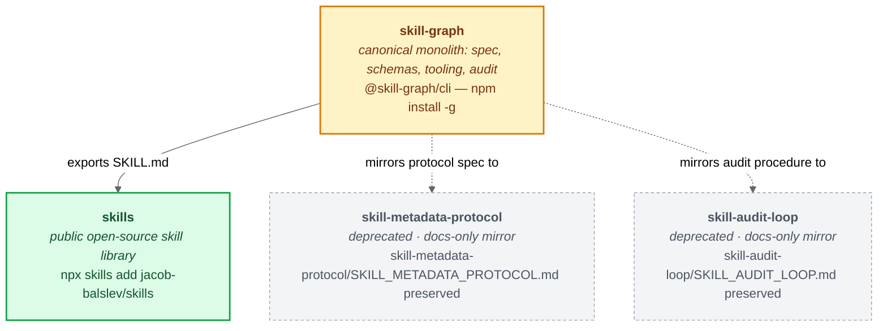

# Skill Graph

[](https://www.npmjs.com/package/@skill-graph/cli) [](skill-metadata-protocol/SKILL_METADATA_PROTOCOL.md) [](LICENSE) [](https://agentskills.io/specification) [](https://github.com/jacob-balslev/skill-graph/actions) [](https://github.com/jacob-balslev/skill-graph/stargazers)

**The canonical home for structured `SKILL.md` libraries.** Skill spec, JSON schemas, lint, manifest compiler, router, drift sentinel, audit loop, and the export pipeline — all shipped as a single CLI.

A plain `SKILL.md` gives an agent a procedure to load. The Skill Metadata Protocol adds the structured frontmatter contract. Skill Graph turns those declarations into a compiled manifest, routing map, drift sentinel, overlap detector, audit loop, and export path back to the plain `SKILL.md` format.

## Is this for me?

**Yes, if** you have **more than ~5 skills** that have started to depend on, verify, or exclude one another; you want **deterministic checks** for skill correctness (schema, paths, Evaluation Status) rather than only LLM-as-grader; you want a **single audit loop** that reports the Integrity Gate separately from the Behavior Gate via per-skill Audit Status fields (`structural_verdict`, `truth_verdict`, `comprehension_verdict`, `application_verdict`, `eval_score`, `drift_status`); or you want **graph queries** over the library ("what depends on this?", "what's the boundary between X and Y?", "which skills verify this one?").

**No, if** you have 1–3 skills and a plain folder is enough; you want a hosted skill marketplace ([Smithery](https://smithery.ai), [agentskills.io](https://agentskills.io)); you want an agent runtime (Claude Code, Cursor, Codex); or you want a tool-execution platform ([Composio](https://docs.composio.dev), your runtime's tool layer).

Full positioning vs. MCP, A2A, Anthropic Skills, Smithery, and Composio: [`docs/positioning.md`](docs/positioning.md).

## What makes this different

The mechanism is a **Karpathy-style keep-or-revert audit loop** ([autoresearch](https://github.com/karpathy/autoresearch)) applied to skill libraries instead of training scripts:

- **One field, one commit, one keep-or-revert decision.**
- Every change has a hard pass/fail gate — a deterministic check script that turns red or green.
- Failed changes auto-revert. The lesson is recorded; the field's truth is preserved.

The protocol's typed fields are the substrate that makes deterministic gates possible. The audit loop ([`skill-audit-loop/SKILL_AUDIT_LOOP.md`](skill-audit-loop/SKILL_AUDIT_LOOP.md)) is the mechanism. The quality bar that governs every change — what "improve" means, when it's safe to remove, how to enrich without dropping coverage — is codified in [`docs/quality-doctrine.md`](docs/quality-doctrine.md). Together they produce a library that drifts less, even as it grows.

## The Three Layers

Skill Graph is three layers, each with its own front door. Keep them distinct — never collapse one into another.

| Layer | Role | Front door |
|---|---|---|
| **Skill Metadata Protocol** | The per-skill contract — typed frontmatter that makes one skill's relevance and boundaries explicit. | [`skill-metadata-protocol/`](skill-metadata-protocol/) |
| **Skill Graph** | The library-level system — compiles the manifest, routes queries, checks drift and overlap, exports back to plain `SKILL.md`. | [`SKILL_GRAPH.md`](SKILL_GRAPH.md) |
| **Skill Audit Loop** | The maintenance discipline — `read → fix → test → next`, keeping each skill true as code and concepts drift. | [`skill-audit-loop/`](skill-audit-loop/) |

The mission is relevance-at-scale: the Protocol makes relevance explicit, the Graph makes it queryable, and the Audit Loop keeps it true. Each folder front door summarizes its layer and links to the binding spec inside it. The *How … Differ* table further down separates these from the plain `SKILL.md` format.

> The `skill-metadata-protocol/` and `skill-audit-loop/` folders in **this** repo are the live canonical homes. The identically-named nodes in the ecosystem diagram below are the **deprecated external GitHub mirror repos** (`github.com/jacob-balslev/…`), kept only for inbound-link stability — not the same thing.

## The ecosystem

<p align="center">
  
</p>



| Repo | npm | Status | Purpose |
|------|-----|--------|---------|
| **skill-graph** *(this repo)* | [`@skill-graph/cli`](https://www.npmjs.com/package/@skill-graph/cli) | **active** | Canonical home — protocol spec, schemas, CLI, lint, manifest, router, drift, audit loop, export |
| **[skills](https://github.com/jacob-balslev/skills)** | — | **active** | Public open-source skill library (consumed via `npx skills add jacob-balslev/skills`) |
| [skill-metadata-protocol](https://github.com/jacob-balslev/skill-metadata-protocol) | _(consolidated)_ | mirror | Historical docs-only mirror of the normative spec — content lives [here](skill-metadata-protocol/SKILL_METADATA_PROTOCOL.md) |
| [skill-audit-loop](https://github.com/jacob-balslev/skill-audit-loop) | _(consolidated)_ | mirror | Historical docs-only mirror of the audit procedure — content lives [here](skill-audit-loop/SKILL_AUDIT_LOOP.md) |

> **Recent consolidation (2026-05-18):** Per [SH-6137](https://linear.app/sales-hub/issue/SH-6137) and [ADR 0009](docs/adr/0009-sibling-repo-deprecation.md), `@skill-graph/protocol` and `@skill-graph/audit` were merged into `@skill-graph/cli@0.5.6`. Schemas, audit scripts, graders, eval fixtures, examples, and the protocol/audit canonical docs now all live in this repo. The sibling repos are preserved as read-only mirrors so existing inbound links remain valid; they were **archived on GitHub on 2026-05-20** (read-only, still publicly readable — see [ADR 0009 § Update](docs/adr/0009-sibling-repo-deprecation.md)).

### Pick the right doc

Two onboarding paths, by need:

- **"I want to author my first skill in 30 minutes."** → [`docs/QUICKSTART-30MIN.md`](docs/QUICKSTART-30MIN.md) — literal terminal walkthrough: clone, install, fill in the template, lint, route a query, record the drift baseline. Use this when you'd rather try the tooling than read about it.
- **"I want to understand the model before I commit."** → [`skill-metadata-protocol/PRIMER.md`](skill-metadata-protocol/PRIMER.md) — conceptual primer: what the protocol is, when to adopt it, the four orthogonal classification axes, the routing model, and what Skill Graph is *not*. Use this when you'd rather build the mental model first.

The QUICKSTART points at the PRIMER for the "why"; the PRIMER points at the QUICKSTART for the "how". Read either first, then loop back.

For everything else:

| If you want to… | Start here |
|---|---|
| **Install the CLI** | [Quick Start](#quick-start) below — `npm install -g @skill-graph/cli` |
| **Install the public skill library** | [`jacob-balslev/skills`](https://github.com/jacob-balslev/skills) — `npx skills add jacob-balslev/skills` |
| **Get oriented in the metadata protocol** | [`skill-metadata-protocol/`](skill-metadata-protocol/) — folder front door (why it exists, the axes, the two encodings, where to go next) |
| **Get oriented in the audit loop** | [`skill-audit-loop/`](skill-audit-loop/) — folder front door (the loop, four operations, two gates, four verdicts) |
| **Understand the `SKILL.md` frontmatter contract** | [`skill-metadata-protocol/SKILL_METADATA_PROTOCOL.md`](skill-metadata-protocol/SKILL_METADATA_PROTOCOL.md) — the normative spec |
| **Audit an existing skill library** | [`skill-audit-loop/SKILL_AUDIT_LOOP.md`](skill-audit-loop/SKILL_AUDIT_LOOP.md) — the audit procedure |
| **Look up a specific field** | [`skill-metadata-protocol/field-reference.md`](skill-metadata-protocol/field-reference.md) |
| **Plan adoption in a new repo** | [`docs/ADOPTION.md`](docs/ADOPTION.md) and [`docs/CONFORMANCE.md`](docs/CONFORMANCE.md) |
| **Migrate from an older `schema_version`** | git history (per [ADR 0014](docs/adr/0014-canonical-only-schema-files.md)) |

> **Surface scope:** The OSS-portable canonical library lives at `skills/skills/`; the live count is the single-source-of-truth value in [`SKILL_GRAPH.md § Current State`](SKILL_GRAPH.md#current-state--single-source-of-truth) (per the AGENTS.md Doc Ownership Map — every other doc links rather than inlining). A separate personal/Sales Hub surface at `skills/` is frozen — new skills are curated into the OSS surface only when non-PII, non-Sales-Hub, and generalizable. See [ADR 0008](docs/adr/0008-skill-surface-split-and-curation-policy.md).

## How SKILL.md, Skill Metadata Protocol, and Skill Graph Differ

| Layer | Job | Concrete output |
|---|---|---|
| **SKILL.md format** | Portable skill packaging. | A folder with `SKILL.md`, optional `scripts/`, `references/`, and `assets/`. |
| **Skill Metadata Protocol** | The per-skill relevance contract. | YAML frontmatter that declares identity, scope, taxonomy, activation signals, relations, grounding, eval state, and portability. |
| **Skill Graph** | The library-level system around the protocol. | Lint, manifest generation, routing, clustering, overlap checks, drift checks, audits, evals, and `SKILL.md` export. |

The distinction matters. The `SKILL.md` format answers "what can this skill do?" Skill Metadata Protocol answers "what is this skill relevant for, where does it belong, and what makes it trustworthy?" Skill Graph answers "how do we operate across a whole library of those declarations?"

## Why More Structured Skills Help

The plain `SKILL.md` format only needs `name` and `description` for the smallest useful skill. That is enough for small libraries. It breaks down when a project has many skills, overlapping domains, multiple workspaces, stale codebase assumptions, or a team that needs to audit why a skill was loaded.

Skill Metadata Protocol makes these questions explicit:

| Question | Protocol fields |
|---|---|
| What kind of skill is this? | `subject`, `deployment_target`, `scope`, `version`, `owner` |
| Where does it belong? | `subject`, `subjects[]`, `taxonomy_domain`, `project[]`, `routing_bundles` |
| When should it load? | `description`, `keywords`, `triggers`, `examples`, `anti_examples`, `paths` |
| What is it near, dependent on, or not responsible for? | `relations.related`, `relations.depends_on`, `relations.verify_with`, `relations.boundary`, `relations.broader`, `relations.narrower` |
| What evidence makes it true? | `grounding.truth_sources`, `grounding.failure_modes`, `grounding.evidence_priority` |
| Is it current and tested? | `freshness`, `drift_check`, `eval_artifacts`, `eval_state`, `routing_eval`, `eval_last_run`, `lifecycle` |
| Can it move to another runtime? | `portability`, `compatibility`, `allowed-tools` |

Once those fields exist, a skill library stops being a flat folder of Markdown files. It becomes a map of project knowledge that humans can browse and agents can route through.

## Skill Metadata Protocol

This is a compact example. The full authoring scaffold is [`examples/skill-metadata-template.md`](examples/skill-metadata-template.md).

```yaml
---
schema_version: 8
name: product-page-ux-review
description: "Reviewing a product page's UX, visual hierarchy, interaction patterns, accessibility, and conversion-critical content."
version: 1.0.0
# v8 classification (required)
subject: design-craft
deployment_target: project
scope: "Shopify product page UX review for an ecommerce project"
taxonomy_domain: design-craft/ux
owner: design-platform
freshness: "2026-05-13"
drift_check:
  last_verified: "2026-05-13"
eval_artifacts: planned
eval_state: unverified
routing_eval: absent
keywords:
  - product page UX
  - visual hierarchy
  - Shopify product detail page
  - conversion friction
  - dark mode review
examples:
  - "Review this Shopify product page for UX problems before launch."
  - "Map which design skills should be loaded for a dark-mode PDP redesign."
anti_examples:
  - "Fix the Shopify webhook signature validation failure."
  - "Diagnose why the checkout build failed in CI."
project:
  - handle: shopify-storefront
    role: primary
routing_bundles:
  - product-experience
paths:
  - app/products/**/*
  - components/product/**/*
relations:
  related:
    - visual-hierarchy
    - color-system-design
    - typography-system
    - dark-mode-implementation
  boundary:
    - skill: shopify
      reason: "shopify owns API, integration, and platform behavior; this skill owns product-page UX review"
    - skill: debugging
      reason: "debugging owns concrete runtime failures; this skill owns pre-release design review"
  verify_with:
    - a11y
    - usability-testing
grounding:
  subject_matter: Shopify product page UX surface
  grounding_mode: repo_specific
  truth_sources:
    - path: app/products/[handle]/page.tsx
    - path: components/product/ProductGallery.tsx
  failure_modes:
    - visual_hierarchy_unclear
    - color_contrast_regression
    - interaction_feedback_missing
  evidence_priority: repo_code_first
portability:
  readiness: scripted
  targets:
    - skill-md
lifecycle:
  stale_after_days: 90
  review_cadence: quarterly
---
```

The protocol is the contract. The template is just the easiest way to author the contract correctly.

## Library Axes

Skill Metadata Protocol uses several independent axes. They should not be collapsed into one taxonomy.

| Axis | Field | Cardinality | Use |
|---|---|---:|---|
| **Subject** | `subject` | one | Primary classification — what the skill teaches. Closed 9-value enum. |
| **Polyhierarchy** | `subjects[]` | zero, one, or two | Optional secondary subject when a skill genuinely spans two browse shelves. `subjects[0]` matches `subject`. |
| **Deployment target** | `deployment_target` | one | Where it deploys: `portable` (any project) or `project` (one specific project; requires `grounding`). |
| **Scope** | `scope` | one | Free-text PRD-style description of the deployment context. Not an enum. |
| **Domain path** | `taxonomy_domain` | zero or one | Slash-delimited hierarchy subdividing `subject`, such as `design-craft/ux` or `code-engineering/api-design`. |
| **Project belonging** | `project[]` | many | Belonging-entity references for `deployment_target: project` skills (handle + role). |
| **Routing group** | `routing_bundles` | many | Runtime bundles or dispatch groups. |
| **Relations** | `relations.*` | many | Typed graph edges between skills. |
| **Grounding** | `grounding.*` | conditional | Truth sources and failure modes for repo-grounded skills (`deployment_target: project`). |

### Current Subjects

`subject` is a **closed enum of nine**, enforced by the schema:

`agent-ops`, `code-engineering`, `frontend-ui`, `design-craft`, `data-analytics`, `quality-assurance`, `meta-methods`, `knowledge-organization`, `product-domain`

These are the values used across the canonical skill library (the sibling `~/Development/skills/` repo at `skills/<subject>/<name>/`) and the `examples/fixture-skills/` specimens. Cross-cutting fit is expressed via `subjects[]` (max 2) or `relations.related`, never by adding new subject values without an ADR.

### Current Domain Paths

| Domain root | Current `domain` paths |
|---|---|
| `ai-engineering` | `ai-engineering/analysis`, `ai-engineering/architecture`, `ai-engineering/concepts`, `ai-engineering/context`, `ai-engineering/evaluation`, `ai-engineering/knowledge`, `ai-engineering/knowledge-extraction`, `ai-engineering/knowledge-representation`, `ai-engineering/language`, `ai-engineering/prompts`, `ai-engineering/safety`, `ai-engineering/strategy`, `ai-engineering/tool-use` |
| `architecture` | `architecture/contracts`, `architecture/decision-records`, `architecture/dependencies`, `architecture/domain-boundaries`, `architecture/domain-discovery`, `architecture/events`, `architecture/technology-selection` |
| `content` | `content/build/images`, `content/maintenance`, `content/markdown/frontmatter`, `content/migrations`, `content/routing` |
| `data` | `data/migrations`, `data/modeling` |
| `design` | `design/information-architecture`, `design/interaction`, `design/ux`, `design/visual` |
| `engineering` | `engineering/api-design`, `engineering/debugging`, `engineering/observability`, `engineering/performance`, `engineering/quality`, `engineering/version-control` |
| `frontend` | `frontend/design-system`, `frontend/layout` |
| `integrations` | `integrations/webhooks` |
| `modeling` | `modeling/conceptual`, `modeling/ontology`, `modeling/state-machines`, `modeling/taxonomy` |
| `skill-system` | `skill-system/authoring`, `skill-system/health` |

### Current Project And Routing Groups

`taxonomy_domain` paths demonstrated in this repo (within `subject` shelves):

`build-pipeline`, `content`, `markdown`, `migrations`, `skill-authoring`, `static-site`

`routing_bundles` demonstrated in this repo:

`quality`

Downstream projects should add their own tags: `shopify`, `checkout`, `billing`, `design-system`, `docs-site`, `mobile`, `b2b-saas`, `healthcare`, and so on. Tags are not a global ontology. They are routing and maintenance handles for your workspace.

## Skill Clusters And Triangulation

The main payoff is not the YAML. The payoff is that a project can load the right cluster of skills for a real task.

Triangulation means selecting skills from multiple independent signals:

| Signal | Example |
|---|---|
| **Project surface** | `deployment_target: project`, `project: [{handle: shopify-storefront}]`, `paths: components/product/**/*` |
| **Subject and domain** | `subject: design-craft`, `taxonomy_domain: design-craft/ux` |
| **Method or phase** | `design-thinking`, `user-research`, `ideation`, `prototyping`, `usability-testing` |
| **Related skills** | `visual-hierarchy`, `color-system-design`, `typography-system`, `dark-mode-implementation` |
| **Verification skills** | `a11y`, `testing-strategy`, `code-review` |
| **Negative boundaries** | `shopify` for API work, `debugging` for runtime failures |

For a UX designer working on a Shopify product page, Skill Graph can form a cluster like this:

| Design phase | Skills to load |
|---|---|
| **Empathize** | `user-research`, `task-analysis`, `journey-mapping` |
| **Define** | `problem-framing`, `information-architecture`, `research-synthesis` |
| **Ideate** | `ideation`, `visual-design-foundations`, `interaction-patterns` |
| **Prototype** | `prototyping`, `layout-composition`, `design-module-composition`, `color-system-design`, `typography-system`, `dark-mode-implementation` |
| **Test** | `usability-testing`, `a11y`, `interaction-feedback` |
| **Project-specific context** | `shopify`, `frontend-architecture`, `design-system-architecture` |

That is the difference between asking an agent to "use the UX skill" and giving it a structured project map: what area is being changed, which design phase the work is in, which sibling skills should co-load, and which nearby skills should not take over.

## Skill Audit Loop

A skill is a contract about a subject. The contract is inert on its own — it stays useful only while the things it was written against still hold. Two of those things move: the codebase the skill is grounded in, and the subject the skill describes. The Skill Audit Loop re-grounds a skill against both. It is what keeps a skill true to its declared `grounding.truth_sources` once time has passed — whether a maintainer runs it across a whole library or an adopter runs it against their own repo.

The loop adapts two useful patterns:

- From [Karpathy's `autoresearch`](https://github.com/karpathy/autoresearch): a tight loop with a constrained action surface, a fixed experiment, a measurable result, and keep-or-revert pressure.
- From [Stanford d.school design thinking](https://dschool.stanford.edu/resources/design-thinking-bootleg) and [IDEO's design thinking framing](https://designthinking.ideo.com/faq/isnt-design-thinking-a-set-step-by-step-process): human-centered iteration through discovery, framing, ideation, prototyping, testing, and loop-back when evidence changes the problem.

For skills, the loop is:

1. Pick a skill or project area.
2. Gather evidence: the `SKILL.md`, eval files, manifest entry, related skills, and `grounding.truth_sources`.
3. Run the **Integrity Gate** first. The `npm run verify` chain runs: schema lint, protocol-consistency, doc-link + doc-drift, mirror freeze, charter parity, stability promotion, manifest validation, routing eval (regenerated each run), SKILL.md export shape, marketplace freshness, status doc freshness, overlap, and unit tests. **Drift sentinel** (`npm run drift`) and **audit-manifest verifier** (`npm run audit-manifest:check`) are run separately because they currently surface CONTENT-side debt that is being drained through the audit loop — see audit findings H9 and H10 (2026-05-27).
4. Run the **Behavior Gate** when certification is needed: realistic positive evals, hard negatives, prior failure regressions, and boundary cases that show whether the skill changes agent behavior.
5. Fix the skill or its metadata when the evidence supports the change.
6. Re-run checks and record the new state.
7. Move to the next skill or loop back if the fix changed the graph.

This is not "self-improving skills" as a slogan. It is a re-grounding loop with evidence, constraints, and repeatable checks. The Integrity Gate proves the skill is safe for the graph; the Behavior Gate proves the skill is useful to an agent.

## Quick Start

### Using the skills (end users)

The public, ready-to-install skill library lives at [`jacob-balslev/skills`](https://github.com/jacob-balslev/skills) — install with:

```bash
npx skills add jacob-balslev/skills
```

That repo holds the canonical skill library in plain Agent-Skills shape (live count in [`SKILL_GRAPH.md § Current State`](SKILL_GRAPH.md#current-state--single-source-of-truth)), indexed on `skills.sh`. You do not need to clone this `skill-graph` tooling repo to consume the skills.

### Running the tooling (authors and maintainers)

Install the CLI from npm:

```bash
npm install --global @skill-graph/cli
skill-graph --help
```

Or skip install entirely and open the repo in a pre-configured GitHub Codespace — Node 20, `skill-graph` linked globally, `doctor` smoke-run on first boot, suggested next commands shown on attach:

[](https://codespaces.new/jacob-balslev/skill-graph)

The devcontainer lives at [`.devcontainer/devcontainer.json`](.devcontainer/devcontainer.json); first-boot logic is in [`.devcontainer/post-create.sh`](.devcontainer/post-create.sh).

The tooling operates against a skill library configured via [`.skill-graph/config.json`](.skill-graph/config.json) → `workspace.skill_roots`. Post-2026-05-18 consolidation, the shipped config points at the public [`jacob-balslev/skills`](https://github.com/jacob-balslev/skills) repo — the canonical skill library, with the live count in [`SKILL_GRAPH.md § Current State`](SKILL_GRAPH.md#current-state--single-source-of-truth). Clone the canonical skills as a sibling of this repo and the tooling resolves automatically — no env-vars needed:

```bash
git clone https://github.com/jacob-balslev/skills.git ~/Development/skills
cd ~/Development/skill-graph    # this repo (tooling)

# Validate every skill against the schema and lint rules.
node scripts/skill-lint.js

# Route a real request and print why each skill was selected, co-loaded, or excluded.
node scripts/skill-graph-route.js "audit my skills for schema conformance"

# Check grounded skills against recorded truth-source hashes.
node scripts/skill-graph-drift.js
```

If your layout differs from the canonical-sibling assumption (e.g., canonical skills cloned elsewhere), override via the `SKILL_GRAPH_WORKSPACE` env-var or edit `.skill-graph/config.json` to point `workspace.skill_roots` at your skill directory.

To regenerate the plain public marketplace staging surface from the canonical source:

```bash
node scripts/export-marketplace-skills.js
node scripts/export-marketplace-skills.js --check
node scripts/verify-skill-md-export.js --plain marketplace/skills
```

The staging surface lands under `marketplace/` for the two-step sync into `jacob-balslev/skills` (see `AGENTS.MD § Release sync`). The canonical end-user install path is `npx skills add jacob-balslev/skills` — that is the path consumers see, and it must remain working before any marketplace badge is added.

**Consuming the best-quality skills locally (you, or any cloner).** The marketplace export is just one downstream profile. To compile the *whole* library — including `deployment_target: project` skills the marketplace gate excludes — into consumable Agent Skills for your own runtime, use `render`:

```bash
skill-graph render --out ~/.claude/skills      # compile every skill into a runtime's skills dir
skill-graph render --check                     # CI: fail if dist/skills is stale
```

`render` compiles each canonical skill into clean Agent-Skills frontmatter + the authored body + a generated `## Skill Graph context` section (projected from the protocol fields by the shared `scripts/lib/render-skill-context.js`). This is what makes the evolved Skill-Graph intelligence visible to a vendor auto-loader, which reads the body but never the `metadata:` map. Default output is `dist/skills/` (git-ignored); point `--out` at any runtime's skills directory to consume directly.

The npm package exposes the same scripts through a `skill-graph` binary:

```bash
skill-graph init my-skill            # Scaffold a new SKILL.md from the template
skill-graph add debugging            # Install a skill from the marketplace
skill-graph lint                     # Validate all SKILL.md files
skill-graph audit my-skill           # Seed or run a single-skill audit
skill-graph route "schema drift"     # Select skills for a query
skill-graph drift                    # Check truth-source hashes
skill-graph eval-staleness           # Check eval file/path/symbol claims
skill-graph render --out ~/.claude/skills  # Compile the library into consumable skills for a runtime
skill-graph export                   # Generate public marketplace export surface
skill-graph evolve --top 5           # PREVIEW: continuous improvement loop (standalone; see Standalone Installation section)
```

Run `skill-graph --help` to see all commands (including legacy aliases).

## Standalone Installation and Usage

All subcommands except `evolve` work standalone out of the box after `npm install -g @skill-graph/cli`. The cross-repo path escapes in the `audit` and `evolve` pipeline were removed in SH-6138; the package no longer requires the Development monorepo to be present.

### Quick standalone setup

```bash
npm install -g @skill-graph/cli

# Point the CLI at your skill library — one of three ways:
# 1. cd into your workspace (the CLI defaults SKILL_GRAPH_WORKSPACE to cwd)
cd /path/to/my-skills && skill-graph lint

# 2. Set SKILL_GRAPH_WORKSPACE explicitly
SKILL_GRAPH_WORKSPACE=/path/to/my-skills skill-graph audit my-skill

# 3. Add a .skill-graph/config.json to your workspace to configure skill_roots
```

### Supported CLI flags for standalone use

| Command | Standalone flag | Purpose |
|---|---|---|
| `skill-graph audit <skill>` | `--dry-run` | Resolve skill and run lint without writing any files. Useful for smoke-testing a fresh install. |
| `skill-graph audit <skill>` | `--audit-root <path>` | Write audit artifacts to a custom directory instead of `<workspace>/audits/`. |
| `skill-graph evolve` | `--workspace-root <path>` | Root of your skills workspace (defaults to cwd). |
| `skill-graph evolve` | `--skills-dir <path>` | Directory containing your SKILL.md files (defaults to `<workspace-root>/skills`). |
| `skill-graph evolve` | `--output-dir <path>` | Directory for evolve output artifacts (defaults to `<workspace-root>/audits`). |
| All commands | `SKILL_GRAPH_WORKSPACE` env var | Override workspace root globally — useful in CI pipelines or when your skill library is not in cwd. |

### Smoke-testing a fresh install

```bash
# Install the CLI globally
npm install -g @skill-graph/cli

# Verify the audit pipeline resolves your skill without writing files (exit 0 = healthy)
skill-graph audit <your-skill-name> --dry-run

# Verify the evolve pipeline prints its help and exit codes
skill-graph evolve --help
```

### evolve standalone requirements

`skill-graph evolve` ships bundled with `lib/audit-shared/auto-improve.js` (included in the package). For standalone use, pass the required workspace flags:

```bash
skill-graph evolve \
  --workspace-root /path/to/my-skills \
  --skills-dir /path/to/my-skills/skills \
  --output-dir /path/to/my-skills/audits \
  --top 5 --max-cycles 3
```

Exit codes for `skill-graph evolve`:

| Code | Meaning |
|---|---|
| `0` | Loop completed successfully (or `--analyze-only` finished). |
| `1` | Fatal error (missing required dependency, unresolvable skill root, etc.). |
| `2` | Failure budget exceeded (`--failure-budget`). |

## What You Get

| Tool | Purpose |
|---|---|
| `scripts/skill-lint.js` | Canonical-source schema gate: valid frontmatter, `schemas/SKILL_METADATA_PROTOCOL_schema.json` validation, identifier shape, non-empty description, and parent-directory/name alignment. Routing quality, relation existence, drift, export, and eval checks live in the dedicated tools below. |
| `scripts/check-protocol-consistency.js` | Cross-artifact checks so schemas, docs, generated field references, and sample manifests stay aligned. |
| `scripts/generate-manifest.js` | Compiles all skills into a deterministic manifest for routing and downstream tooling. |
| `scripts/skill-graph-route.js` | Reference router that explains selected, co-loaded, and excluded skills. |
| `scripts/skill-graph-routing-eval.js` | Checks `examples` and `anti_examples` against router behavior. |
| `scripts/skill-graph-drift.js` | Hashes `grounding.truth_sources` and reports drift, broken sources, stale skills, or missing baselines. |
| `lib/audit/eval-staleness-checker.js` | Checks `examples/evals/*.json` for stale file-path, line-range, and symbol claims using the configured skill roots. |
| `scripts/skill-overlap.js` | Finds overlapping skill ownership and routing ambiguity. |
| `scripts/skill-audit.js` | Generates audit artifacts and optional graded review prompts. |
| `scripts/export-skill.js` | Exports protocol-enriched skills back to plain `SKILL.md` shape. |
| `scripts/export-marketplace-skills.js` | Generates and validates the public plain `SKILL.md` marketplace surface with provenance, description-limit, privacy, and link gates. |

## Repository Map

| Path | Purpose |
|---|---|
| [`SKILL_GRAPH.md`](SKILL_GRAPH.md) | Library-level system model and authority tiers. |
| [`skill-metadata-protocol/`](skill-metadata-protocol/) | Protocol layer — folder front door (`README.md`) plus the spec and its companions. |
| [`skill-metadata-protocol/SKILL_METADATA_PROTOCOL.md`](skill-metadata-protocol/SKILL_METADATA_PROTOCOL.md) | **Canonical** normative spec for the `SKILL.md` frontmatter contract. |
| [`skill-audit-loop/`](skill-audit-loop/) | Audit-loop layer — folder front door (`README.md`) plus the spec and the runner prompts. |
| [`skill-audit-loop/SKILL_AUDIT_LOOP.md`](skill-audit-loop/SKILL_AUDIT_LOOP.md) | **Canonical** audit procedure (4 operations: audit, improve, evaluate, evolve). |
| `skill-audit-loop/SKILL_AUDIT_LOOP.md` § Part 2 — Per-Skill Audit Checklist | Per-skill audit checklist used during `audit`. |
| [`AGENTS.md`](AGENTS.md) | Agent-facing repo guide (doctrine, doc routing, validation commands, `lib/` layout, public-distribution contract). `CLAUDE.md` imports it. |
| [`CHANGELOG.md`](CHANGELOG.md) | Release notes for protocol, schemas, scripts, and CLI. |
| [`schemas/`](schemas/) | Canonical-only JSON Schemas — `SKILL_METADATA_PROTOCOL_schema.json` (the binding contract; current shape is v8, see [`SKILL_GRAPH.md § Current State`](SKILL_GRAPH.md#current-state--single-source-of-truth)) + `manifest.schema.json` + `audits-manifest.schema.json` + `comprehension.schema.json`. Prior contract versions live in git history per [ADR-0014](docs/adr/0014-canonical-only-schema-files.md). Also `skill.context.jsonld` and a `vocabulary/` namespace. |
| [`lib/audit/`](lib/audit/) | Audit-loop runtime bundled in `@skill-graph/cli` — see [`AGENTS.md § Internal lib/ layout`](AGENTS.md#internal-lib-layout). |
| [`marketplace/`](marketplace/) | Staging buffer for the public `jacob-balslev/skills` release. Generated by `scripts/export-marketplace-skills.js`. **Never hand-edit** — see [`AGENTS.md § Public Distribution`](AGENTS.md#public-distribution--canonical-url-contract). |
| [`audits/`](audits/) | Per-skill audit artifacts (`audits/<skill>/findings.md`, `verdict.md`, `scorecard.md`) emitted by `audit`. Evidence, not state — state lives in each skill's Audit Status. |
| [`evals/`](evals/) | Routing-eval baseline (`retrieval-baseline-v2.json`). Per-skill comprehension/application evals live alongside each skill or under `examples/evals/`. |
| [`data/`](data/) | Hand-edited classification data feeding upstream tooling. Today: `publication-classification.json` (per-skill OSS publication tier, consumed by the parent Development repo's audit worklist). |
| [`examples/skill-metadata-template.md`](examples/skill-metadata-template.md) | Copyable authoring template. |
| [`examples/projects/markdown-static-site/`](examples/projects/markdown-static-site/) | Specimen project with codebase-grounded skills. |
| [`skill-metadata-protocol/field-reference.md`](skill-metadata-protocol/field-reference.md) | Field-by-field reference. |
| [`skill-metadata-protocol/field-decision-guide.md`](skill-metadata-protocol/field-decision-guide.md) | Decision tables for hard field choices. |
| [`docs/quality-doctrine.md`](docs/quality-doctrine.md) | Quality bar for preserving scope, readable names, organization-over-trimming, compression, and verification. |
| [`docs/SKILL-MD-FORMAT-COMPATIBILITY.md`](docs/SKILL-MD-FORMAT-COMPATIBILITY.md) | How export maps protocol-enriched skills back to plain `SKILL.md`. |
| [`docs/marketplace-syndication.md`](docs/marketplace-syndication.md) | Syndication workflow for public `SKILL.md` marketplaces. |
| [`docs/adr/`](docs/adr/) | Architecture Decision Records, including [ADR 0009 — sibling repo deprecation](docs/adr/0009-sibling-repo-deprecation.md). |
| git history (per [ADR 0014](docs/adr/0014-canonical-only-schema-files.md)) | Per-bump author migration procedures (v4→v5, v5→v6, v6→v7). |

**Related repos:**

| Repo | Status | Purpose |
|---|---|---|
| [`jacob-balslev/skills`](https://github.com/jacob-balslev/skills) | **active** | Public open-source canonical skill library — live count in [`SKILL_GRAPH.md § Current State`](SKILL_GRAPH.md#current-state--single-source-of-truth). Distributed via `npx skills add jacob-balslev/skills`. |
| [`jacob-balslev/skill-metadata-protocol`](https://github.com/jacob-balslev/skill-metadata-protocol) | mirror | Historical docs-only mirror of the protocol spec (kept for inbound-link stability). Canonical doc now in [`skill-metadata-protocol/SKILL_METADATA_PROTOCOL.md`](skill-metadata-protocol/SKILL_METADATA_PROTOCOL.md). |
| [`jacob-balslev/skill-audit-loop`](https://github.com/jacob-balslev/skill-audit-loop) | mirror | Historical docs-only mirror of the audit workflow. Canonical doc now in [`skill-audit-loop/SKILL_AUDIT_LOOP.md`](skill-audit-loop/SKILL_AUDIT_LOOP.md). |

## Releasing (Maintainers)

### Local development note (pnpm workspace)

If you have a parent `pnpm-workspace.yaml` above this directory (e.g. when this repo is checked out inside the `Development` monorepo), pnpm will absorb `skill-graph/` into the parent workspace. That blocks standalone `pnpm-lock.yaml` generation here. For local dev/lockfile work, run:

```bash
pnpm install --ignore-workspace
pnpm install --frozen-lockfile --ignore-workspace
```

CI is unaffected — `.github/workflows/publish.yml` runs in a clean checkout with no parent workspace, so the unflagged `pnpm install --frozen-lockfile` works correctly there.

### Prerequisites

Before cutting the first release, ensure these one-time steps are done:

1. **npm org** — the `@skill-graph` npm org must exist. The npm CLI does NOT support `npm org create`; orgs are created via the website. Go to https://www.npmjs.com/org/create, enter `skill-graph` as the org name, pick "Unlimited public packages — Free", and add yourself as owner. Verify with `npm org ls skill-graph`.
2. **NPM_TOKEN secret** — generate a publish token (`npm token create --read-only=false`) and add it as `NPM_TOKEN` in the GitHub repo secrets (`Settings → Secrets and variables → Actions`). For finer scoping, manage tokens at https://www.npmjs.com/settings/<user>/tokens.

### Cutting a release

```bash
# 1. Bump version, commit, and tag locally
pnpm version patch   # or minor, or major

# 2. Push the commit and the tag — the tag push by itself does NOT publish
git push && git push --tags

# 3. Trigger the publish workflow manually from the GitHub Actions UI,
#    or via the CLI, passing the tag you just pushed:
gh workflow run "Publish @skill-graph/cli to npm" -f tag=v0.5.9
```

The publish pipeline at `.github/workflows/publish.yml` is **manually gated as of v0.5.9**: it triggers only on `workflow_dispatch` and requires the maintainer to enter the release tag. The workflow checks out that tag, runs `pnpm test`, then publishes `@skill-graph/cli` with provenance attestation. The npm package is always published from CI — do not run `pnpm publish` locally. (Releases up to and including v0.5.8 used an auto-publish-on-tag trigger; the manual gate was added immediately after the v0.5.8 publish completed.)

### Manual prereq summary

| Step | Who | Command |
|------|-----|---------|
| Create `@skill-graph` npm org (once) | Jacob | https://www.npmjs.com/org/create — pick "Unlimited public packages — Free" |
| Add `NPM_TOKEN` GitHub secret (once) | Jacob | GitHub Settings → Secrets |
| Cut a release | Maintainer | `pnpm version <patch\|minor\|major>` then `git push --tags`, then `gh workflow run "Publish @skill-graph/cli to npm" -f tag=v<x.y.z>` |

> CLI distribution via npm (`@skill-graph/cli`) is separate from skill library syndication. The skill library is published from [`jacob-balslev/skills`](https://github.com/jacob-balslev/skills) via `npx skills add jacob-balslev/skills`. See [`docs/marketplace-syndication.md`](docs/marketplace-syndication.md) for the skill library syndication workflow. See SH-6110 for install verification.

## What This Is Not

Skill Graph is not:

- a hosted skill marketplace
- an agent runtime
- persistent agent memory
- a replacement for `AGENTS.md` or `CLAUDE.md`
- a prompt library
- a guarantee that every skill is correct

It is a structured protocol and reference toolchain for making skills easier to route, cluster, verify, maintain, and port.

## Where Skill Graph fits

Skill Graph sits **above** plain `SKILL.md` files and **beside** runtime protocols like MCP and A2A. It is an **authoring + audit-time** project, not a runtime. Full positioning with explicit comparisons against [Anthropic Skills](https://docs.anthropic.com/en/docs/claude-code/skills), [the Agent Skills spec](https://agentskills.io/specification), [MCP](https://modelcontextprotocol.io), [A2A](https://google.github.io/A2A/latest/specification/), [Smithery](https://smithery.ai), [Composio](https://docs.composio.dev), and [AGENTS.md](https://agents.md/) lives in [**`docs/positioning.md`**](docs/positioning.md) — it names what Skill Graph is **not** before naming what it **is**.

One-line summary: most agent-skills projects answer *"how does the agent find / load / call / dispatch / publish a skill?"* Skill Graph answers *"how do you keep a library of skills correct over time?"* The unique mechanism is the **Karpathy keep-or-revert audit loop** applied to skill libraries instead of training scripts (see [Skill Audit Loop](#skill-audit-loop) below and [`docs/quality-doctrine.md`](docs/quality-doctrine.md) for the quality bar that doctrine enforces).

For project framing context, see [GitHub Discussion #1](https://github.com/jacob-balslev/skill-graph/discussions/1) and the linked [Bluesky thread](https://bsky.app/profile/did:plc:dydxbat6yyyhjfaln22sx66t/post/3mln2lefdi22u).

## Status

Latest release: **`@skill-graph/cli@0.5.10`** (2026-05-25) — the "canonical-shape sweep" release closing the 2026-05-25 multi-model restructure review backlog. See [`CHANGELOG.md`](CHANGELOG.md) and the generated [`docs/status.generated.md`](docs/status.generated.md). The current contract is `schema_version: 8` (v7 classification fields are historical and rejected by the live schema — see [`SKILL_GRAPH.md § Current State`](SKILL_GRAPH.md#current-state--single-source-of-truth) and [`schemas/SKILL_METADATA_PROTOCOL_schema.json`](schemas/SKILL_METADATA_PROTOCOL_schema.json) for the authoritative shape). Per [ADR-0014](docs/adr/0014-canonical-only-schema-files.md) (canonical-only schema files), only `SKILL_METADATA_PROTOCOL_schema.json` lives on disk; prior contract versions are recoverable from git history (`git show <commit>:schemas/SKILL_METADATA_PROTOCOL_schema.json`) and external consumers pinning a historical version should resolve against a tag rather than a duplicate file. The schema's `$id` (`https://skillgraph.dev/schemas/skill.schema.json`) is the stable identifier.

## Contributing & Trust

- **Contributing** — see [`CONTRIBUTING.md`](CONTRIBUTING.md). Issues and PRs welcome via the structured templates in [`.github/`](.github/).
- **Security** — report vulnerabilities privately via the [security policy](SECURITY.md), not as public issues.
- **Code of Conduct** — this project follows the [Contributor Covenant 2.1](CODE_OF_CONDUCT.md).
- **License** — code is licensed under [Apache-2.0](LICENSE). Skill content and documentation under CC-BY-4.0 where noted in [`NOTICE`](NOTICE).
- **Discussions** — open-ended questions and ideas welcome in [GitHub Discussions](https://github.com/jacob-balslev/skill-graph/discussions).
