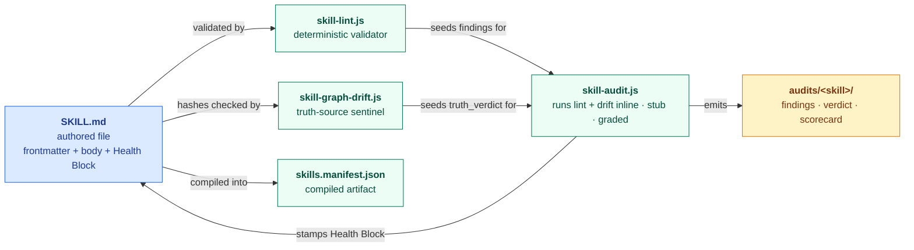
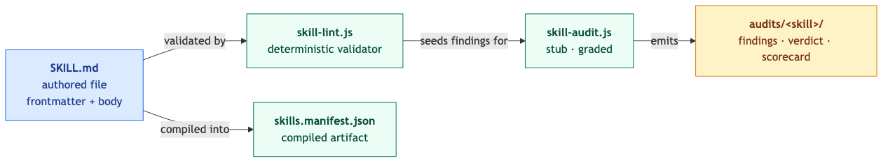
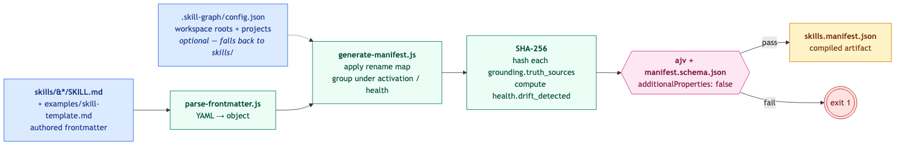
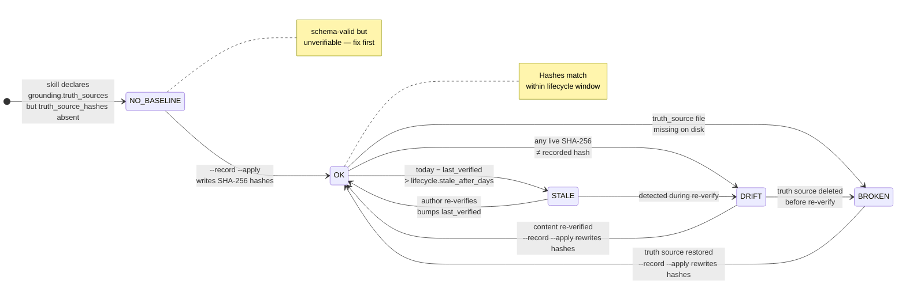
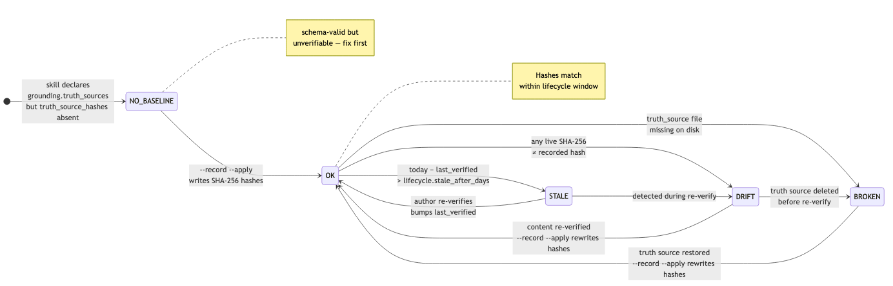
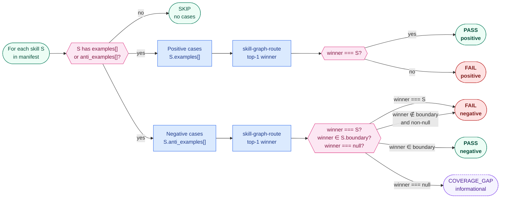
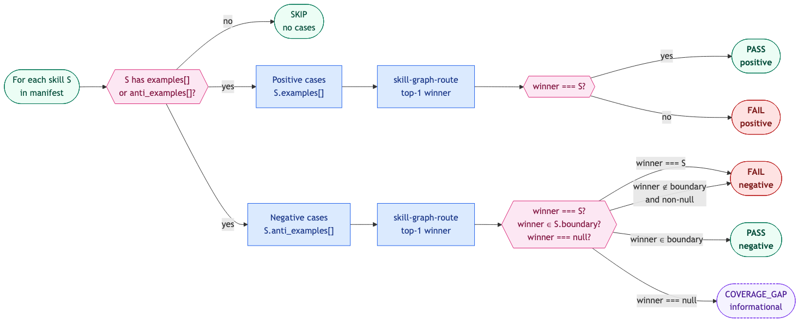
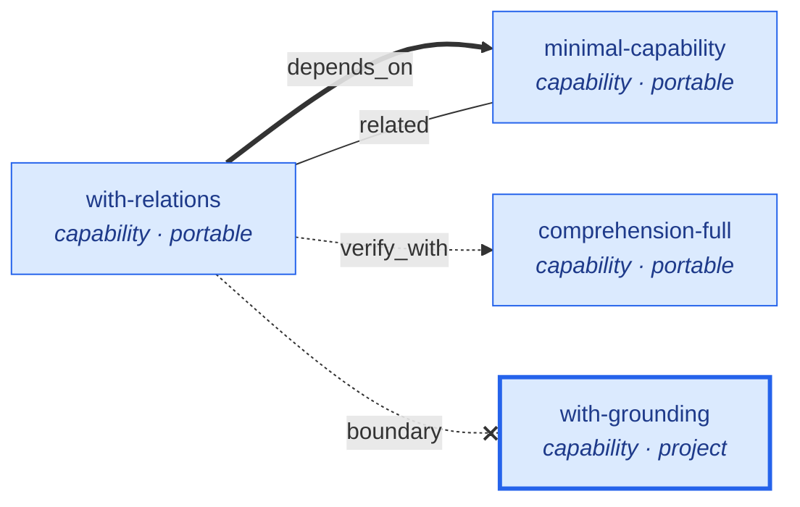

# Skill Graph

> **Read this if:** you want to understand the library-level Skill Graph system: the tools, generated artifacts, authority tiers, and maintenance loops that operate on Skill Metadata Protocol records.

Skill Graph is the library-level system around the [Skill Metadata Protocol](SKILL_METADATA_PROTOCOL.md). The protocol defines what one `SKILL.md` must declare; Skill Graph supplies the manifest compiler, validator, router, drift sentinel, and export pipeline that make those declarations useful across many skills. The repo is organised in five authority tiers: each tier derives from the one above it, and tooling enforces the derivation automatically. When any two files appear to contradict each other, the tier with higher authority wins; the lower-tier file is a bug.

The three layers divide the work cleanly. The [Skill Metadata Protocol](SKILL_METADATA_PROTOCOL.md) declares what each skill is grounded against — its `truth_sources`, `grounding_mode`, and `failure_modes`. Skill Graph operates across the whole library of those declarations, compiling, routing, clustering, and checking them. The [Skill Audit Loop](SKILL_AUDIT_LOOP.md) is the maintenance discipline — now consolidated into this repo (per [ADR 0009](docs/adr/0009-sibling-repo-deprecation.md)) — that re-grounds each skill against its declared sources on a cadence, so the declarations the protocol captured stay true to the reality they point at.

---

## Current State — single source of truth

> This block is the canonical "what version / how many" reference. Other docs (`AGENTS.md`, `README.md`) should link here rather than restate these numbers, to avoid the drift that recurs when each doc carries its own copy.

| Fact | Value | Source of truth |
|---|---|---|
| **Schema version enforced** | **v7 + v8 in compatibility mode** (`schema_version: 7\|8` both validate; v8 skills additionally require `subject` + `operation`; v7 `category.const` 6-enum retained as the only category constraint) | `schemas/skill.schema.json` + [ADR-0017 § Landing strategy](docs/adr/0017-five-axis-classification-model.md) |
| **Corpus v7/v8 distribution** | **144 source skills carry `schema_version: 8`; 9 source skills carry `schema_version: 7`**. The v8 axes (`subject`, `operation`) are populated through the compatibility migration, but v7 legacy fields (`type`, `category`) remain required until the v7 sunset removal lands. Verified 2026-05-26 from live manifest generation. | `node scripts/generate-manifest.js --output /tmp/manifest.json` then inspect `summary.by_schema_version` |
| Manifest schema file | tracks v7 + v8 dual-emit | `schemas/manifest.schema.json` |
| Emitted manifest `schema_version` | **4** (back-compatible root contract) | `scripts/generate-manifest.js`; `schemas/manifest.schema.json` `schema_version.const` |
| Manifest summary facets | **dual emit** — v7 (`by_category` / `by_type`) and v8 (`by_subject` / `by_operation`) side-by-side, plus `by_schema_version` for migration tracking | `scripts/generate-manifest.js::computeSummary` |
| Per-skill `schema_version` in manifest | **present** (top-level field on every skill entry — added 2026-05-25 per F4 finding) | `scripts/generate-manifest.js::buildSkillEntry` |
| Canonical skill count | **153** SKILL.md in the canonical library; **154** when the protocol template is included. Verified 2026-05-26 by `find` + live manifest generation. | live: `find ~/Development/skills/skills -name SKILL.md \| wc -l` (153) and `node scripts/generate-manifest.js --include-template --validate-only` (154). |
| Marketplace export count | **152** SKILL.md in `marketplace/skills/` (verified 2026-05-26); the publication gate excludes repo-specific/internal skills (`scope: project` or legacy `scope: codebase`, plus internal grounding modes). | live: `find skill-graph/marketplace/skills -name SKILL.md \| wc -l` |
| Canonical library location | sibling repo `jacob-balslev/skills` at `~/Development/skills/` | `.skill-graph/config.json` → `skill_roots: ["../skills/skills"]` |
| This repo's role | tooling + protocol + schemas + docs (no `skills/` tree) | [ADR 0009](docs/adr/0009-sibling-repo-deprecation.md) |
| Audit Loop maturity | Integrity Gate ≈ MLOps L1 (write-back wired into `skill-graph audit` as of 2026-05-25 per SH-6481 F14); **Behavior Gate data remains sparse** — application verdicts stay `UNVERIFIED` until `evals/application.json` artifacts are authored and graders run. | [`SKILL_AUDIT_LOOP.md:45-52`](SKILL_AUDIT_LOOP.md) |
| **Audit-ledger consistency** (separate red gate, not in `npm run verify`) | **`npm run audit-manifest:check` currently FAILS** — 15 historical graded-comprehension verdicts in `.opencode/progress/skill-audits/<skill>/runs/<run-id>/verdict.md` claim `PROVISIONAL`/`PASS` without a backing `evals/comprehension.json` artifact. Downgrading the SKILL.md Health Block to `comprehension_verdict: UNVERIFIED` resolves each (the gate respects honest downgrade per `scripts/check-audit-manifest.js:177-180`). Tracked as CONTENT follow-up at SH-6548. | `node scripts/check-audit-manifest.js` |

## Source vs Marketplace — why there are two `skills/` trees

A common point of confusion: the canonical library and the in-repo `marketplace/skills/` look like duplicates (same count, similar frontmatter). They are not — they are the two ends of a publishing pipeline AND the source library is one repo wearing two hats:

```
                                ┌── HAT 1: canonical authoring source
                                │        (read by skill-graph tooling
                                │         via .skill-graph/config.json
                                │         → skill_roots: ["../skills/skills"])
                                │
   ~/Development/skills/  ──────┤
   (one physical repo)          │
                                └── HAT 2: public Agent-Skills release
                                         (published to github.com/jacob-balslev/skills,
                                          indexed at skills.sh/jacob-balslev/skills)

   ~/Development/skills/skills/<category>/<name>/SKILL.md   AUTHORING SOURCE (nested, hand-edited)
           │  scripts/export-marketplace-skills.js  (reads source, normalizes, applies publication gate)
           ▼
   skill-graph/marketplace/skills/<name>/SKILL.md          GENERATED EXPORT (staging, never hand-edited; flat)
           │  two-step sync: copy marketplace/skills/* into ~/Development/skills/skills/, commit, push
           ▼
   github.com/jacob-balslev/skills  →  skills.sh           PUBLIC, installable
```

**The two-hat insight:** the AUTHORING SOURCE and the PUBLIC RELEASE are the **same physical repo**. The pipeline above pushes the staging buffer (`skill-graph/marketplace/skills/`) into that repo, so writing to skill-graph and pushing the canonical library both eventually update `github.com/jacob-balslev/skills`. The `marketplace/` directory is the transform buffer between this tooling repo and the library repo, not a separate publication target.

The export is **not** a copy. It (1) applies the **publication gate** — excludes `scope: project` (plus legacy `scope: codebase|operational`) and `grounding_mode: repo_specific` skills and fails on private paths, so internal skills never publish; (2) **normalizes** the frontmatter (flattens the `compatibility` object, etc.); and (3) historically **flattened** the directory layout. Because the source library (`~/Development/skills/`) is *also* the public release repo (`jacob-balslev/skills`), source and release are the same repo; `marketplace/skills/` is the transform/staging buffer between this tooling repo and that one. See `AGENTS.md § Public Distribution` for the two-step sync protocol.

> **Layout note (verified 2026-05-20):** the export is self-consistent — `node scripts/export-marketplace-skills.js --check` is clean and a write run is a no-op (0 files changed). `marketplace/skills/` uses a **flat** `<name>/` layout (the plain Agent Skills publish shape) while the authoring/release library is **nested** `<category>/<name>/`. These layouts intentionally differ — authoring organization vs publish shape — so the flat export is current, not stale. One thing to confirm: the `ls marketplace/skills/ | wc -l == ls skills/ | wc -l` pre-release check in `AGENTS.md` compares top-level entry counts, which differ between a flat and a nested tree; that check should compare recursive `SKILL.md` counts instead.

> **Conformance caveat:** the exporter **hardcodes** `skill_graph_protocol: Skill Metadata Protocol v7` on every exported skill (`SKILL_GRAPH_PROTOCOL`, `scripts/export-marketplace-skills.js:41`), even when the source skill's content was authored to an older bar (its source `skill_graph_protocol` may read `v5`/`v6`). Treat the exported label as "produced by v7 tooling," not "content verified at v7." See `AGENTS.md § Version labels are earned, not bumped`.

---

## System Model — how the pieces fit together

> **The question this diagram answers:** "What are the moving parts of Skill Graph, and who talks to whom?"

Before drilling into the five authority tiers, orient yourself on the five runtime entities you will actually interact with as an author or adopter. Every other diagram in the docs zooms into one of these boxes.



<!-- Rendered copy for non-Mermaid viewers. Regenerate via: npx @mermaid-js/mermaid-cli -i <source> -o docs/images/system-model.png -->


**Legend.** Blue = authored input. Green = tooling. Yellow = output artifact. Solid arrows are the data flow. The `stamps Health Block` arrow (added 2026-05-25 per SH-6481 F14) closes the loop — the Auditor's verdicts land on the skill itself (`last_audited`, `lint_verdict`, `structural_verdict`, `truth_verdict`), so the state-of-truth lives in the skill, not in a side artifact. Every entity in this diagram has its own deep-dive diagram: [§ Anatomy](docs/skill-metadata-protocol.md#anatomy) for `SKILL.md`, [§ The Four Operations](SKILL_AUDIT_LOOP.md#the-four-operations) for `skill-audit.js`, [§ Manifest Field Mapping](docs/manifest-field-mapping.md) for `skills.manifest.json`.

---

## The five tiers at a glance

| Tier | Role | When it's truth | What enforces the derivation |
|---|---|---|---|
| **1. Schema** | `schemas/*.json` | Always. These are the machine-enforced rules. | — |
| **2. Explanation** | Root `SKILL_METADATA_PROTOCOL.md` / `SKILL_AUDIT_LOOP.md` / `SKILL_AUDIT_LOOP.md` § Part 2 + `docs/*.md` describing the schema | Until the schema disagrees. | `check-protocol-consistency.js` C1, C2 |
| **3. Enforcement** | `scripts/*.js` that police + compile + transform | Run-time only; their output must match Tier 1 | `skill-lint.js` checks 6, 7, 8 |
| **4. Consumer** | `skill-graph-route`, `skill-graph-drift` | They USE Tier 1 to make decisions; they don't redefine anything | — |
| **5. Specimens** | `examples/` + `skills/` starters | Illustrative only. If they break the schema, they're wrong. | `skill-lint.js` checks 1–4 |

A sixth set of files — `README.md`, `CHANGELOG.md`, `CONTRIBUTING.md`, `LICENSE`, `.github/` — is **governance**, not a tier. These govern *the repo*, not the protocol shape.

---

## Tier 1 — Schema (binding, machine-enforceable)

**If Tier 1 disagrees with anything below it, Tier 1 wins. Always.**

| File | Role |
|---|---|
| `schemas/skill.schema.json` | The frontmatter schema — canonical-only per [ADR-0014](docs/adr/0014-canonical-only-schema-files.md). Currently accepts both `schema_version: 7` and `schema_version: 8` in compatibility mode (ADR-0017 § Landing strategy). The file's `$id` (`https://skillgraph.dev/schemas/skill.schema.json`) is the stable identifier. |
| `schemas/manifest.schema.json` | The compiled-manifest schema — canonical-only. Tracks the current contract (carries the four Health Block verdicts under v7). |
| `schemas/audits-manifest.schema.json` | The Skill Audit Loop manifest schema — binds the shape of `audits/manifest.json` (protocols, runners, required artifacts, runtime aliases). Authored 2026-05-25; closes the manifest version-discipline gap (Opus novelty memo #1). |
| `schemas/comprehension.schema.json` | The comprehension-eval schema — binds the shape of `skills/<name>/evals/comprehension.json`, the artifact the gate-8 grader evaluates against. Authored 2026-05-25 to close the highest-priority canonicalization gap (Opus G2#3 CRITICAL). |

One rule governs this tier:

1. **Canonical-only schemas.** Per [ADR-0014](docs/adr/0014-canonical-only-schema-files.md), prior contract versions (v2-v6) live in git history; they are NOT mirrored on disk. The C6 "Versioned schema parity" check is retired. An external consumer that needs to pin against a historical version resolves via `git show <commit>:schemas/skill.schema.json` or a `git tag schema-vN` if one exists — never a duplicate file in `main`.

---

## Tier 2 — Explanation (human-readable reflection of Tier 1)

Public docs that define or explain the protocol in prose. If a Tier 2 file disagrees with Tier 1, Tier 2 is the bug — fix the doc, not the schema.

| File | Role |
|---|---|
| [`SKILL_METADATA_PROTOCOL.md`](SKILL_METADATA_PROTOCOL.md) *(repo root)* | Normative spec: required fields, semantic rules, authored vs generated fields, migration notes. |
| `docs/skill-metadata-protocol.md` | Rationale and deep explanation: archetype section map, requiredness groups, strictness rules, schema versioning policy, design tradeoffs. |
| `docs/field-reference.md` | One section per authored field. All current v7 top-level fields with purpose, rules, allowed values, examples. |
| `docs/field-decision-guide.md` | Decision tables for the hard choices: `scope`, `relations.*`, eval-health triple, `portability`, `workspace_tags`, and the "tag vs. category vs. routing_bundles" question. |
| `docs/manifest-field-mapping.md` | The authored → generated bridge: rename map, loss policy, per-version migration notes, worked example. |

Three rules govern this tier:

1. **Section headers in `field-reference.md` must exactly match the top-level properties of `skill.schema.json`.** Enforced by C1. A missing section or an orphan one is a CI failure.
2. **Every authored field must be covered in `manifest-field-mapping.md`** (either in the rename map or the dropped-field list). Enforced by C2.
3. **The v2→v3 migration note in `manifest-field-mapping.md`** must be accurate enough that an author running `migrate-skill-v2-to-v3.js` gets the same result the doc describes. Checked at release time via the worked example.

---

## Tier 3 — Enforcement and transformation tooling

Scripts that police Tier 1 (lint, consistency) or compile Tier 1's output (manifest, exports). These are Tier 1's automated watchdogs; their own output must agree with Tier 1.

### Authoring-time enforcement (runs per skill)

| File | Role |
|---|---|
| `scripts/skill-lint.js` | Four-check canonical-source validator: YAML parse, `name` field using Skill Metadata Protocol identifier syntax, non-empty `description`, and parent directory matching the final `name` segment. Reduced from the previous broad lint pipeline in commit `2bd8e64` (2026-05-19) per the audit-doctrine cleanup — project-internal checks (relation targets, eval coherence, schema parity, archetype sections, routing quality, stability promotion, etc.) moved out of lint. |
| `scripts/lint/format-code-frame.js` | Babel/Rust-style diagnostic formatter. |
| `scripts/lib/parse-frontmatter.js` | Minimal YAML parser. Handles quoted keys, block sequences, nested objects, block sequences of objects (v3 `boundary` / `depends_on` shape). |

### Cross-artifact enforcement (runs once per commit)

| File | Role |
|---|---|
| `scripts/check-protocol-consistency.js` | Eight checks (C1–C8): field-set parity, authored-to-generated parity, artifact-root convention, sample manifest correctness, example truth invariants, versioned schema parity, generated field-reference parity, JSON-LD context coverage. |

### Compilation and transformation

| File | Role |
|---|---|
| `scripts/generate-manifest.js` | Authored -> compiled manifest compiler. Multi-root workspace aware via `.skill-graph/config.json`. Computes SHA-256 on normalized truth-source keys for drift detection. |
| `scripts/export-skill.js` | Plain `SKILL.md` export transform. Flattens the v3 `compatibility` object to a single string for the portable export shape. |
| `scripts/migrate-skill-v2-to-v3.js` | v2 → v3 codemod. Line-based — preserves author YAML style (comments, quoting, indentation). |

#### Pipeline — how a SKILL.md becomes a manifest entry

> **The question this diagram answers:** "How does `generate-manifest.js` project authored frontmatter into `skills.manifest.json`?"

```mermaid
flowchart LR
  Skills["<b>skills/&#42;/SKILL.md</b><br/>+ examples/skill-metadata-template.md<br/>authored frontmatter"]
  Config[".skill-graph/config.json<br/>workspace roots + projects<br/><i>optional — falls back to skills/</i>"]
  Parse["<b>parse-frontmatter.js</b><br/>YAML → object"]
  Rename["<b>generate-manifest.js</b><br/>apply rename map<br/>group under activation / health"]
  Hash["<b>SHA-256</b><br/>hash each grounding.truth_sources<br/>compute health.drift_detected"]
  Validate{{"<b>ajv + manifest.schema.json</b><br/>additionalProperties: false"}}
  Manifest["<b>skills.manifest.json</b><br/>compiled artifact"]

  Skills --> Parse
  Config -.-> Rename
  Parse --> Rename --> Hash --> Validate
  Validate -->|pass| Manifest
  Validate -->|fail| Error((("exit 1")))

  classDef input fill:#dbeafe,stroke:#2563eb,color:#1e3a8a
  classDef tool fill:#ecfdf5,stroke:#047857,color:#064e3b
  classDef gate fill:#fce7f3,stroke:#db2777,color:#831843
  classDef artifact fill:#fef3c7,stroke:#d97706,color:#78350f
  classDef err fill:#fee2e2,stroke:#b91c1c,color:#7f1d1d
  class Skills,Config input
  class Parse,Rename,Hash tool
  class Validate gate
  class Manifest artifact
  class Error err
```



<!-- Rendered copy for non-Mermaid viewers. Source: docs/diagrams/manifest-pipeline.mmd. Regenerate via: npx @mermaid-js/mermaid-cli -i docs/diagrams/manifest-pipeline.mmd -o docs/images/manifest-pipeline.png -b white --width 1600 -->


**Legend.** Blue = authored input. Green = tooling step. Pink = validation gate (hard-fail on additionalProperties). Yellow = the compiled artifact. Red = exit-1 on schema mismatch. The rename map this pipeline applies is the one documented in [`docs/manifest-field-mapping.md § Rename Map`](docs/manifest-field-mapping.md#rename-map) — the diagram shows the topology, the manifest field mapping shows the field-level fates.

### Audit (hybrid enforcement/consumption)

| File | Role |
|---|---|
| `scripts/skill-audit.js` | Two-mode audit runner: stub mode (lint-seeded TODO findings) and `--graded` mode (external model CLI for per-dimension verdicts). |
| `scripts/lib/audit-prompt-builder.js` | Seven-dimension prompt composer for graded mode. |
| `scripts/lib/mock-grader.js` | Deterministic stand-in grader for CI smoke-tests without an API key. |

---

## Tier 4 — Reference consumer tooling

**This is the tentpole tier.** Every other skill format in the ecosystem stops at Tier 3 — they define a contract and ship a linter. Skill Graph is the only format that also ships tools that *use* the metadata to make visible decisions. These two files are the argument for why the extra metadata pays rent.

| File | Role |
|---|---|
| `scripts/skill-graph-route.js` | Graph-aware selector. Uses every unique Skill Graph field: `relations.depends_on` transitive closure, `relations.verify_with` co-loading, `relations.boundary` anti-ownership exclusion, `eval_state` quality gate, `lifecycle.stale_after_days` staleness annotation, `workspace_tags` filtering with workspace semantic-tag expansion. Emits per-skill reasons. |
| `scripts/skill-graph-drift.js` | Drift sentinel. Hashes every `grounding.truth_sources` entry with SHA-256, including line-range and anchor object entries; compares against the recorded `drift_check.truth_source_hashes` baseline; reports DRIFT / BROKEN / STALE / NO_BASELINE. `--record --apply` updates the SKILL.md in place with fresh hashes. |

These tools are the *proof* that Tier 1's schema earns its complexity. If you ever doubt whether `boundary` or `grounding.truth_sources` or `lifecycle` is worth the field count, run these scripts against a real skill library and watch them change routing decisions.

### Drift sentinel — state machine

> **The question this diagram answers:** "What state can `skill-graph-drift.js` put a skill in, and what transitions it?"

This is the single highest-leverage argument for the v3 `drift_check.truth_source_hashes` + `lifecycle.stale_after_days` fields. Without them the sentinel has nothing to compare against and nothing to time-box. With them every grounded skill sits in one of five states with explicit transitions.



<!-- Rendered copy for non-Mermaid viewers. Source: docs/diagrams/drift-states.mmd. Regenerate via: npx @mermaid-js/mermaid-cli -i docs/diagrams/drift-states.mmd -o docs/images/drift-states.png -b white --width 1400 -->


**Legend.** Five states; arrows are transitions with the trigger printed on them. `OK` is the only green state — every other state signals something the author must act on. `--record --apply` is the only author action that can write hashes back into the skill's frontmatter; every other transition is observed, not commanded. The `DRIFT → BROKEN` edge is the one nobody wants — a drifted claim silently outlives the file it was grounded in.

### Routing harness — per-skill decision path

> **The question this diagram answers:** "How does `skill-graph-routing-eval.js` decide whether a skill's `routing_eval: present` claim holds?"

This is the rent-proof for the v0.5.0 `examples`, `anti_examples`, and `relations.boundary.{skill, reason}` fields. Without this harness those fields sit unverified in every SKILL.md — the router's retrieval behavior against them is asserted but never checked. With this harness every authored positive prompt and every authored negative prompt produces a concrete routing decision that the manifest can be graded against. `scripts/skill-graph-routing-eval.js` is now the canonical gate for `routing_eval: present`; the earlier per-file lint wrapper was removed with the non-mandatory lint checks.



<!-- Rendered copy for non-Mermaid viewers. Source: docs/diagrams/routing-harness.mmd. Regenerate via: npx @mermaid-js/mermaid-cli -i docs/diagrams/routing-harness.mmd -o docs/images/routing-harness.png -b white --width 1600 -->


**Legend.** Green = pass state or loop endpoint. Red = FAIL state — the verdict that keeps `routing_eval: absent`. Pink = decision gate. Blue = work node. Purple-dashed = `COVERAGE_GAP` (not a FAIL — the anti-example correctly avoids the skill but no other skill absorbs it; surfaces a `relations.boundary` gap worth tightening in the next pass). The asymmetry between the positive and negative gates is the whole point: positive cases must uniquely identify the skill (tight gate); negative cases must only avoid the skill (loose gate with boundary confirmation as the quality signal). Lint check 12 refuses `routing_eval: present` when any red terminal is reached; a skill with only green + purple terminals earns `present`.

---

## Tier 5 — Specimens (worked examples that illustrate)

Concrete artifacts that show adopters what "good" looks like. Every specimen is derivable from the tiers above — but without them, the tiers above are abstract.

### Canonical specimen

| File | Role |
|---|---|
| `examples/skill-metadata-template.md` | Self-referential authoring template. Its subject is skill authoring itself. Demonstrates the v7 field shape including object-shaped `drift_check`, `compatibility`, `boundary[{skill, reason}]`, `lifecycle`, the five flat Understanding fields, and the four-verdict Health Block. |
| `examples/fixture-skills/` | Four in-repo specimen skills covering distinct shapes: `minimal-capability`, `with-grounding` (full `grounding` block + recorded `truth_source_hashes`), `with-relations`, and `comprehension-full` (populated Understanding fields). |
| `examples/skills.manifest.sample.json` | Generator-produced sample. Drift-checked against live generator output by `skill-lint.js` check 8. |

### Starter skills

> **Location note (post-ADR-0009 consolidation):** this repo no longer ships a `skills/` tree. The canonical skill library lives in the sibling repo at `~/Development/skills/` (nested `<category>/[<domain>/]<name>/SKILL.md`, closed 6-category enum), with a plain-Agent-Skills export mirror under `marketplace/skills/`. In-repo specimens live in `examples/fixture-skills/`. The table below is a **historical archetype-coverage reference** describing the original eight-starter specimen set chosen to cover every archetype × scope combination the schema permits; `skills/<name>` paths are illustrative of that set, not current in-repo paths. Entries marked _(archive)_ are no longer in the in-repo specimen set — their archetype coverage moved to `examples/fixture-skills/`. The relations diagram further below has been reauthored against the four in-repo `examples/fixture-skills/` (see § The fixture graph).

> **v8 archetype labelling.** `type` in this table is the v7 label retained for archive readability. The v8 equivalent is `operation` (Bloom-grounded): `capability → know`/`do`, `workflow → do` (with sequence), `router → decide`, `overlay → modify`. Both v7 and v8 axes are required on real skills today (per `SKILL_METADATA_PROTOCOL.md § Migration state`); this table shows v7 only for brevity.

| Skill | `type` (v7) / `operation` (v8) | `scope` | Unique thing it demonstrates |
|---|---|---|---|
| `a11y` | capability / `know` | portable | Minimal routable capability, eval artifact present |
| `debugging` | workflow / `do` | portable | `## Workflow` section with numbered steps |
| `documentation` _(archive)_ | capability / `know` | portable | Eval artifact + worked audit both shipped — archetype coverage now in `examples/fixture-skills/` |
| `refactor` | workflow / `do` | portable | `relations.depends_on: [testing-strategy]` |
| `testing-strategy` | capability / `decide` | portable | `routing_bundles: [quality]` |
| `skill-router` _(archive)_ | router / `decide` | portable | Router archetype with `## Routing Rules` — archetype coverage now in `examples/fixture-skills/` |
| `lint-overlay` | overlay / `modify` | portable | Overlay archetype with `extends` + `## Overlay Rules` |
| `graph-audit` _(archive)_ | capability / `know` | codebase / `project` | Full `grounding` block + recorded `truth_source_hashes` (this shape now demonstrated by `examples/fixture-skills/with-grounding`). |

### Supporting artifacts

| Directory | Role |
|---|---|
| `audits/` | Current per-skill audit outputs (`findings.md`, `verdict.md`, `scorecard.md`) emitted by `skill-graph audit`. |
| `examples/audits/` | Historical worked audit outputs retained as examples only. New audit runs should not write here. |
| `examples/evals/` | Eval fixtures for starter skills plus expanded routing and content-verification surfaces. |
| `examples/exports/` | Five plain `SKILL.md` exports demonstrating Tier 3's `export-skill.js` transform. |

---

## The fixture graph — how the four hermetic fixtures relate

> **The question this diagram answers:** "How do `relations.*` edges resolve, and why does a dangling target fail confidently?"

The relations graph cuts across all five tiers — declared in Tier 5 SKILL.md frontmatter, validated by Tier 3 lint, and consumed by Tier 4 routing. Its worst failure mode is silent drift: the router fails *confidently* because a dangling target looks like a valid one. The in-repo `examples/fixture-skills/` set is a **closed reference graph** — `with-relations` exercises all four `relations.*` edge types against the other three fixtures, so lint resolves every target from this directory alone, with no dependency on the sibling `../skills/skills/` canonical library. The diagram reads the authoritative edges from each fixture's frontmatter; it does not duplicate them.

> These four are **v6-pinned hermetic test fixtures** (see `examples/fixture-skills/README.md`), not v7 style exemplars — their job is to exercise the schema's conditional-requiredness rules and the `{skill, reason}` relation shape, not to model a realistic skill domain. The full, realistic relations graph lives in the sibling canonical library (`~/Development/skills/`) and is what `scripts/skill-graph-route.js` traverses at request time.



**Legend.** All four fixtures are `capability`; node fill is blue. A thick node stroke marks `scope: project` (legacy fixtures may still show `scope: codebase` as the accepted v7 alias) — only `with-grounding` carries the `grounding` block and recorded `truth_source_hashes`. Edge styles, all declared by `with-relations`: `==>` thick solid = `depends_on` (load-bearing — assumes `minimal-capability` lints clean); `-.->` dashed = `verify_with` (co-load `comprehension-full` for its Understanding fields); `---` thin = `related` (symmetric co-read with `minimal-capability`); `-. boundary .-x` red = `boundary` (anti-ownership — excludes grounding/project-scope cases from co-routing when `with-relations` wins).

Every edge is verifiable. `node bin/skill-graph.js lint examples/fixture-skills/with-relations` rejects dangling targets; `node scripts/skill-graph-route.js` uses these edges at request time to decide which skill wins, which co-loads via `verify_with` or `depends_on`, and which is excluded via `boundary`.

---

## Governance (not a tier — sits outside the authority hierarchy)

| File | Role |
|---|---|
| `README.md` | Entry point; status; tiered tour (this document). |
| `CHANGELOG.md` | Keep-a-Changelog release history. |
| `CONTRIBUTING.md` | How to contribute. The tier a new file belongs to goes in the PR description. |
| `LICENSE` | MIT. |
| `.github/workflows/skill-graph-lint.yml` | CI: runs Tier 3 enforcement on every PR. |
| `docs/integrations/github-actions.md` | Copy-paste CI snippet for adopters. |
| [`SKILL_AUDIT_LOOP.md`](SKILL_AUDIT_LOOP.md) + `SKILL_AUDIT_LOOP.md` § Part 2 — Per-Skill Audit Checklist | The audit discipline — four operations (`audit` / `improve` / `evaluate` / `evolve`); the older five-phase flow is now the inner pipeline of `audit`. Consolidated into this repo per [ADR 0009](docs/adr/0009-sibling-repo-deprecation.md); the standalone `skill-audit-loop` repo is an archived deprecation mirror. |
| `docs/plans/multi-root-workspace.md` | Shipped v0.4.0 design doc. |
| `docs/plans/scripts-roadmap.md` | Forward-looking script plan. |

---

## The invariants this structure guards

Because the tiers are ordered, a tiny set of invariants holds the whole repo together:

- **Tier 1 → Tier 2:** Every top-level property in `skill.schema.json` has a matching section in `field-reference.md`. (`check-protocol-consistency.js` C1.)
- **Tier 1 canonical-only:** Per [ADR-0014](docs/adr/0014-canonical-only-schema-files.md), `schemas/skill.schema.json` and `schemas/manifest.schema.json` are the only schema files on disk; prior contract versions live in git history. The C6 "Versioned schema parity" invariant is retired (there is no second pinned file to drift against).
- **Tier 1 → Tier 3 (generator):** Every authored field has a documented projection into the manifest — copied, grouped, or dropped. No silent drops. (C2.)
- **Tier 1 ↔ Tier 5 (sample manifest):** The committed sample manifest matches live generator output. (`skill-lint.js` check 8.)
- **Tier 5 → Tier 1:** Every starter skill validates against the schema; every relation target exists; every eval_artifact declaration is backed by a real file. (`skill-lint.js` checks 1–5.)

Break any one of these invariants and CI fails. That's why the tiering works: the enforcement tier (Tier 3) is literally the set of scripts that prove the upper and lower tiers agree.

---

## Adding something new — which tier does it go in?

| You want to add | Tier | Also touch |
|---|---|---|
| A new required field | 1 (schema) | 2 (field-reference.md, skill-metadata-protocol.md, manifest-field-mapping.md rename map), 3 (generator if grouped; lint deprecation warning if renaming), 5 (template + at least one starter) |
| A new optional field | 1 (schema) | 2 (field-reference.md entry), 3 (generator flow-through), 5 (template if it demonstrates the new field) |
| A new lint rule | 3 (skill-lint.js or scripts/lint/) | — |
| A new tool that uses the manifest | 4 | README Reference consumer section |
| A new starter skill | 5 | Regenerate sample manifest |
| A new worked audit | 5 | — |
| A new integration guide | Governance | — |

When in doubt: if the file *defines* a constraint, it's Tier 1. If it *describes* a constraint, it's Tier 2. If it *enforces* a constraint, it's Tier 3. If it *uses* a constraint to make a decision, it's Tier 4. If it *illustrates* a constraint, it's Tier 5. If none of those fit, it's Governance.

---

## Further reading

- [`README.md`](README.md) — the project overview; now structured by these same tiers.
- [`docs/skill-metadata-protocol.md`](docs/skill-metadata-protocol.md) — the authoritative field-semantics doc; § Anatomy carries the Mermaid diagram of the SKILL.md three-layer composition (frontmatter × body × teaching layer).
- [`docs/manifest-field-mapping.md`](docs/manifest-field-mapping.md) — the authored → generated bridge.
- [`docs/field-decision-guide.md`](docs/field-decision-guide.md) — decision tables for hard field choices.
- [`SKILL_AUDIT_LOOP.md`](SKILL_AUDIT_LOOP.md) *(repo root)* — the repeatable audit loop; carries the Mermaid diagram of the five-phase flow (deterministic → graded → aggregate → fix → re-verify).
- [§ Tier 3 — Pipeline](#pipeline--how-a-skillmd-becomes-a-manifest-entry) — how `generate-manifest.js` projects authored frontmatter into the compiled manifest.
- [§ Tier 4 — Drift sentinel state machine](#drift-sentinel--state-machine) — the five states a grounded skill sits in and what transitions them.
- [§ Tier 4 — Routing harness](#routing-harness--per-skill-decision-path) — per-skill decision path that turns `routing_eval: present` from self-assertion into a lint-enforced claim.
- [§ The fixture graph](#the-fixture-graph--how-the-four-hermetic-fixtures-relate) — the four in-repo hermetic fixtures and their `relations.*` edges, indexed visually.
- [`CHANGELOG.md`](CHANGELOG.md) — what shipped in each version.
