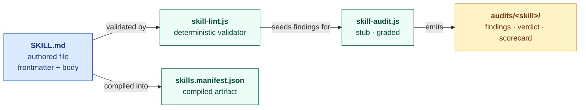
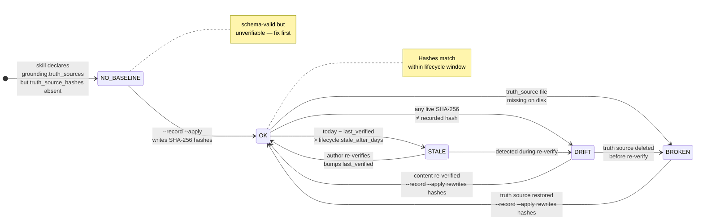
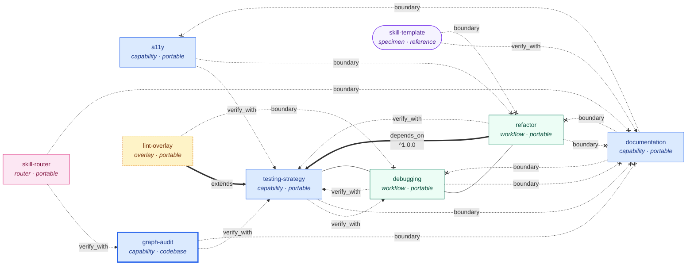
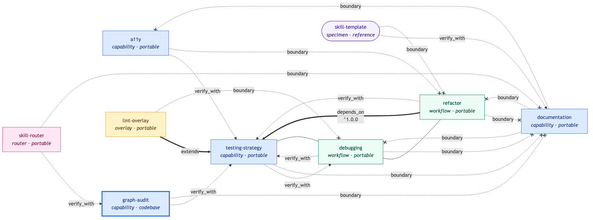

# Skill Graph Architecture

> **Read this if:** you want to understand how the ~70 files in this repo relate to each other, which file is authoritative when two files disagree, and why the contract doesn't silently drift.

Skill Graph is a contract-first project. The repo is organised in five authority tiers — each tier derives from the one above it, and tooling enforces the derivation automatically. When any two files appear to contradict each other, the tier with higher authority wins; the lower-tier file is a bug.

---

## System Model — how the pieces fit together

> **The question this diagram answers:** "What are the moving parts of Skill Graph, and who talks to whom?"

Before drilling into the five authority tiers, orient yourself on the five runtime entities you will actually interact with as an author or adopter. Every other diagram in the docs zooms into one of these boxes.

<!-- Rendered copy for non-Mermaid viewers. Regenerate via: npx @mermaid-js/mermaid-cli -i <source> -o docs/images/system-model.png -->

**Legend.** Blue = authored input. Green = tooling. Yellow = output artifact. Solid arrows are the data flow. Every entity in this diagram has its own deep-dive diagram: [§ Anatomy](metadata-contract.md#anatomy) for `SKILL.md`, [§ Loop at a Glance](library-audit-workflow.md#loop-at-a-glance) for `skill-audit.js`, [§ Manifest Contract](manifest-contract.md) for `skills.manifest.json`.

---

## The five tiers at a glance

| Tier | Role | When it's truth | What enforces the derivation |
|---|---|---|---|
| **1. Contract** | `schemas/*.json` | Always. These are the law. | — |
| **2. Explanation** | `docs/*.md` describing the schema | Until the schema disagrees. | `check-contract-consistency.js` C1, C2 |
| **3. Enforcement** | `scripts/*.js` that police + compile + transform | Run-time only; their output must match Tier 1 | `skill-lint.js` checks 6, 7, 8 |
| **4. Consumer** | `skill-graph-route`, `skill-graph-drift` | They USE Tier 1 to make decisions; they don't redefine anything | — |
| **5. Specimens** | `examples/` + `skills/` starters | Illustrative only. If they break the schema, they're wrong. | `skill-lint.js` checks 1–4 |

A sixth set of files — `README.md`, `CHANGELOG.md`, `CONTRIBUTING.md`, `LICENSE`, `.github/` — is **governance**, not a tier. These govern *the repo*, not the contract.

---

## Tier 1 — Contract (binding, machine-enforceable)

**If Tier 1 disagrees with anything below it, Tier 1 wins. Always.**

| File | Role |
|---|---|
| `schemas/skill.schema.json` | The frontmatter contract. Unversioned — tracks latest (v3 today). |
| `schemas/manifest.schema.json` | The compiled-manifest contract. Unversioned — tracks latest (v3 today). |
| `schemas/skill.v3.schema.json` | Pinned v3 copy. Consumers that want stability across a future v4 bump validate against this file. |
| `schemas/manifest.v3.schema.json` | Pinned v3 copy. Same rationale. |
| `schemas/skill.v2.schema.json` | **Frozen.** Retained for consumers still on v2. Never updated. |
| `schemas/manifest.v2.schema.json` | **Frozen.** Same rationale. |

Two rules govern this tier:

1. **Pinned copies must match the unversioned file modulo `$id` and `title`.** Enforced by C6 in `check-contract-consistency.js`. Drift is a CI failure.
2. **Frozen prior-version schemas must exist** but are not parity-checked. Freezing is the whole point of pinning.

---

## Tier 2 — Explanation (human-readable reflection of Tier 1)

Documents that describe the schemas in prose. If a Tier 2 file disagrees with Tier 1, Tier 2 is the bug — fix the doc, not the schema.

| File | Role |
|---|---|
| `docs/metadata-contract.md` | Authoritative overview: archetype section map, requiredness groups, strictness rules, schema versioning policy. |
| `docs/field-reference.md` | One section per authored field. All 29 v3 fields with purpose, rules, allowed values, examples. |
| `docs/field-decision-guide.md` | Decision tables for the hard choices: `scope`, `relations.*`, eval-health triple, `portability`, `project_tags`, and the "tag vs. category vs. routing_groups" question. |
| `docs/manifest-contract.md` | The authored → generated bridge: rename map, loss policy, per-version migration notes, worked example. |

Three rules govern this tier:

1. **Section headers in `field-reference.md` must exactly match the top-level properties of `skill.schema.json`.** Enforced by C1. A missing section or an orphan one is a CI failure.
2. **Every authored field must be covered in `manifest-contract.md`** (either in the rename map or the dropped-field list). Enforced by C2.
3. **The v2→v3 migration note in `manifest-contract.md`** must be accurate enough that an author running `migrate-skill-v2-to-v3.js` gets the same result the doc describes. Checked at release time via the worked example.

---

## Tier 3 — Enforcement and transformation tooling

Scripts that police Tier 1 (lint, consistency) or compile Tier 1's output (manifest, exports). These are Tier 1's automated watchdogs; their own output must agree with Tier 1.

### Authoring-time enforcement (runs per skill)

| File | Role |
|---|---|
| `scripts/skill-lint.js` | Eleven-check per-skill validator. Schema validation, parent-directory check, relation-target existence, eval coherence, archetype sections, routing quality, cross-schema parity, sample manifest conformance, generator parity, migration warnings. |
| `scripts/lint/check-archetype-sections.js` | Archetype-aware H2 section validator. Errors on missing required sections per archetype. |
| `scripts/lint/check-routing-quality.js` | Routing quality heuristics. R1: keywords required for codebase-scope or routing_groups skills. R2: description must not be duplicated verbatim in `## Coverage`. |
| `scripts/lint/format-code-frame.js` | Babel/Rust-style diagnostic formatter. |
| `scripts/lib/parse-frontmatter.js` | Minimal YAML parser. Handles quoted keys, block sequences, nested objects, block sequences of objects (v3 `boundary` / `depends_on` shape). |

### Cross-artifact enforcement (runs once per commit)

| File | Role |
|---|---|
| `scripts/check-contract-consistency.js` | Six checks (C1–C6): field-set parity, authored-to-generated parity, artifact-root convention, sample manifest correctness, example truth invariants, versioned schema parity. |

### Compilation and transformation

| File | Role |
|---|---|
| `scripts/generate-manifest.js` | Authored → compiled manifest compiler. Multi-root workspace aware via `.skill-graph/config.json`. Computes SHA-256 on truth sources for drift detection. |
| `scripts/export-skill.js` | Agent Skills export transform. Flattens the v3 `compatibility` object to a single 500-char string for the base standard. |
| `scripts/migrate-skill-v2-to-v3.js` | v2 → v3 codemod. Line-based — preserves author YAML style (comments, quoting, indentation). |

#### Pipeline — how a SKILL.md becomes a manifest entry

> **The question this diagram answers:** "How does `generate-manifest.js` project authored frontmatter into `skills.manifest.json`?"

```mermaid
flowchart LR
  Skills["<b>skills/&#42;/SKILL.md</b><br/>+ examples/skill-template.md<br/>authored frontmatter"]
  Config[".skill-graph/config.json<br/>workspace roots + projects<br/><i>optional — falls back to skills/</i>"]
  Parse["<b>parse-frontmatter.js</b><br/>YAML → object"]
  Rename["<b>generate-manifest.js</b><br/>apply rename map<br/>group under activation / health"]
  Hash["<b>SHA-256</b><br/>hash each grounding.truth_sources<br/>compute health.drift_detected"]
  Validate{{"<b>ajv + manifest.schema.json</b><br/>additionalProperties: false"}}
  Manifest["<b>skills.manifest.json</b><br/>compiled artifact"]

  Skills --> Parse
  Config -.-> Rename
  Parse --> Rename --> Hash --> Validate
  Validate -->|pass| Manifest
  Validate -->|fail| Error((("exit 1")))

  classDef input fill:#dbeafe,stroke:#2563eb,color:#1e3a8a
  classDef tool fill:#ecfdf5,stroke:#047857,color:#064e3b
  classDef gate fill:#fce7f3,stroke:#db2777,color:#831843
  classDef artifact fill:#fef3c7,stroke:#d97706,color:#78350f
  classDef err fill:#fee2e2,stroke:#b91c1c,color:#7f1d1d
  class Skills,Config input
  class Parse,Rename,Hash tool
  class Validate gate
  class Manifest artifact
  class Error err
```

<!-- Rendered copy for non-Mermaid viewers. Source: docs/diagrams/manifest-pipeline.mmd. Regenerate via: npx @mermaid-js/mermaid-cli -i docs/diagrams/manifest-pipeline.mmd -o docs/images/manifest-pipeline.png -b white --width 1600 -->

**Legend.** Blue = authored input. Green = tooling step. Pink = validation gate (hard-fail on additionalProperties). Yellow = the compiled artifact. Red = exit-1 on schema mismatch. The rename map this pipeline applies is the one documented in [`docs/manifest-contract.md § Rename Map`](manifest-contract.md#rename-map) — the diagram shows the topology, the manifest contract shows the field-level fates.

### Audit (hybrid enforcement/consumption)

| File | Role |
|---|---|
| `scripts/skill-audit.js` | Two-mode audit runner: stub mode (lint-seeded TODO findings) and `--graded` mode (external model CLI for per-dimension verdicts). |
| `scripts/lib/audit-prompt-builder.js` | Seven-dimension prompt composer for graded mode. |
| `scripts/lib/mock-grader.js` | Deterministic stand-in grader for CI smoke-tests without an API key. |

---

## Tier 4 — Reference consumer tooling

**This is the tentpole tier.** Every other skill format in the ecosystem stops at Tier 3 — they define a contract and ship a linter. Skill Graph is the only format that also ships tools that *use* the metadata to make visible decisions. These two files are the argument for why the extra metadata pays rent.

| File | Role |
|---|---|
| `scripts/skill-graph-route.js` | Graph-aware selector. Uses every unique Skill Graph field: `relations.depends_on` transitive closure, `relations.verify_with` co-loading, `relations.boundary` anti-ownership exclusion, `eval_state` quality gate, `lifecycle.stale_after_days` staleness annotation, `project_tags` filtering with workspace semantic-tag expansion. Emits per-skill reasons. |
| `scripts/skill-graph-drift.js` | Drift sentinel. Hashes every `grounding.truth_sources` entry with SHA-256; compares against the recorded `drift_check.truth_source_hashes` baseline; reports DRIFT / BROKEN / STALE / NO_BASELINE. `--record --apply` updates the SKILL.md in place with fresh hashes. |

These tools are the *proof* that Tier 1's schema earns its complexity. If you ever doubt whether `boundary` or `grounding.truth_sources` or `lifecycle` is worth the field count, run these scripts against a real skill library and watch them change routing decisions.

### Drift sentinel — state machine

> **The question this diagram answers:** "What state can `skill-graph-drift.js` put a skill in, and what transitions it?"

This is the single highest-leverage argument for the v3 `drift_check.truth_source_hashes` + `lifecycle.stale_after_days` fields. Without them the sentinel has nothing to compare against and nothing to time-box. With them every grounded skill sits in one of five states with explicit transitions.

<!-- Rendered copy for non-Mermaid viewers. Source: docs/diagrams/drift-states.mmd. Regenerate via: npx @mermaid-js/mermaid-cli -i docs/diagrams/drift-states.mmd -o docs/images/drift-states.png -b white --width 1400 -->

**Legend.** Five states; arrows are transitions with the trigger printed on them. `OK` is the only green state — every other state signals something the author must act on. `--record --apply` is the only author action that can write hashes back into the skill's frontmatter; every other transition is observed, not commanded. The `DRIFT → BROKEN` edge is the one nobody wants — a drifted claim silently outlives the file it was grounded in.

---

## Tier 5 — Specimens (worked examples that illustrate)

Concrete artifacts that show adopters what "good" looks like. Every specimen is derivable from the tiers above — but without them, the tiers above are abstract.

### Canonical specimen

| File | Role |
|---|---|
| `examples/skill-template.md` | Self-referential authoring template. Its subject is skill authoring itself. Demonstrates every v3 field including object-shaped `drift_check`, `compatibility`, `boundary[{skill, reason}]`, and `lifecycle`. |
| `examples/skills.manifest.sample.json` | Generator-produced sample. Drift-checked against live generator output by `skill-lint.js` check 8. |

### Starter skills

Eight starters, chosen to cover every archetype × scope combination that the schema permits:

| Skill | `type` | `scope` | Unique thing it demonstrates |
|---|---|---|---|
| `skills/a11y` | capability | portable | Minimal routable capability, eval artifact present |
| `skills/debugging` | workflow | portable | `## Workflow` section with numbered steps |
| `skills/documentation` | capability | portable | Eval artifact + worked audit both shipped |
| `skills/refactor` | workflow | portable | `relations.depends_on: [testing-strategy]` |
| `skills/testing-strategy` | capability | portable | `routing_groups: [quality]` |
| `skills/skill-router` | router | portable | Router archetype with `## Routing Rules` |
| `skills/lint-overlay` | overlay | portable | Overlay archetype with `extends` + `## Overlay Rules` |
| `skills/graph-audit` | capability | codebase | **The only starter with a full `grounding` block and recorded `truth_source_hashes`.** |

### Supporting artifacts

| Directory | Role |
|---|---|
| `examples/audits/` | Worked audit outputs (findings/verdict/scorecard) for `a11y`, `debugging`, `documentation`. |
| `examples/evals/` | Nine eval fixtures — one per starter + `comprehension.json`. |
| `examples/exports/` | Five round-trip Agent Skills exports demonstrating Tier 3's `export-skill.js` transform. |

---

## The starter graph — how the eight starters relate

> **The question this diagram answers:** "Who verifies whom, depends on whom, and boundaries whom out across the eight starter skills?"

Layer 7 of the authority model is the relations graph — the edges declared in each SKILL.md's `relations` frontmatter block. This is the worst failure mode when it drifts silently: the router fails *confidently* because a dangling target looks like a valid one. The diagram below indexes every relation edge in the starters without duplicating any L1 data. The authoritative relation data lives once, in each SKILL.md's frontmatter; this diagram reads it.

<!-- Rendered copy for non-Mermaid viewers. Source: docs/diagrams/starter-graph.mmd. Regenerate via: npx @mermaid-js/mermaid-cli -i docs/diagrams/starter-graph.mmd -o docs/images/starter-graph.png -b white --width 1600 -->

**Legend.** Node fill encodes archetype: blue = capability, green = workflow, pink = router, yellow-dashed = overlay, purple = specimen. A thick node stroke marks `scope: codebase` — only `graph-audit`; every other starter is `portable` and the template is `reference`. Edge styles: `==>` thick solid = `depends_on` (load-bearing) or `extends` (overlay inheritance — semantically stronger than `depends_on`); `-.->` dashed = `verify_with` (co-load for confidence); `---` thin = `adjacent` (suggested co-reading, no dependency); `-. boundary .-x` red-dashed = `boundary` (anti-ownership — the router must route elsewhere).

Every edge is verifiable. `node scripts/skill-lint.js` rejects dangling targets (see `skills/graph-audit/SKILL.md § Relation Integrity`); `node scripts/skill-graph-route.js` uses these edges at request time to decide which skill wins, which co-loads via `verify_with` or `depends_on`, and which is excluded via `boundary`. Regenerate the PNG when a starter is added or a relation block changes — the source is `docs/diagrams/starter-graph.mmd`.

---

## Governance (not a tier — sits outside the authority hierarchy)

| File | Role |
|---|---|
| `README.md` | Entry point; status; tiered tour (this document). |
| `CHANGELOG.md` | Keep-a-Changelog release history. |
| `CONTRIBUTING.md` | How to contribute. The tier a new file belongs to goes in the PR description. |
| `LICENSE` | MIT. |
| `.github/workflows/skill-graph-lint.yml` | CI: runs Tier 3 enforcement on every PR. |
| `docs/integrations/github-actions.md` | Copy-paste CI snippet for adopters. |
| `docs/single-skill-audit-checklist.md` | Checklist accompanying Tier 3 audit runner. |
| `docs/library-audit-workflow.md` | Repeated audit loop for a whole library. |
| `docs/plans/multi-root-workspace.md` | Shipped v0.4.0 design doc. |
| `docs/plans/scripts-roadmap.md` | Forward-looking script plan. |

---

## The invariants this structure guards

Because the tiers are ordered, a tiny set of invariants holds the whole repo together:

- **Tier 1 → Tier 2:** Every top-level property in `skill.schema.json` has a matching section in `field-reference.md`. (`check-contract-consistency.js` C1.)
- **Tier 1 → Tier 1 (pinned):** The current pinned schema is byte-identical to the unversioned schema modulo `$id` and `title`. (C6.)
- **Tier 1 → Tier 3 (generator):** Every authored field has a documented projection into the manifest — copied, grouped, or dropped. No silent drops. (C2.)
- **Tier 1 ↔ Tier 5 (sample manifest):** The committed sample manifest matches live generator output. (`skill-lint.js` check 8.)
- **Tier 5 → Tier 1:** Every starter skill validates against the schema; every relation target exists; every eval_artifact declaration is backed by a real file. (`skill-lint.js` checks 1–5.)

Break any one of these invariants and CI fails. That's why the tiering works: the enforcement tier (Tier 3) is literally the set of scripts that prove the upper and lower tiers agree.

---

## Adding something new — which tier does it go in?

| You want to add | Tier | Also touch |
|---|---|---|
| A new required field | 1 (schema) | 2 (field-reference.md, metadata-contract.md, manifest-contract.md rename map), 3 (generator if grouped; lint deprecation warning if renaming), 5 (template + at least one starter) |
| A new optional field | 1 (schema) | 2 (field-reference.md entry), 3 (generator flow-through), 5 (template if it demonstrates the new field) |
| A new lint rule | 3 (skill-lint.js or scripts/lint/) | — |
| A new tool that uses the manifest | 4 | README Reference consumer section |
| A new starter skill | 5 | Regenerate sample manifest |
| A new worked audit | 5 | — |
| A new integration guide | Governance | — |

When in doubt: if the file *defines* a constraint, it's Tier 1. If it *describes* a constraint, it's Tier 2. If it *enforces* a constraint, it's Tier 3. If it *uses* a constraint to make a decision, it's Tier 4. If it *illustrates* a constraint, it's Tier 5. If none of those fit, it's Governance.

---

## Further reading

- [`README.md`](../README.md) — the project overview; now structured by these same tiers.
- [`docs/metadata-contract.md`](metadata-contract.md) — the authoritative field-semantics doc; § Anatomy carries the Mermaid diagram of the SKILL.md three-layer composition (frontmatter × body × teaching layer).
- [`docs/manifest-contract.md`](manifest-contract.md) — the authored → generated bridge.
- [`docs/field-decision-guide.md`](field-decision-guide.md) — decision tables for hard field choices.
- [`docs/library-audit-workflow.md`](library-audit-workflow.md) — the repeatable audit loop; § Loop at a Glance carries the Mermaid diagram of the five-phase flow (deterministic → graded → aggregate → fix → re-verify).
- [§ Tier 3 — Pipeline](#pipeline--how-a-skillmd-becomes-a-manifest-entry) — how `generate-manifest.js` projects authored frontmatter into the compiled manifest.
- [§ Tier 4 — Drift sentinel state machine](#drift-sentinel--state-machine) — the five states a grounded skill sits in and what transitions them.
- [§ The starter graph](#the-starter-graph--how-the-eight-starters-relate) — Layer 7 indexed visually across all eight starters plus the template.
- [`CHANGELOG.md`](../CHANGELOG.md) — what shipped in each version.
