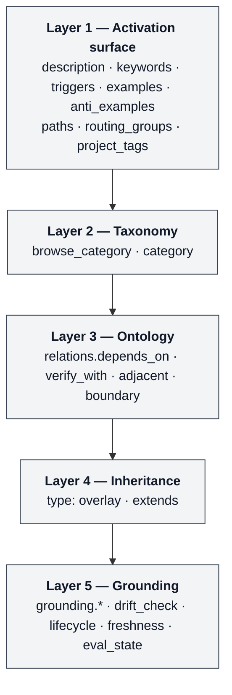

# Skill Graph Primer

> **Read this if:** you author Agent Skills and your library is large enough that skills have started to depend on, verify, or exclude one another. This primer is the conceptual introduction to the Skill Graph metadata contract. It is *explanation* documentation — it answers *what* and *why*. For reference material see `docs/field-reference.md`; for procedures see `CONTRIBUTING.md` and `docs/library-audit-workflow.md`; for decision tables see `docs/field-decision-guide.md`.

**Status.** Stable for `schema_version: 3`.
**Audience.** Skill authors who have hit at least one of these failures: (a) the agent picks the wrong skill on an ambiguous prompt; (b) a grounded skill cites a file that was rewritten and the skill is now lying; (c) you need to share some skills across two projects but not all. Library size is a proxy for this — these failures usually start around 5 skills, sometimes earlier if you have multiple projects, sometimes later for a single small project.
**Prerequisites.** Working familiarity with the [Agent Skills specification](https://agentskills.io/specification), including `SKILL.md` layout and the progressive-disclosure loading model.

## Related documents

| Document | Purpose |
|---|---|
| `docs/PRIMER.md` (this file) | Conceptual introduction: what Skill Graph is, when to adopt it, how the metadata composes |
| [`README.md`](../README.md) | Project overview, quick start, five-authority-tier tour |
| [`docs/ARCHITECTURE.md`](ARCHITECTURE.md) | Repo organisation: five **authority tiers** (contract / docs / tooling / consumer / specimen) and the invariants CI enforces |
| [`docs/metadata-contract.md`](metadata-contract.md) | Archetype section map, requiredness groups, schema strictness rules |
| [`docs/field-reference.md`](field-reference.md) | Per-field semantics for all 32 v3 fields |
| [`docs/field-decision-guide.md`](field-decision-guide.md) | Decision tables for `scope`, `relations.*`, eval-health, `portability`, `project_tags` |
| [`docs/manifest-contract.md`](manifest-contract.md) | The authored → generated bridge: rename map, loss policy, migration notes |
| [Agent Skills specification](https://agentskills.io/specification) | The base standard Skill Graph extends |

> **Terminology note.** This primer describes the **five metadata layers** inside a single skill's frontmatter (Activation, Taxonomy, Ontology, Inheritance, Grounding). Do not confuse these with the **five authority tiers** of the repository (contract, docs, tooling, consumer, specimen) described in `docs/ARCHITECTURE.md`. They are different fives at different scopes: metadata layers live inside one `SKILL.md`; authority tiers span the whole repo.

## Contents

1. [What is Skill Graph?](#1-what-is-skill-graph)
2. [When to adopt Skill Graph](#2-when-to-adopt-skill-graph)
3. [The metadata contract — five layers](#3-the-metadata-contract--five-layers)
4. [Structuring and indexing a library — four orthogonal axes](#4-structuring-and-indexing-a-library--four-orthogonal-axes)
5. [Where domain knowledge about tools, frameworks, and templates lives](#5-where-domain-knowledge-about-tools-frameworks-and-templates-lives)
6. [Routing — a worked example](#6-routing--a-worked-example)
7. [Portability back to base Agent Skills](#7-portability-back-to-base-agent-skills)
8. [What Skill Graph is not](#8-what-skill-graph-is-not)
9. [See also](#9-see-also)

---

## 1. What is Skill Graph?

**Skill Graph is the metadata contract for authoring skills grounded in your stack** — skills that know which files in your repository they describe, which other skills they depend on or verify with, which projects in your workspace they apply to, and what their current eval state is. The contract specifies 13 required and ~19 optional frontmatter fields that turn a folder of `SKILL.md` files into a structured library a router can reason over. The failure modes the contract addresses — wrong-skill routing on ambiguous prompts, silent staleness when a grounded file is rewritten, project-scope ambiguity in multi-project workspaces — are consequences of skills that don't yet have this structure.

Skill Graph is interoperable with [Agent Skills](https://agentskills.io/specification) via `scripts/export-skill.js`. The two are distinct contracts; the export lets a Skill Graph library be consumed by any Agent-Skills-compatible runtime.

It is a **contract**, not a runtime. This repository ships reference implementations of a linter (`scripts/skill-lint.js`), a manifest generator (`scripts/generate-manifest.js`), a router (`scripts/skill-graph-route.js`), and a drift sentinel (`scripts/skill-graph-drift.js`) so adopters have something to read, fork, or replace. A Skill Graph library can be consumed by any agent runtime that supports the base Agent Skills standard, at whatever level of Skill Graph awareness that runtime chooses to implement.

### At a glance

| | Agent Skills | Skill Graph |
|---|---|---|
| Required fields | 2 (`name`, `description`) | 2 (same) |
| Optional fields | 3 standard (`license`, `compatibility`, `allowed-tools`) | 30, grouped into 5 metadata layers |
| Validation | Not standardised | Deterministic schema + lint + manifest + drift |
| Routing model | Lexical (activation surface only) | Compound (all 5 layers) |
| Grounding to real artifacts | — | SHA-256 baselines + time-boxed freshness |
| Eval awareness | — | `eval_artifacts`, `eval_state`, `routing_eval` |
| Portability | N/A | One-way export to base Agent Skills via `scripts/export-skill.js` |

### Scope of this primer

The primer transmits the **mental model** needed to read the reference material without getting lost. It does not exhaust the contract; every field named here has a normative definition in `docs/field-reference.md`. Worked authoring procedures live in `CONTRIBUTING.md § Adding or modifying a skill`. Audit procedures live in `docs/library-audit-workflow.md`.

### How Skill Graph differs from marketplaces and runtimes

Before the four "not"s in section 8, here is what Skill Graph **is**, in relation to its closest neighbors in the 2026 AI-coding-context landscape:

| Neighbor | What it does | What Skill Graph does differently |
|---|---|---|
| **[Anthropic Agent Skills](https://www.claude.com/skills)** | A format for skill packaging — *"Build once, use everywhere"*, *"Stack skills for complex work."* | Skill Graph is a distinct contract that adds typed relations, drift detection, eval state, and project scoping. Round-trips to Agent Skills shape via `scripts/export-skill.js` for cross-runtime portability. |
| **[skillsmp.com](https://skillsmp.com)** | Aggregator marketplace — *"Discover open-source agent skills from GitHub."* The discovery surface for community skills. | Skill Graph is the contract a marketplace could enforce on the skills it aggregates. **A skillsmp search is for *finding* a skill; a Skill Graph library is for *managing* your team's expertise.** |
| **[skills.sh](https://skills.sh)** | Same category as skillsmp — *"The Open Agent Skills Ecosystem."* | Same distinction as skillsmp: discovery surface vs. library-management contract. |
| **[Cursor rules](https://cursor.com/docs)** (`.cursor/rules/*.mdc`) | Repo-behavior guardrails the IDE applies to every Cursor agent action. | Cursor rules are repo-behavior guardrails; Skill Graph is **skill-library structure** for the moment you have many skills to route, verify, and ground. The two solve different problems and complement each other in the same repo. |
| **CLAUDE.md / AGENTS.md** | Always-on plain-text repo conventions Claude Code or generic agent runtimes read at session start. | CLAUDE.md/AGENTS.md is *always-on* repo context (small, opinionated). Skill Graph is *on-demand* skill packaging (many, structured, routable). |

For the standalone reference covering every neighbor with pros/cons per axis, see [`docs/positioning-vs-marketplaces.md`](positioning-vs-marketplaces.md).

---

## 2. When to adopt Skill Graph

Skill Graph is materially more expensive to author and maintain than plain Agent Skills. Thirty-two frontmatter fields, SHA-256 baselines for grounded skills, cross-skill relation checks, and a time-boxed freshness claim are ongoing authoring work. The linter, manifest generator, and drift sentinel absorb the mechanics — they do not absorb the judgment of choosing the right relation predicate, re-baselining hashes when the underlying file is deliberately changed, or keeping `eval_state` honest.

### Adopt when any of the following describe your library

- **Two skills cover overlapping territory** and the agent routes to the wrong one on ambiguous prompts. `boundary` pushes the router off the wrong skill explicitly rather than relying on description re-ranking.
- **One skill is load-bearing for another** and you have silently broken the assumption by editing the parent. `depends_on` surfaces the breakage at lint time instead of at routing time.
- **One or more skills are grounded in specific repo files** and you have noticed the skill get stale the day after the file is rewritten. `drift_check.truth_source_hashes` catches that on the next lint run.
- **You run evals on skills** and want the router to respect quality, not just relevance. `eval_state` + `--min-eval-state passing` turns "we have evals" into "routing honours evals."
- **You are authoring skills for multiple projects** that share some and diverge on others. `project_tags` plus `.skill-graph/config.json` expansion gives you many-to-many project membership without naming specific codebases in the skill.

### Stay on base Agent Skills when

None of the above pressures is pushing on your library yet. The extra fields are overhead without a payoff until the library is large enough to produce the implicit graph in the first place.

---

## 3. The metadata contract — five layers

Skill Graph organises the frontmatter into **five metadata layers**. Each layer is a group of fields that answers a question the layer above it cannot. A flat keyword retriever sees only Layer 1; a graph-aware router reads all five and makes a compound decision.



**Legend.** Each box is the set of fields that constitute one layer. The arrows do not express runtime data flow; they express expressiveness — each layer reasons over strictly more than the one above it.

### Layer 1. Activation surface

**Purpose.** Free-text signals and overlapping tags — the words, patterns, and logical groupings a skill belongs to.

**Fields.** `description`, `keywords`, `triggers`, `examples`, `anti_examples`, `paths`, `routing_groups`, `project_tags`.

**What it answers.** *Does this skill activate for this query?* This is the **semantic layer** — text for lexical retrieval, exactly what Agent Skills ships with. It is useful for discovery and not sufficient for reasoning.

**What you do with this:** Tune `keywords` until the right skill activates on your test prompts. Adjust `description` when two skills compete for the same prompt. Add `examples` for prompts you've seen in production. Add `anti_examples` after the router has misfired — speculative anti_examples rarely match reality.

### Layer 2. Taxonomy

**Purpose.** Place the skill at exactly one position in a hierarchical tree.

**Fields.** `browse_category` (the top-level shelf, always required), `category` (the slash-delimited nested path, optional).

**What it answers.** *What kind of concern is this?* The tree carries meaning through nesting: `editor/linting/eslint-rules` says eslint-rules *is a kind of* linting *is a kind of* editor concern. Use `category` only when the library is large enough that a tree helps navigation (`docs/field-reference.md § category` recommends it past ~20 skills). A skill occupies exactly one taxonomic position — this is the difference between taxonomy and the multi-membership tag axes (see section 4).

**What you do with this:** Pick `browse_category` to file the skill on a top-level shelf (`engineering`, `quality`, `integration`, etc.). Add `category` only when your library is past ~20 skills and a tree helps readers navigate.

### Layer 3. Ontology

**Purpose.** Typed, machine-checkable relations between skills.

**Fields.** `relations.depends_on` (load-bearing prerequisite), `relations.verify_with` (co-load for confidence), `relations.adjacent` (suggested co-reading, non-load-bearing), `relations.boundary` (anti-ownership — route elsewhere).

**What it answers.** *How does this skill relate to the rest of the library?* The four predicates are not synonyms. `depends_on` closure is transitive; the linter enforces that targets resolve. `verify_with` is additive at selection — the router co-loads the verifier when the primary skill is picked. `boundary` excludes — a prompt covered by a boundary-listed skill is pushed off the current skill and onto the boundary target. `adjacent` is a hint without routing consequences. This is the layer that turns a skill collection into a graph an agent can reason over.

**What you do with this:** Add `boundary` when two skills cover the same prompt and you want the more-specific one to win. Add `verify_with` when one skill's verdict needs another skill's check before being trusted. Add `depends_on` when removing the target would silently break this skill at runtime. Use `adjacent` sparingly — most "often used together" links are better expressed as `verify_with` if the secondary skill should auto-co-load.

### Layer 4. Inheritance

**Purpose.** Express "this skill is a specialisation of that skill" as a single typed predicate with schema-level consequences.

**Fields.** `type: overlay` and `extends` (a sibling skill name).

**What it answers.** *Is this skill a specialised version of another skill?* Inheritance is its own layer rather than folded into Ontology because it carries a dual obligation: an ontological claim (*this is a kind of that*) *and* a schema-level constraint on body structure (overlay skills MUST carry `## Extends` and `## Overlay Rules` sections). The other four relation predicates do not impose body-structure obligations.

**What you do with this:** Use `extends` only when removing the parent would break the overlay's identity (the overlay is anti-rigid in OntoClean terms — it has no coherent meaning standalone). For "this is a kind of that" without existential dependency, use `relations.broader` instead — that's the OntoClean test (ADR 0003). The `lint-overlay` starter `extends: testing-strategy` because lint-overlay is meaningless without the base verification framework; `react-best-practices broader: [frontend]` because react-best-practices remains coherent if `frontend` is deleted.

### Layer 5. Grounding

**Purpose.** Tie an otherwise abstract skill to specific, hashable artifacts in the codebase, and report when those artifacts have changed.

**Fields.** `grounding.domain_object`, `grounding.grounding_mode`, `grounding.truth_sources`, `grounding.failure_modes`, `grounding.evidence_priority`, `drift_check.truth_source_hashes`, `lifecycle.stale_after_days`, `freshness`, `eval_state`.

**What it answers.** *Is what this skill claims still true?* Grounding is conditional on `scope: codebase` and is enforced by the schema. The drift sentinel (`scripts/skill-graph-drift.js`) SHA-256-hashes every listed `truth_source` and reports one of four states: `CLEAN`, `DRIFT`, `BROKEN` (file moved or deleted), or `NO_BASELINE` (hashes not recorded yet). `lifecycle.stale_after_days` time-boxes the freshness claim independently. This is the layer that turns an abstract ontology into a knowledge graph populated with real entities, and keeps the representation honest as those entities change.

**What you do with this:** Re-baseline `truth_source_hashes` after every deliberate edit to the source file (`node scripts/skill-graph-drift.js --record --apply <skill-dir>`). When the drift sentinel reports DRIFT, re-verify the skill's `## Verification` checklist against the changed truth source *before* re-recording — drift is a prompt to re-read the truth source, not to silently rubber-stamp the new hash.

### How the five layers compose into a routing decision

The reference router (`scripts/skill-graph-route.js`) reads all five layers and produces a single ranked result set. For a query `"accessibility keyboard navigation"` scoped to `--project <your-project>`:

1. **Layer 1** matches against `description`, `keywords`, `triggers`, `paths`. Non-matches are filtered out.
2. **`project_tags`** (Layer 1 field) filters further by workspace affiliation.
3. **Layer 3** expands the `depends_on` closure — any skill whose dependency is also matched is boosted; co-loads `verify_with` targets of selected skills.
4. **Layer 3** applies `boundary`: if a matched skill's boundary targets another skill that also matched, the boundary-owner absorbs the prompt and the boundary-loser is excluded.
5. **Layer 5** applies the quality gate. The default `--min-eval-state` is `unverified`, which admits everything; passing `--min-eval-state passing` excludes skills below that state. Staleness from `lifecycle.stale_after_days` is annotated on the result line (a `⚠ stale` marker), not used for exclusion.

Section 6 shows this in action with a real query.

---

## 4. Structuring and indexing a library — four orthogonal axes

Beyond the five metadata layers that express *meaning*, a library needs four independent axes for *structure and indexing*. These axes live inside Layers 1 and 2 but are worth calling out explicitly because adopters routinely confuse them. They are **orthogonal**: a single skill picks exactly one value of Scope and Taxonomy, and many values of the two tag axes.

| Axis | Field | Cardinality | Purpose |
|---|---|---|---|
| **Scope** | `scope` | Exactly one of `portable` \| `codebase` \| `reference` | *Where does this skill apply?* |
| **Taxonomy (hierarchy)** | `browse_category` + `category` | Exactly one position | *What kind of concern is this?* |
| **Domain affiliation (tag)** | `project_tags` | Many-to-many | *Which kinds of project is this relevant to?* |
| **Routing group (bundle)** | `routing_groups` | Many-to-many | *Which router-query-time bundle does this skill join?* |

The four axes compose without nesting. A single skill can be `scope: portable` with `browse_category: engineering`, `category: editor/linting/eslint-rules`, `project_tags: [ecommerce, b2b-saas]`, and `routing_groups: [quality, linting]` — each axis carries a different shape of answer, and the router uses them for different things.

### 4.1 Scope — *where does this apply?*

Three values, chosen at authoring time and enforced by the schema:

- **`portable`** — applies to any project. Most reusable skills (for example the starter `refactor` and `testing-strategy`) use this scope.
- **`codebase`** — applies to a specific repo. Triggers Layer 5 (Grounding): `truth_sources` and `drift_check.truth_source_hashes` become required, so the skill is pinned to the real artifacts it describes and the drift sentinel can catch silent divergence.
- **`reference`** — documentation-only. Kept out of the default routing pool (for example the `skill-template` scaffold). Opt in with `--include-template` when you deliberately want to route to it.

Scope is the first axis the router filters on and the only axis with body-structure implications (`grounding` is conditional on `scope: codebase`). For the full decision table, see `docs/field-decision-guide.md § 1. Which scope do I use?`.

### 4.2 Taxonomy — *what kind of concern is this?*

`browse_category` is the top-level shelf; `category` is the optional slash-delimited path beneath. Exactly one position per skill. Segments inherit meaning from the ones above them, so `editor/linting/eslint-rules` encodes a three-level kind-of hierarchy. This is the closest thing in the contract to a **taxonomical layer** in the classical sense — each skill sits at a unique address in a tree.

Use `category` only when the library is big enough that a tree helps navigation. Smaller libraries stay flat on `browse_category` alone.

### 4.3 Domain affiliation — *which kinds of project is this relevant to?*

`project_tags` is a many-to-many coarse-grained affiliation tag. A skill declaring `project_tags: [ecommerce]` becomes available to every project whose workspace `.skill-graph/config.json` lists `ecommerce` among its `semantic_tags`. Two projects that both declare the `ecommerce` tag share that skill without either naming the other. Multi-root workspaces union their `skill_roots` into a single manifest with each skill stamped by its owning project handle.

`project_tags` names the *kind of project* a skill applies to — **not** the specific codebase or the company that owns it. For per-codebase gating, put the codebase identifier in the workspace's `config.json`, not the skill's frontmatter.

### 4.4 Routing groups — *which query-time bundle does this skill join?*

`routing_groups` is a many-to-many logical grouping used **at router query time**, not at authoring. Adopters typically define 5-15 groups (`quality`, `security`, `design`, `ops`, etc.) and assign each skill to the one or two that best describe what it contributes. The consumer then runs router queries of the form *"return the best skill in group X whose other filters pass"* instead of trying to encode group membership in description text.

Unlike taxonomy (one position in a tree, strict hierarchy), routing groups are **overlapping logical bundles**. A single skill can belong to `quality`, `security`, and `design` simultaneously without that meaning anything about a hierarchy.

### 4.5 When axes collide

If two axes appear to answer the same question for your skill, pick by cardinality:

- **One answer?** Use Scope or Taxonomy.
- **Many answers along a "which projects apply" dimension?** Use `project_tags`.
- **Many answers along a "which retrieval bundle" dimension?** Use `routing_groups`.

If an adopter-specific concept doesn't fit any of the four axes, the activation surface (`keywords`, `triggers`) is the escape valve. Do not stretch `project_tags` or `routing_groups` into a new meaning.

---

## 5. Where domain knowledge about tools, frameworks, and templates lives

Beyond the four structuring axes, three categories of domain knowledge have dedicated homes in the frontmatter:

**Features and tools** live on the activation surface: `keywords`, `triggers`, `paths`, plus `allowed-tools` (the space-separated tool allowlist Agent Skills inherits from the base standard) for runtime gating. A skill that operates on `.tsx` files declares `paths: ["**/*.tsx"]`; a skill that should only activate when `jest` is in the prompt declares it in `triggers`.

**Frameworks and patterns** live in the relations graph (Layer 3). `depends_on` is the right edge for "you cannot apply this pattern responsibly without that framework in place" — the starter `refactor` skill declares `depends_on: [testing-strategy]` for exactly this reason. `extends` (Layer 4) is the right edge for "this is a specialisation" — the `lint-overlay` starter extends `testing-strategy`. `adjacent` is for "these are worth reading together" without load-bearing dependency.

**Templates** live in the specimen tier of the repo (Tier 5 per `docs/ARCHITECTURE.md`): `examples/skill-template.md` is the self-referential authoring template, and the overlay archetype is the contract's templating mechanism. Adopters fork the template and tighten its frontmatter; the teaching layer (`> **TEMPLATE NOTE:**` blockquotes and `# TEMPLATE NOTE:` YAML comments) is stripped from derived skills before shipping.

---

## 6. Routing — a worked example

The claim that authored edges buy the consumer something needs proof. This section shows it in runnable form.

### 6.1 The smallest conforming Skill Graph skill

```yaml
---
schema_version: 3
name: my-skill
description: "Use when <concrete situation>. Covers <A, B, C>. Do NOT use for <D, E>."
---
# my-skill

Body content...
```

This validates. It is also a Skill Graph skill in name only — no relations, no grounding, no eval health — and it routes exactly as a plain Agent Skills skill does. Skill Graph does not penalise you for authoring minimally.

### 6.2 A skill that uses Layers 3 and 5

The `refactor` starter skill reduced to its load-bearing fields:

```yaml
---
schema_version: 3
name: refactor
description: "Use when reorganizing existing code without changing external behavior..."
type: workflow
browse_category: engineering
scope: portable
eval_state: passing
relations:
  depends_on: [testing-strategy]      # cannot refactor responsibly without a green suite
  verify_with: [testing-strategy]     # re-run after the refactor to prove behavior preserved
  boundary: [debugging, testing-strategy]  # these absorb prompts listed in anti_examples
---
```

### 6.3 Routing trace — prompt lands on `refactor`

```
$ node scripts/skill-graph-route.js "clean up this duplicated logic"
SELECTED  refactor            eval_state=passing    triggers+paths match
VERIFY    testing-strategy    eval_state=passing    verify_with of refactor
```

Three things happened that a description-only retriever could not do:

1. `refactor` was selected on Layer 1 lexical match.
2. `testing-strategy` was co-loaded from Layer 3 because `refactor.relations.verify_with` names it. The agent now has the pre/post guard for behavior preservation in context without the user asking for it.
3. No exclusion fired this run, but the `boundary` edge would have fired on a different prompt — see 6.4.

### 6.4 Routing trace — same library, different prompt, different decision

```
$ node scripts/skill-graph-route.js "the test is failing after my edit"
SELECTED  debugging           eval_state=passing    triggers+paths match
EXCLUDED  refactor            boundary: debugging absorbs this prompt
```

Same library, same manifest, same metadata. Different compound decision. The router explains *why* one skill was chosen and another was not, in a form a human can audit and a CI check can assert on.

### 6.5 Routing trace — boundary edge fires on a webhook prompt

Same pattern, different domain. Imagine an adopter library with `webhook-review` (capability, codebase-grounded), `owasp-security` (capability, listed as `verify_with` of `webhook-review`), and `documentation` (capability, listed in `webhook-review.boundary` because docs would otherwise absorb the prompt).

A query about a specific Stripe webhook signature failure routes like this:

```
$ node scripts/skill-graph-route.js "why is the stripe webhook intermittently rejecting valid signatures"
SELECTED  webhook-review     eval_state=passing    keyword:stripe webhook, keyword:signature
VERIFY    owasp-security     eval_state=passing    verify_with of webhook-review
EXCLUDED  documentation      —                     in boundary[] of webhook-review: documentation writes prose ABOUT webhook patterns; webhook-review is the verification primitive in code
```

Three layers fired in one query:

1. **Layer 1** lexical match selected `webhook-review` on two keyword tokens.
2. **Layer 3 `verify_with`** co-loaded `owasp-security` because `webhook-review` declares it as a verifier — the agent now has the security checklist alongside the implementation review.
3. **Layer 3 `boundary`** excluded `documentation` because `webhook-review.boundary` explicitly says "documentation writes prose; this skill is the primitive in code." Without that boundary, `documentation` might have outscored `webhook-review` on a query mentioning "review" — the boundary edge prevents that misroute.

This trace pattern is how the `payment-provider-router` specimen at [`examples/projects/saas-stripe-postgres/skills/payment-provider-router/`](../examples/projects/saas-stripe-postgres/skills/payment-provider-router/SKILL.md) works in concept; install the specimens into your own `skills/` and the same trace runs against them.

---

## 7. Portability back to base Agent Skills

Every valid Skill Graph skill can be transformed back to a base Agent Skills file via `scripts/export-skill.js`. This is the compatibility safety valve: adopting Skill Graph does not trap you in the format.

**The caveat.** Portability is **one-way**. `agent-skills` is the only value the contract currently recognises for `portability.targets`, and Skill Graph's richer structure — typed relations, grounding anchors, drift hashes, overlay inheritance — is flattened or dropped on export. The exported file runs on any runtime that reads base Agent Skills; it cannot be round-tripped back into a Skill Graph skill without re-authoring the lost fields.

Exporting is appropriate for publishing a skill to a runtime that does not yet read Skill Graph metadata. It is not appropriate for migrating a library off Skill Graph once you've committed to the contract — the information loss is permanent in the exported artifact.

---

## 8. What Skill Graph is not

The positive identity is in [§1 — How Skill Graph differs from marketplaces and runtimes](#how-skill-graph-differs-from-marketplaces-and-runtimes). For completeness, the brief negative summary:

- **Not a prompt library.** Skill Graph does not distribute skills or prompts. It describes the metadata format for skills a library already contains.
- **Not a skill marketplace.** There is no registry, no discovery service, no hosted index — see skillsmp.com or skills.sh for that surface.
- **Not an agent runtime.** The contract is consumed by agent runtimes; it is not one.
- **Not a second skill format competing with Agent Skills.** Every valid Skill Graph skill is also a valid Agent Skills skill for the two required fields, and can be exported to base Agent Skills (section 7).
- **Not a tutorial.** For "how do I author my first skill," see [`docs/QUICKSTART-30MIN.md`](QUICKSTART-30MIN.md) and `CONTRIBUTING.md § Adding or modifying a skill`.
- **Not exhaustive.** This primer transmits the mental model. Normative field semantics live in `docs/field-reference.md`; archetype section maps live in `docs/metadata-contract.md`; contract invariants live in `docs/ARCHITECTURE.md`.

---

## 9. See also

**Recommended reading order for a newcomer:**

1. `README.md` — project overview and quick start
2. `docs/PRIMER.md` — this file
3. `docs/ARCHITECTURE.md` — repo organisation and the five authority tiers
4. `docs/field-decision-guide.md` — decision tables you will consult while authoring
5. `docs/metadata-contract.md` — archetype section maps and strictness rules
6. `docs/field-reference.md` — per-field reference (bookmark, don't read linearly)

**External specification:** [Agent Skills](https://agentskills.io/specification) — the base standard Skill Graph extends.

**Reference implementations** (this repo):
- `scripts/skill-lint.js` — deterministic validator (schema, relations, evals, parity)
- `scripts/generate-manifest.js` — compile library to `skills.manifest.json`
- `scripts/skill-graph-route.js` — reference graph-aware router
- `scripts/skill-graph-drift.js` — reference drift sentinel
- `scripts/skill-audit.js` — stub + graded audit harness
- `scripts/export-skill.js` — one-way export to base Agent Skills
