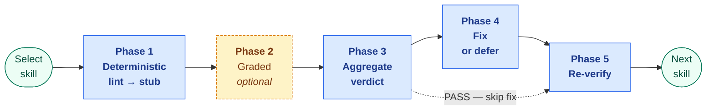
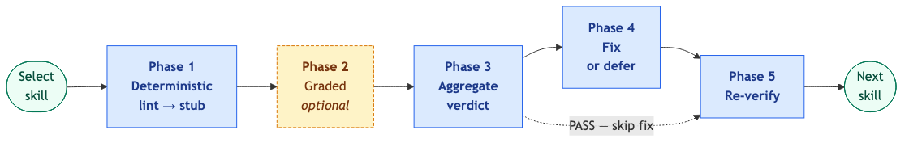
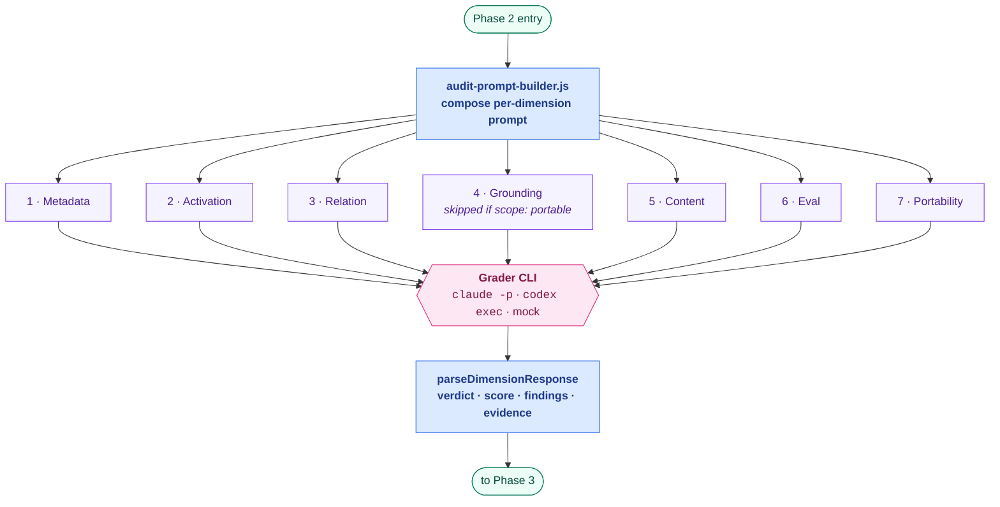
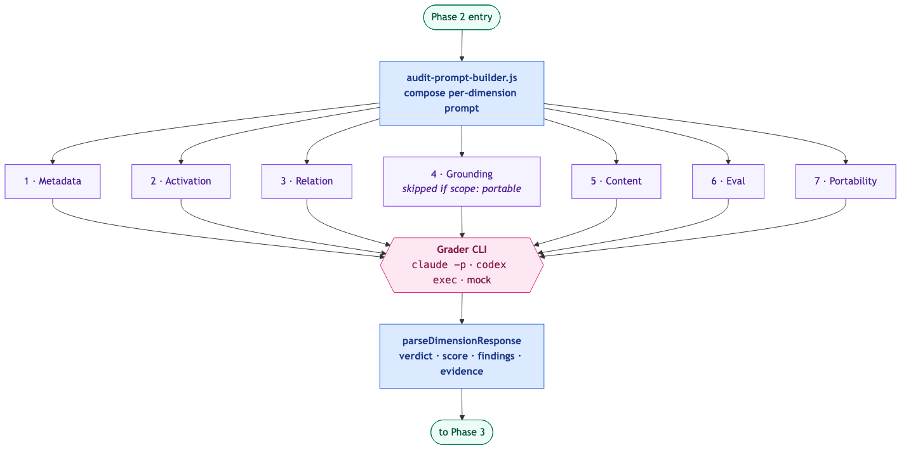

# Skill Audit Loop

This document standardizes the repeatable loop for auditing many skills in Skill Graph.

## Goal

The loop exists to keep a skill library healthy over time.

It should continuously detect:

- metadata drift
- routing drift
- relation drift
- stale grounding
- weak eval coverage
- portability hazards

## Loop Principles

1. One skill at a time
2. Deterministic checks first
3. Human judgment second
4. Fix confirmed drift in the same pass when practical
5. Keep artifacts small and standardized

## Loop Inputs

The loop consumes:

1. `SKILL.md`
2. any eval files
3. referenced truth sources
4. manifest output
5. deterministic lint/census results

## Loop Outputs

The loop should emit:

1. audit report
2. scorecard or verdict file
3. optional fix patch
4. updated manifest if inventory changed

The minimum concrete file set is:

```text
audits/<skill-name>/findings.md
audits/<skill-name>/verdict.md
```

## Loop at a Glance

> **The question this diagram answers:** "What are the phases of an audit, and which are optional?"

Five phases, left to right. Phase 2 (Graded) is the only optional one — stub mode skips it and hands qualitative work to the human. Every other phase runs on every iteration.



<!-- Rendered copy for non-Mermaid viewers. Regenerate via: npx @mermaid-js/mermaid-cli -i <source> -o docs/images/audit-phases.png -->


**Legend.** Blue solid = mandatory phase. Yellow dashed = optional phase. Green ovals = loop endpoints. The dashed arrow from Phase 3 to Phase 5 is the PASS shortcut — when the verdict is clean, there is nothing to fix.

**What each phase owns:**

- **Phase 1 — Deterministic** (always runs). `scripts/skill-lint.js` runs schema validation, relation-target existence, eval coherence, archetype section presence, and routing quality. Writes stubbed `findings.md` / `verdict.md` / `scorecard.md` with P1 lint errors and P2 warnings pre-populated and qualitative dimensions left as human TODO.
- **Phase 2 — Graded** (only under `--graded`). Dispatches seven per-dimension prompts to a grader CLI; see the zoomed diagram below.
- **Phase 3 — Aggregate**. `aggregateVerdict` combines the seven dimension verdicts into one final verdict ∈ {`PASS`, `PASS WITH FIXES`, `PARTIAL`, `FAIL`}. Any `FAIL` dominates; any `PASS WITH FIXES` dominates otherwise; all-`PASS` yields `PASS`.
- **Phase 4 — Fix or defer**. Fix in-pass when the issue is localized, confirmed, low-risk, and inside the skill or its metadata. Defer explicitly with rationale otherwise.
- **Phase 5 — Re-verify**. Re-run `skill-lint.js`, regenerate manifest if touched, confirm fixes stick, update `drift_check.last_verified`.

### Graded mode, zoomed in

> **The question this diagram answers:** "What happens inside Phase 2 when `--graded` is set?"

The graded phase dispatches one prompt per scorecard dimension, collects the structured responses, and merges the verdicts. The fan-out is the whole point: each dimension is graded in isolation so a weak dimension does not hide behind a strong one.



<!-- Rendered copy for non-Mermaid viewers. Regenerate via: npx @mermaid-js/mermaid-cli -i <source> -o docs/images/graded-mode.png -->


**Legend.** Blue = prompt composition and response parsing (mechanical). Purple = individual dimension prompts. Pink = the external grader CLI, user-configurable via `--grader-cli`. Green ovals = entry/exit handoffs to the main loop.

### Which phase writes to which artifact?

The three artifact files are append-only across phases. Tracing where any line came from:

- **Phase 1 (stub seeding)** — writes initial `findings.md` (lint P1/P2), `verdict.md` (FAIL if lint errors, PASS WITH FIXES otherwise), and `scorecard.md` (metadata auto-scored from lint, others TODO).
- **Phase 2 (graded overwrite)** — replaces the qualitative TODO sections in `findings.md` / `verdict.md` / `scorecard.md` with grader-emitted verdicts + evidence quotes. Metadata row stays lint-sourced.
- **Phase 3 (aggregate)** — writes the final verdict into `verdict.md § Final Verdict` and the dimension summary table into `scorecard.md`.
- **Phase 4 (fix)** — appends a Follow-up State note to `verdict.md` naming each fix applied or deferred with rationale.
- **Phase 5 (re-verify)** — no artifact writes; updates `drift_check.last_verified` in the skill's own `SKILL.md` frontmatter.

Artifact roots: `examples/audits/<skill>/` for curated worked examples shipped with this repo; `audits/<skill>/` for downstream adopter output. See [Recommended Artifact Layout](#recommended-artifact-layout) for the two-tier convention.

## Standard Loop

### Step 1. Select a skill

Choose a skill from the active library.

Selection strategies:

- highest drift risk
- lowest eval coverage
- highest routing centrality
- newest or least stable skills

### Step 2. Run deterministic checks

Run the local health tooling first. The stub generator combines Steps 2 and 9
into a single command — it runs lint for you, parses the output, and writes the
three artifact stubs with lint findings pre-populated so you can focus on the
qualitative sections:

```bash
node scripts/skill-audit.js <skill-name>
# options:
#   --audit-root <path>   default: examples/audits/ (use audits/ for downstream output)
#   --force               overwrite existing artifacts
```

The command produces `<audit-root>/<skill-name>/{findings,verdict,scorecard}.md`
with lint errors and warnings stubbed as P1/P2 findings and all qualitative
dimensions left as TODO placeholders for human review. See "## Stub Generator"
below for the full behaviour reference.

Typical manual checks (when running the loop without the stub generator):

1. frontmatter/schema validation
2. manifest regeneration
3. overlap/conflict detection
4. routing coverage checks
5. broken reference checks

### Step 3. Read the skill as a contract

Read the skill itself and classify it:

1. what kind of skill is this?
2. what decision is it supposed to help with?
3. what mistake is it supposed to prevent?
4. what would go wrong if it drifted?

### Step 4. Apply the Skill Audit Checklist

Use `docs/single-skill-audit-checklist.md` as the canonical audit checklist.

### Step 5. Verify grounding

When the skill is grounded to code, routes, or external reference truth:

1. check every truth source exists
2. check claims still match the source
3. classify mismatches as either:
   - skill drift
   - code drift
   - documentation drift

### Step 6. Evaluate routing quality

Review whether the skill is likely to activate correctly.

Check:

1. description specificity
2. keyword quality
3. trigger quality
4. path precision
5. under-triggering or over-triggering risks

### Step 7. Evaluate relation quality

Check:

1. adjacency makes sense
2. boundary rules are crisp
3. verification partners are current
4. dependencies are real

### Step 8. Grade the skill

Use a simple OSS verdict model.

| Verdict | Meaning |
|---|---|
| PASS | healthy, no meaningful drift |
| PASS WITH FIXES | healthy after in-pass fixes |
| PARTIAL | useful but still incomplete |
| FAIL | not safe or not useful enough in current form |

### Step 9. Write artifacts

Minimum artifacts:

1. findings report
2. verdict summary

Optional artifacts:

1. scorecard
2. updated manifest snapshot
3. migration notes

Use the standard file names and section structures from `docs/single-skill-audit-checklist.md`.

### Step 10. Fix what is safe to fix now

Fix in the same pass when the issue is:

- localized
- confirmed
- low-risk
- inside the skill or its metadata

Defer only when the issue requires larger codebase or governance changes.

### Step 11. Re-run deterministic verification

After changes:

1. re-run schema validation
2. re-run manifest generation if needed
3. re-run any affected lint/overlap checks

### Step 12. Mark completion

A loop iteration is done when:

1. verdict is written
2. findings are recorded
3. fixes are applied or deferred explicitly
4. verification was re-run after changes

## Recommended Artifact Layout

Skill Graph uses a two-tier artifact root convention:

| Root | When to use |
|---|---|
| `examples/audits/<skill-name>/` | Shipped, curated worked examples that travel with the repo (e.g. the `documentation` audit in this repo). These are reference artifacts for adopters. |
| `audits/<skill-name>/` | Downstream consumer output — audit artifacts produced by adopters running the loop against their own skill libraries. These do not belong in the Skill Graph repo itself. |

The minimum concrete file set under either root is:

```text
<root>/<skill-name>/
    findings.md
    verdict.md
    scorecard.md   (optional but strongly recommended)
```

## Artifact Content Contract

### `findings.md`

Must contain:

1. audited skill name
2. date of audit
3. final verdict summary
4. every finding with severity and evidence
5. required fixes list

### `verdict.md`

Must contain:

1. audited skill name
2. final verdict using the canonical verdict vocabulary
3. short rationale
4. explicit statement of whether fixes were applied, deferred, or unnecessary

### `scorecard.md`

When present, it must score these exact dimensions:

1. Metadata validity
2. Activation quality
3. Relation quality
4. Grounding fidelity
5. Content quality
6. Eval quality
7. Portability quality

## Standard Scorecard Dimensions

Use these dimensions if you want a richer audit output.

| Dimension | Question |
|---|---|
| Metadata validity | Is the frontmatter contract valid? |
| Activation quality | Will the skill activate when it should? |
| Relation quality | Are graph relations useful and correct? |
| Grounding fidelity | Do claims match truth sources? |
| Content quality | Is the skill dense, clear, and actionable? |
| Eval quality | Does the skill have meaningful evaluation coverage? |
| Portability quality | Can the skill travel without losing its meaning? |

## Stub Generator

`scripts/skill-audit.js` accelerates the audit loop by seeding the three
artifact stubs from lint output. It is the recommended entry point for Steps 2
and 9 of the loop.

### What it does

1. Validates that `skills/<skill-name>/SKILL.md` exists.
2. Runs `scripts/skill-lint.js skills/<skill-name> --no-color --skip-generator-parity`
   and captures stdout, stderr, and exit code.
3. Parses the lint output into `(file, line, col, severity, message)` tuples.
4. Writes three stubs under `<audit-root>/<skill-name>/`:
   - `findings.md` — one finding per lint diagnostic (P1 for errors, P2 for
     warnings) plus five human-judgment TODO sections (activation, relations,
     grounding, content, evals).
   - `verdict.md` — FAIL when lint errors exist, PASS WITH FIXES otherwise;
     always includes a "Human Judgment Required" section.
   - `scorecard.md` — schema validity auto-scored from lint; all other
     dimensions are TODO. Grounding row is N/A when `scope: portable`.

### What it does NOT do

- It does not automate any qualitative judgment.
- It does not modify the skill being audited.
- It does not run the full lint suite (generator parity and sample manifest
  checks are skipped — those run against the whole library, not one skill).

### CLI reference

```bash
node scripts/skill-audit.js <skill-name>
node scripts/skill-audit.js <skill-name> --audit-root <path>
node scripts/skill-audit.js <skill-name> --force
```

| Flag | Default | Effect |
|---|---|---|
| `<skill-name>` | required | Must match a directory under `skills/` |
| `--audit-root <path>` | `examples/audits/` | Destination root for the three stubs |
| `--force` | off | Overwrite any existing artifact files |

The tool exits 1 if the skill directory does not exist, if any of the three
output files already exist (without `--force`), or if argument parsing fails.

### Audit-root convention

| Root | When to use |
|---|---|
| `examples/audits/<skill-name>/` | Shipped, curated worked examples (this repo) |
| `audits/<skill-name>/` | Downstream consumer output (adopters' own libraries) |

Use `--audit-root audits/` when running the loop against a skill library that
is not the Skill Graph repo itself.

### Typical workflow

```bash
# 1. Seed the stubs
node scripts/skill-audit.js my-skill

# 2. Open findings.md and complete the human-judgment TODO sections

# 3. Update verdict.md with the final verdict once all sections are reviewed

# 4. Fill in scorecard.md scores (replace TODO with 1–5 + justification)

# 5. Re-run lint to confirm any fixes are clean
node scripts/skill-lint.js skills/my-skill
```

## Standard Cadence

Suggested cadence for a living library:

- every change: deterministic validation
- weekly: routing drift + overlap review
- monthly: deep per-skill audits for high-value skills
- before release: full-library health sweep

## Non-Goals

This loop does not require:

- a separate issue tracker integration
- a dashboard or control plane
- a proprietary quality rubric beyond the checklist
- any runtime beyond a markdown reader and a JSON Schema validator

Adopters can layer any of these on top without changing the loop itself.
