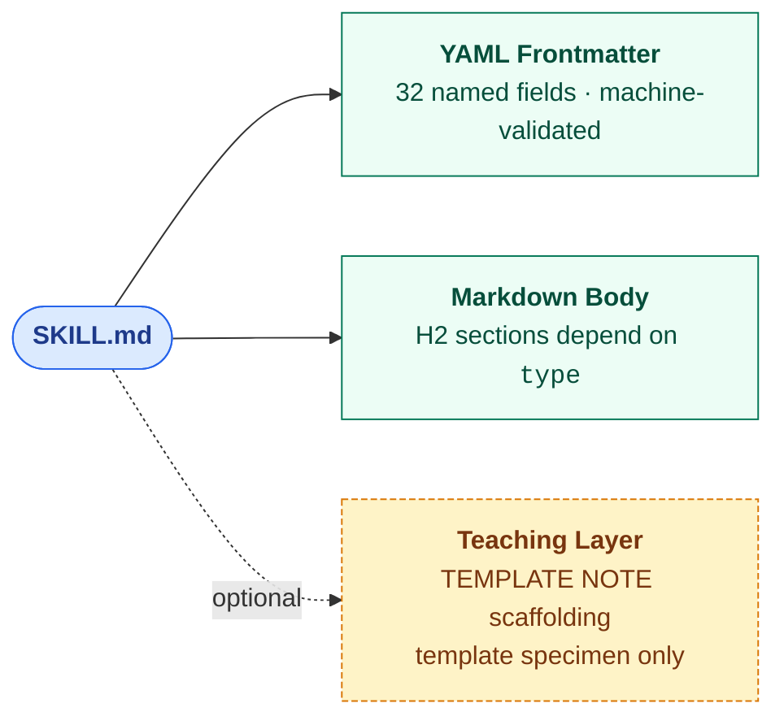

# Skill Graph Metadata Contract

> **Migrating from an older schema?** Jump straight to the migration notes:
> - [v2 → v3](manifest-contract.md#migration-note--v2--v3-v040) — `drift_check` scalar → object, `compatibility` scalar → object, `family` → `browse_category`, new optional fields
> - [v1 → v2](manifest-contract.md#migration-note--v1--v2-sh-5784) — `scope` enum rename, `eval_status` split into three fields, `route_groups` → `routing_groups`
> - Codemod: `node scripts/migrate-skill-v2-to-v3.js` upgrades v2 skills in place
> - Planned v3 → v4 changes (ADR 0001, ADR 0004): `adjacent`/`boundary` removed in favour of `related`/`disjoint_with`; `urn` becomes required

## Related Documents

| Document | Purpose |
|---|---|
| `docs/metadata-contract.md` (this file) | Overview, archetype map, requiredness groups, schema strictness rules |
| `docs/field-reference.md` | One section per authored field — purpose, rules, examples, when to use |
| `docs/field-decision-guide.md` | Decision tables for `scope`, `relations.*`, and the eval-health fields (`eval_artifacts`, `eval_state`, `routing_eval`) / `portability` |
| `docs/concept-map.md` | Teaching map — 32 authored fields grouped by conceptual role; drift log vs earlier framings |
| `docs/manifest-contract.md` | Authored-to-generated bridge: rename map, loss policy, worked example |
| `docs/adr/` | Architecture decision records — 0001 predicate set, 0002 JSON-LD @context, 0003 OntoClean rigidity tags, 0004 persistent identifiers |
| `schemas/skill.context.jsonld` | JSON-LD @context mapping every authored field to W3C vocabularies (SKOS, Dublin Core, PROV-O) |
| `schemas/vocabulary/` | Controlled vocabularies for `keywords` (canonical + synonyms) and `project_tags` (literal handles + semantic tags) — advisory, surfaced as lint warnings |

## Design Principles

This contract is the public source of truth for the Skill Graph frontmatter format.

It:
- keeps a flat author-facing frontmatter format
- keeps one `SKILL.md` file per skill
- keeps one generated manifest downstream
- tightens field semantics
- adds a small number of high-value fields beyond the Agent Skills base
- stays additive to the Agent Skills standard so every Skill Graph skill can be transformed back to the base shape

### What kind of graph is this?

Skill Graph is a **property graph with a controlled-vocabulary set of typed predicates**, not an RDF knowledge graph. Nodes are skills; edges are keys inside `relations.*`; node attributes are the 32 authored frontmatter fields. The JSON-LD `@context` at `schemas/skill.context.jsonld` projects the property graph into SKOS / Dublin Core Terms / PROV-O triples for consumers that want RDF semantics, but authoring stays in flat YAML.

Skill Graph does **not** promise:

- Automated inference (no OWL reasoner runs against the graph)
- Open-world consistency checking (the schema closes it via `additionalProperties: false`)
- SPARQL queryability as the primary interface (get that by applying the JSON-LD `@context` first)

What it does promise: deterministic lint, manifest generation, relation-aware routing, drift detection against content-addressable truth sources, and portable export to Agent Skills.

### Drift-check hash semantics

`drift_check.truth_source_hashes` maps each truth-source **file path** (never a directory) to the **SHA-256 hex digest of the file content** at the time of last verification. The digest is computed over the raw byte stream of the file, not a normalisation of it — line endings, trailing whitespace, and encoding are all hashed as-is. The drift sentinel (`scripts/skill-graph-drift.js`) reports `DRIFT` when the live hash differs from the recorded hash, `BROKEN` when a declared truth source is missing from disk, `STALE` when `today - drift_check.last_verified > lifecycle.stale_after_days`, and `NO_BASELINE` when truth sources are declared but no hashes are recorded. To add a baseline: `node scripts/skill-graph-drift.js --record --apply <skill-path>`.

### Overlay composition precedence

When `type: overlay` and `extends: <parent-skill>`, the overlay's authored fields **override** the parent's fields on a per-field basis. There is no field-level merge — a field present on the overlay replaces the same field on the parent entirely. The overlay body sections (`## Coverage`, `## Overlay Rules`, `## Extends`, `## Do NOT Use When`) stand on their own and do not inherit prose from the parent. This mirrors OntoClean specialisation: the overlay is anti-rigid (-R) and existentially dependent (+D) on the parent, but the overlay's *content* is authoritative within its own SKILL.md (ADR 0003). Consumers resolving an overlay at routing time:

1. Load the overlay's frontmatter as the effective skill metadata.
2. Treat the parent's metadata as context — available for reference but not merged.
3. Apply the overlay's `## Overlay Rules` as modifications to the parent's behaviour, scoped to the overlay's `## Coverage`.

If an overlay needs to *add* rather than *replace* a field's value (e.g. add keywords), author the full intended set in the overlay — the schema does not offer additive inheritance. Future work under ADR 0001 may introduce explicit merge strategies; today the rule is overlay-wins-per-field.

## Relationship to the Agent Skills Standard

Skill Graph extends the [Agent Skills](https://agentskills.io/specification) open standard with a richer authoring contract. The base standard requires two frontmatter fields (`name` and `description`) and defines four optional fields (`license`, `compatibility`, `metadata`, `allowed-tools`). Skill Graph keeps the two required base fields and three of the four optional base fields (`license`, `compatibility`, `allowed-tools`) as top-level Skill Graph fields — though `compatibility` is tightened from a free-text string to a structured object, and `name` allows `/` and `:` for namespacing. It does not use the base `metadata` field; Skill Graph promotes its own extensions to additional named top-level fields instead.

A Skill Graph SKILL.md is *not* automatically a valid Agent Skills file: the `compatibility` shape and `name` pattern diverge. The export transform at `scripts/export-skill.js` produces a `SKILL.agent-skills.md` that is valid against the base standard — flattening `compatibility` to a string and nesting Skill Graph's extension fields under the base `metadata:` key. Round-trip parity is via the export transform, not via direct schema compatibility.

| Field | Source | Skill Graph treatment |
|---|---|---|
| `name` | Agent Skills required | Kept as required; Skill Graph tightens the character pattern |
| `description` | Agent Skills required | Kept as required; scoped to routing |
| `license` | Agent Skills optional | Kept top-level; strongly recommended for shared skills |
| `compatibility` | Agent Skills optional | Kept top-level; optional |
| `allowed-tools` | Agent Skills optional | Kept top-level as a space-separated string |
| `metadata` | Agent Skills optional | Not used at the top level; Skill Graph promotes extensions to named fields |
| `schema_version`, `version`, `type`, `browse_category`, `scope`, `owner`, `freshness`, `drift_check`, `eval_artifacts`, `eval_state`, `routing_eval` | Skill Graph extension | Required for Skill Graph; additive to the base |
| `relations`, `grounding`, `portability`, `triggers`, `keywords`, `examples`, `anti_examples`, `paths`, `project_tags`, `category`, `routing_groups`, `lifecycle`, `runtime_telemetry`, `extends`, `stability`, `superseded_by` | Skill Graph extension | Optional in Skill Graph; additive to the base |

A Skill Graph `SKILL.md` is **not** a valid Agent Skills file as authored, because Skill Graph requires fields the base standard does not define. An export transform can produce an Agent-Skills-valid file by moving every Skill Graph extension field under the standard `metadata:` key. The transform is implemented as `scripts/export-skill.js`.

## Archetype Section Map

Each skill archetype expects a specific set of body H2 sections. These are the minimum required sections per archetype. Additional sections are allowed when they earn their line count.

| Archetype | Required H2 sections |
|---|---|
| `capability` | `## Coverage`, `## Philosophy`, `## Verification`, `## Do NOT Use When` |
| `workflow` | `## Coverage`, `## Philosophy`, `## Workflow`, `## Verification`, `## Do NOT Use When` |
| `router` | `## Coverage`, `## Routing Rules`, `## Do NOT Use When` |
| `overlay` | `## Coverage`, `## Overlay Rules`, `## Extends` (name of the base skill), `## Do NOT Use When` |

`## Key Files` is recommended for skills that reference concrete repo files. Prefer file paths with line ranges (`src/foo.ts:45-120`) over bare paths when the skill depends on a specific function or section. `## References` is recommended for skills that point at external reading.

### Relationship to wider skill-authoring doctrine

This archetype map is Skill Graph's own minimum. When Skill Graph is adopted into a monorepo that already has a canonical authoring standard (e.g., a `canonical-standard` or `skill-scaffold` skill), the adopter's standard may impose additional required sections or stricter content rules on top of this map. Skill Graph does not replace such a standard — it provides the portable subset that every skill must satisfy regardless of which adopter's fuller doctrine also applies. If you are adopting Skill Graph into a repo with a `canonical-standard` skill, reference that skill's archetype canon instead of republishing a narrower one in your own repo docs.

## Requiredness Groups

These groups are documentation categories only. They do not require nested YAML.

### Required for all skills

```yaml
schema_version
name
description
version
type
browse_category
scope
owner
freshness
drift_check
eval_artifacts
eval_state
routing_eval
```

### Strongly recommended

Not schema-required, but most useful skills include these:

```yaml
stability
license
relations
keywords
triggers
```

### Required for specific skill classes

| Condition | Required field(s) |
|---|---|
| `type: overlay` | `extends` |
| `scope: codebase` | `grounding` (schema-enforced) |
| Routable skills (label or language activation) | `keywords`; `triggers` and `paths` when routing explicitly depends on them |

### Optional enrichments

These improve portability, discoverability, and health tracking, but are not required for a valid Skill Graph skill.

```yaml
paths
project_tags
category
compatibility
allowed-tools
routing_groups
portability
lifecycle
runtime_telemetry
```

## Template and Teaching Layer Discipline

### Semantic layer discipline

Two fields look similar but serve opposite layers — sibling levels of progressive disclosure, not duplicates:

| Element | Layer | Purpose | Length |
|---|---|---|---|
| `description:` (frontmatter) | **Routing contract** | Tells the router "should this skill activate?" | ≤ 3 sentences |
| `## Coverage` (body section) | **Scope map** | Tells the reader, once the skill is loaded, what topics the skill covers | Bulleted topic list, ≥ 4 items for non-trivial skills |

If `description:` is bloated with scope detail, it will conflict with `## Coverage`. If `## Coverage` restates the description in one line, it has collapsed into the routing layer. Restore each to its proper layer when this happens.

### Teaching layer delivery mechanisms

Meta-commentary aimed at the template reader must never live in an H2 header slot. AI agents adapting a template copy its H2 structure verbatim. That means meta sections like `## How To Read This Template` get cargo-culted into every new skill. The correct delivery mechanisms are:

- **`> **TEMPLATE NOTE:**` blockquotes** for body-level meta guidance (structurally distinct from H2 headers)
- **`# TEMPLATE NOTE:` inline YAML comments** for field-level meta guidance (disappears when an author tightens their frontmatter)
- **Never** put meta-commentary in an H2/H3 section header

### When adapting the example template

1. Restore `description:` to routing-only if it has drifted into scope description.
2. Keep the H2 structure that matches the skill archetype (see **Archetype section map** above).
3. Replace example values only with equally real, context-correct values.
4. Remove sections that are conditionally irrelevant rather than keeping them with fake content.
5. Leave `> **TEMPLATE NOTE:**` blockquotes and `# TEMPLATE NOTE:` YAML comments out of the new skill — they are authoring scaffolding, not skill content.

### Title casing convention

The H1 title at the top of each SKILL.md body is Title Case — every significant word capitalized — and it is the human-readable expansion of `name:`, not a duplicate. Single-word skills (`debugging` → `# Debugging`) capitalize the single word. Abbreviations and identifier-style names expand to their human form (`a11y` → `# Accessibility`, `graph-audit` → `# Graph Audit`). The `name:` field stays lowercase and hyphenated; the H1 is never used as a graph identifier.

### Description opener convention

Every `description:` field leads with a trigger clause — `"Use when …"` or an equivalent imperative — and names at least one explicit negative boundary with `"Do NOT use for …"`. Do not lead with the skill's own name as a noun (`"Debugging skill for …"`); the router already knows the name from the `name:` field, so the opener should spend its budget on when the skill activates, not on self-reference. A good opener names (a) the triggering situation, (b) the scope the skill covers, and (c) at least one concrete case where a different skill is correct instead.

## Anatomy

> **The question this diagram answers:** "What are the parts of a SKILL.md?"

Every Skill Graph SKILL.md is the same shape: a YAML frontmatter, a Markdown body, and — only in the canonical template specimen — a teaching layer that is stripped when the template is adapted. The field-level detail lives in the table below the diagram and in [`docs/field-reference.md`](field-reference.md); the archetype → required-section mapping lives in the [Archetype Section Map](#archetype-section-map) above. This diagram shows only the compositional shape.



<!-- Rendered copy for non-Mermaid viewers. Regenerate via: npx @mermaid-js/mermaid-cli -i <source> -o docs/images/skill-anatomy.png -->


**Legend.** Blue = the file. Green = a required layer. Yellow dashed = an optional / specimen-only layer.

### The 32 authored fields, grouped by purpose

The YAML frontmatter has 32 top-level fields. The schema is the authoritative source for types and requiredness (`schemas/skill.v3.schema.json`); the canonical per-field reference is [`docs/field-reference.md`](field-reference.md). The table below is a navigable index — every field name links to its reference section. `always` = required by the base schema; `if <condition>` = conditionally required; blank = optional enrichment.

| Group | Field | Required? | Shape |
|---|---|---|---|
| **Identity** | [`name`](field-reference.md#name) | always | string |
| | [`description`](field-reference.md#description) | always | string |
| | [`version`](field-reference.md#version) | always | semver string |
| | [`owner`](field-reference.md#owner) | always | string |
| **Classification** | [`schema_version`](field-reference.md#schema_version) | always | integer `3` |
| | [`type`](field-reference.md#type) | always | `capability` \| `workflow` \| `router` \| `overlay` |
| | [`scope`](field-reference.md#scope) | always | `codebase` \| `reference` \| `portable` |
| | [`browse_category`](field-reference.md#browse_category) | always | string |
| | [`category`](field-reference.md#category) | | hierarchical path |
| | [`stability`](field-reference.md#stability) | | `experimental` \| `stable` \| `deprecated` |
| | [`superseded_by`](field-reference.md#superseded_by) | if `stability: deprecated` | skill name |
| **Health & Drift** | [`freshness`](field-reference.md#freshness) | always | ISO date |
| | [`drift_check`](field-reference.md#drift_check) | always | `{ last_verified, truth_source_hashes? }` |
| | [`lifecycle`](field-reference.md#lifecycle) | | `{ stale_after_days, review_cadence }` |
| | [`runtime_telemetry`](field-reference.md#runtime_telemetry) | | `{ feedback_source, metrics }` |
| **Eval Health** (orthogonal triple) | [`eval_artifacts`](field-reference.md#eval_artifacts) | always | `present` \| `planned` \| `none` |
| | [`eval_state`](field-reference.md#eval_state) | always | `passing` \| `unverified` \| `failing` |
| | [`routing_eval`](field-reference.md#routing_eval) | always | `present` \| `absent` |
| **Activation & Routing** | [`keywords`](field-reference.md#keywords) | if routable | string[] |
| | [`triggers`](field-reference.md#triggers) | | string[] |
| | [`paths`](field-reference.md#paths) | | glob[] |
| | [`examples`](field-reference.md#examples) | | string[] (positive prompts) |
| | [`anti_examples`](field-reference.md#anti_examples) | | string[] (negative prompts) |
| | [`project_tags`](field-reference.md#project_tags) | | string[] |
| | [`routing_groups`](field-reference.md#routing_groups) | | string[] |
| **Relations** | [`relations`](field-reference.md#relations) | | `{ adjacent, boundary, verify_with, depends_on }` |
| **Grounding** | [`grounding`](field-reference.md#grounding) | if `scope: codebase` | `{ domain_object, grounding_mode, truth_sources, failure_modes, evidence_priority }` |
| **Portability & Standards** | [`portability`](field-reference.md#portability) | | `{ readiness, targets }` |
| | [`license`](field-reference.md#license) | | SPDX identifier |
| | [`compatibility`](field-reference.md#compatibility) | | `{ runtimes?, node?, notes? }` |
| | [`allowed-tools`](field-reference.md#allowed-tools) | | space-separated string |
| | [`extends`](field-reference.md#extends) | if `type: overlay` | skill name |

**Conditional requiredness in one line:** `keywords` when the skill is routable, `extends` when `type: overlay`, `grounding` when `scope: codebase`, `superseded_by` when `stability: deprecated`. The schema enforces all four via `allOf` rules. For the decision tables that help you choose between `capability` / `workflow` / `router` / `overlay` or between `codebase` / `reference` / `portable`, see [`docs/field-decision-guide.md`](field-decision-guide.md).

## Schema Strictness

The Skill Graph schemas are intentionally strict.

- Unknown top-level fields fail validation rather than being silently accepted.
- Field names must not rely on undocumented aliases.
- New public fields must be added by updating both the docs and the schemas.
- If you touched `docs/metadata-contract.md` or `schemas/skill.schema.json`, also update the other side so they remain in lockstep. The metadata contract is the source of truth for semantics; the schema is the source of truth for machine enforcement. Drift between them is a bug.

## Relationship to Audit Tooling

This contract is designed to work with:

1. `docs/single-skill-audit-checklist.md`
2. `docs/library-audit-workflow.md`

The metadata must support three things cleanly:

- activation
- relation-aware retrieval
- deterministic auditing

## Non-Goals

This contract does not introduce:
- open-core vs closed-core runtime layers
- nested metadata requirements for authoring
- enterprise-only fields
- a second skill format
- a marketplace-specific packaging system

It also does not require a full private control plane. The OSS contract keeps only the metadata needed for a portable, graph-aware, lintable system.

## Authored vs Generated Fields

### Authored in `SKILL.md`

The 32 authored fields (in schema order): `schema_version`, `name`, `description`, `version`, `type`, `browse_category`, `category`, `scope`, `owner`, `freshness`, `drift_check`, `eval_artifacts`, `eval_state`, `routing_eval`, `stability`, `superseded_by`, `license`, `compatibility`, `allowed-tools`, `extends`, `triggers`, `keywords`, `examples`, `anti_examples`, `paths`, `project_tags`, `routing_groups`, `relations`, `grounding`, `portability`, `lifecycle`, `runtime_telemetry`.

For the purpose, rules, and examples for each field, see `docs/field-reference.md`.

### Generated in `skills.manifest.json`

- normalized category rollups
- health flags
- eval counts
- missing coverage flags
- mirror status
- compiled activation tables
- generated docs ownership

See `docs/manifest-contract.md` for the full rename map, loss policy, migration policy, and a worked example showing the authored-to-generated projection field by field.

## Schema Versioning Policy

Skill Graph uses a single integer `schema_version` to signal contract evolution. Current version: **3** (bumped from 2 in the v0.4.0 release). The five policy points together define when `schema_version` bumps, what consumers should expect, and where migration tooling lives:

1. **Breaking changes bump `schema_version`.** Renamed fields, removed fields, retyped fields, removed enum values, or tightened required-ness constraints bump the integer. Consumers must migrate or pin.
2. **Additive changes do not bump.** New optional fields, new enum values that extend (not replace) an enum, and new checks in `scripts/skill-lint.js` that only affect warnings do not bump the version. Consumers on the prior minor release continue to pass.
3. **Validate against the matching schema.** `schemas/skill.schema.json` and `schemas/manifest.schema.json` track the latest contract (v3 today). Pinned copies ship alongside them as `schemas/skill.v3.schema.json` and `schemas/manifest.v3.schema.json` — content-identical to the unversioned files except for `$id` and `title`. The prior-version pinned files (`schemas/skill.v2.schema.json`, `schemas/manifest.v2.schema.json`) remain in the repo for consumers pinned to v2. Consumers that want stability across a future v4 bump should validate against the versioned files; consumers that want to automatically follow the latest contract should validate against the unversioned files.
4. **One-version-overlap deprecation is preferred.** `scripts/skill-lint.js` emits warnings (not errors) for v2-specific patterns (scalar `drift_check`, scalar `compatibility`, `family` field name) during the v3 window. Authors get a warning window to migrate. Hard-error enum/shape changes — rejected by `additionalProperties: false` + type constraints in the schema itself — are paired with the friendlier lint warning so the error points at the rename.
5. **Migration tooling ships with the bump.** The v3 bump ships `scripts/migrate-skill-v2-to-v3.js`, a line-based codemod that preserves author YAML style (comments, quoting, indentation). Future bumps follow the same pattern: one codemod per version, shipped in the same PR.

For the concrete v2→v3 mapping tables, see `docs/manifest-contract.md § Migration Note — schema_version 2 → 3`. For the v1→v2 tables (historical), see the same document. For field-level before/after pairs, see `docs/field-decision-guide.md`.
