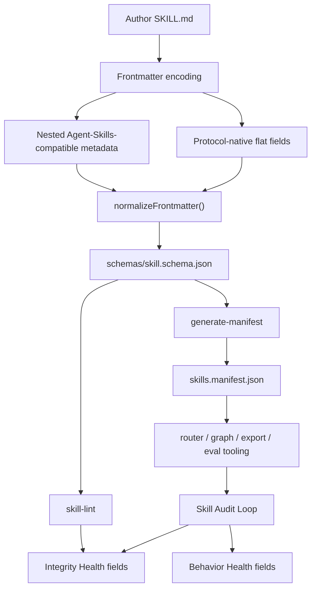
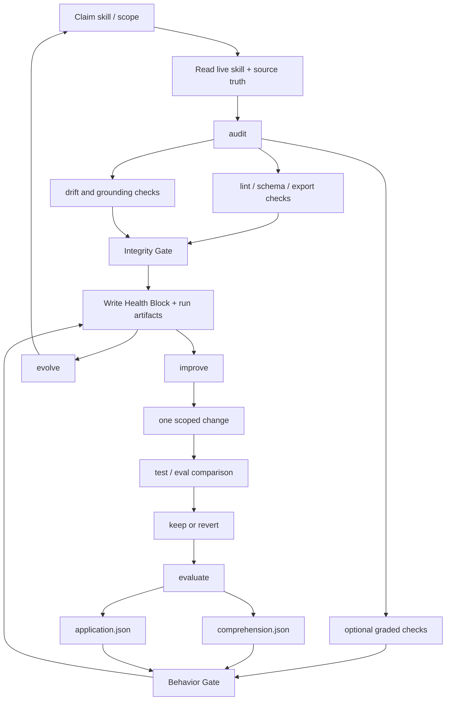

# Skill System Current-State Codex Audit

Date: 2026-05-26
Auditor: Codex
Mode: SYSTEM work only
Scope: workspace `AGENTS.md` / `CLAUDE.md`, Skill Graph repo, Skill Metadata Protocol, Skill Audit Loop, canonical `/skills/` library, verification scripts, slash-command resolvers, and Linear project state.

## Executive Verdict

The three concepts are good, but the teaching surface is still noisy:

1. **Skill Metadata Protocol** is the per-`SKILL.md` type contract. It defines identity, classification, routing, relations, grounding, eval state, and Health Block evidence.
2. **Skill Graph** is the library-level compiler/runtime. It normalizes the skills, validates the corpus, builds the manifest, drives routing/eval/export checks, and stages marketplace output.
3. **Skill Audit Loop** is the maintenance discipline. It audits, improves, evaluates, and evolves skills while writing evidence back to Health Blocks and run artifacts.

As of this current pass, `npm run verify` passes end to end for the deterministic suite, including routing eval and unit tests. That is a meaningful improvement from the earlier SH-6525 report. However, a separate audit-ledger consistency checker still fails on historical graded verdicts without backing `comprehension.json` artifacts, and that checker is not included in `npm run verify`.

My answer to the user's core question is: **AGENTS.md is much better than a normal repo instruction file, but it is not sufficient as a cold-start teaching layer yet.** Agents still have to reconcile duplicate docs, stale v7 examples, stale counts, old command names, and missing resolver targets before they can safely act. The user should not have to re-explain the three-layer model this often.

## Loaded Skills

I loaded the relevant local skills and treated the live schema/docs as the authority when skills were scaffold-level:

- `skill-graph-ontology`
- `skill-graph-semantics`
- `skill-graph-taxonomy`
- `skill-infrastructure`
- `graph-audit`
- `conceptual-modeling`
- `information-architecture`
- `taxonomy-design`
- `writing-humanizer`
- `context-graph`

Important finding: the three root `skill-graph-*` skills are scaffolds. They help with routing intent, but they do not teach the current protocol or audit loop in a way that can replace the live docs.

## Skill Metadata Protocol Diagram

Plain-English explanation: the Skill Metadata Protocol turns a Markdown skill into a typed object. It tells tools what the skill is, when to load it, where it belongs, what it owns, what it excludes, what it depends on, what truth sources it claims, and what audit/eval evidence exists.

## How The Skill Metadata Protocol Functions

The protocol has four working roles:

1. **Authoring contract**: tells humans and agents which fields to write.
2. **Validation contract**: gives `skill-lint` and schema checks a binding shape.
3. **Routing contract**: gives the router classification axes, keywords, examples, and relation edges.
4. **Audit contract**: gives the audit loop Health Block fields to stamp and interpret.

The live state is v7 + v8 compatibility mode. `schema_version: 7` and `schema_version: 8` both validate. A v8 skill requires `subject` and `operation`, but v7 fields such as `type` and `category` are still globally required. New canonical skills therefore need both v7 compatibility fields and v8 axes until the coordinated v7-removal lands.

Is it easy to understand and follow? **Partly.** The root protocol doc explains the migration state, but there are still conflicting or stale secondary explanations. A careful maintainer can reconstruct the truth; a cold-start agent can easily pick the wrong doc and author invalid or outdated metadata.

## Skill Audit Loop Diagram

Plain-English explanation: the loop is meant to keep each skill honest. `audit` checks current truth and writes evidence. `improve` makes one controlled change and keeps it only if verification does not regress. `evaluate` checks whether the skill actually changes agent behavior. `evolve` repeats that across the corpus.

## Step-By-Step Audit Loop Assessment

### 1. `audit`

The conceptual workflow is clear in `SKILL_AUDIT_LOOP.md`: read the live skill, compare against source truth, run deterministic checks, optionally run graders, write artifacts, and update the Health Block. The CLI surface exists and `npm run verify` covers audit smoke tests.

The weak spot is documentation/runtime consistency. The active `.claude/commands/audit/audit.md` resolver still points to `skill-graph/audits/per-skill-contract.md`, but that file does not exist. The canonical runbook now lives in `SKILL_AUDIT_LOOP.md` Part 3.

### 2. `improve`

The intended model is strong: one field or artifact at a time, verify, keep or revert. The docs are understandable for a maintainer, but still too spread out for a cold agent because the exact evidence receipt is split between `SKILL_AUDIT_LOOP.md`, command resolvers, and historical audit docs.

### 3. `evaluate`

The command and tests exist, and current unit tests verify application verdict writeback behavior. The corpus is still sparse: I verified 7 `comprehension.json`, 5 `application.json`, and 17 `evals/evals.json` artifacts under the 153 canonical source skills. That is enough to prove the path exists, not enough to say Behavior Gate coverage is mature.

### 4. `evolve`

The command is present and included in CLI help as a preview. The doctrine is understandable, but the system should keep calling it preview until the Behavior Gate data and audit-ledger consistency are clean enough to support corpus-wide automation.

## Skill Graph Structure Assessment

The structure is conceptually clear once the reader learns the three-layer model. The v8 five-axis classification is also more intuitive than the older v7 categories:

- `subject`: browse shelf.
- `operation`: cognitive operation.
- `scope`: portability/deployment target.
- `keywords`: fuzzy activation.
- `relations`: graph edges and routing boundaries.

The groupings are directionally intuitive, but the live distribution shows that the taxonomy is not yet balanced:

- `code-engineering`: 35 skills
- `quality-assurance`: 27
- `frontend-ui`: 20
- `design-craft`: 20
- `agent-ops`: 17
- `meta-methods`: 11
- `product-domain`: 10
- `knowledge-organization`: 7
- `data-analytics`: 3

The stated balance rule says each subject should hold 5-25 skills. The current corpus breaks that on both ends: `code-engineering` and `quality-assurance` are too large; `data-analytics` is too small. That does not make the taxonomy bad, but it does mean the docs should present the balance rule as an active maintenance signal, not as a satisfied property.

The operation distribution is more lopsided:

- `know`: 99
- `do`: 48
- `decide`: 2
- `modify`: 1

That may be accurate for the current library, but it weakens the teaching value of a four-operation model unless docs explain why most current skills are knowledge skills and what would cause a skill to become `decide` or `modify`.

## AGENTS.md Sufficiency

`AGENTS.md` is sufficient as a high-density reference. It is not sufficient as a first-use teaching path.

What it does well:

- Names the three layers.
- Declares SYSTEM vs CONTENT work separation.
- States v7/v8 compatibility mode.
- Warns that non-Claude agents must load skills manually.
- Explains that lint is a floor and `application_verdict` is the real quality signal.
- Calls out the inverse meaning of `relations.boundary`.

Why agents still need repeated explanation:

- The Skill System section arrives after a large global rules stack.
- `AGENTS.md`, `skill-graph/AGENTS.md`, `SKILL_GRAPH.md`, `SKILL_METADATA_PROTOCOL.md`, and `docs/skill-metadata-protocol.md` overlap rather than forming a single guided path.
- Secondary docs still teach v7-era examples, stale counts, and old commands.
- Runtime resolver docs still reference missing files.
- The relevant root-level `skill-graph-*` skills are scaffolds rather than teaching assets.

Recommendation: add a short "Skill System Cold Start" block to both root `AGENTS.md` and `skill-graph/AGENTS.md`. It should say, in order: three layers, current authoring contract, where to edit, what to run, and what not to claim without evidence.

## Verification Receipts

| Claim | Receipt |
|---|---|
| Canonical source corpus has 153 skills | `node scripts/generate-manifest.js --output /tmp/skill-graph-audit-manifest-current.json` wrote 153 skills. |
| Schema distribution is v7/v8 compatibility mode | Manifest summary: 144 skills at schema v8, 9 at schema v7. |
| `npm run verify` passes now | Ran in `skill-graph`; lint, template lint, category check, protocol check, docs links, docs drift, mirror freeze, charter parity warning-only, stability, manifest, routing eval, export verify, overlap, and unit tests all passed. |
| Routing eval is green for asserted skills | `routing-eval`: 9 skill groups PASS, 0 FAIL; 9/153 skills carry `routing_eval: present`. |
| Marketplace export count is 152 | `node scripts/export-marketplace-skills.js --check` reported 152; `find skill-graph/marketplace/skills -name SKILL.md | wc -l` returned 152. |
| Audit-ledger consistency is not green | `node scripts/check-audit-manifest.js` failed with 16 verdicts claiming graded comprehension without artifacts. |
| Behavior artifacts are sparse | `find ... application.json` = 5, `comprehension.json` = 7, `evals/evals.json` = 17. |
| `scope: project` grounding is not schema-required | `scripts/__tests__/test-v8-schema-compat.js` explicitly deletes `grounding` from a `scope: project` v8 fixture and expects validation to pass. |
| Missing per-skill contract path is real | `test -f skill-graph/audits/per-skill-contract.md` returned missing; root `docs/reference/skill-audit-pipeline.md` exists, `skill-graph/docs/reference/skill-audit-pipeline.md` does not. |
| Linear Skill Graph project checked | Project ID `4a1a9dc2-590e-4dbc-b352-9c542e25cb0d`; 178 issues scanned. |
| Linear Skill Audit Loop project checked | Project ID `3a60852f-597c-4758-a69b-29cde0b59c4a`; 527 issues scanned. |

## Findings

### F1. `npm run verify` passes, but audit-ledger consistency still fails outside the verify suite

Severity: P1

Evidence: `npm run verify` passed. `node scripts/check-audit-manifest.js` failed with 16 missing comprehension artifacts behind graded verdict claims.

Impact: an agent can honestly say "verify is green" while missing a failing audit evidence invariant.

Action: add `check-audit-manifest.js` to the appropriate verification script, or document it as an intentionally separate historical-ledger audit with its own status badge.

All 16 failing ledger entries:

- `agent-infrastructure/2026-05-23T2040--audit--codex--44c5b5`
- `backend/2026-05-23T1704--audit--codex--bdd034`
- `bayesian-reasoning/2026-05-25T0641--improve--codex--76c948`
- `chrome-devtools-mcp/2026-05-23T2045--audit--codex--e95079`
- `credential-encryption/2026-05-23T1654--audit--codex--ba321c`
- `docs-development/2026-05-23T2053--audit--codex--a04166`
- `ecosystem-modeling/2026-05-25T0711--audit--codex--d84f5c`
- `expected-value/2026-05-25T0749--audit--gpt55--24c747`
- `growth-metrics-frameworks/2026-05-23T1928--audit--codex--dbdc84`
- `human-in-the-loop/2026-05-23T1443--audit--gpt55--fa518c`
- `knowledge-graph/2026-05-24T2026--audit--codex--17de27`
- `mcp-builder/2026-05-23T1710--audit--codex--6b1b39`
- `skill-graph-glossary/2026-05-23T1717--audit--codex--c5eeaf`
- `task-lifecycle/2026-05-23T2033--audit--codex--c8b2e0`
- `task-lifecycle/2026-05-23T1723--audit--codex--493d87`
- `token-cost-estimation/2026-05-23T1919--audit--codex--11f35d`

### F2. The secondary metadata-protocol doc still says "New skills should author the v8 axes only"

Severity: P1

Evidence: `skill-graph/docs/skill-metadata-protocol.md:12` says new skills should author v8 axes only. The canonical `SKILL_METADATA_PROTOCOL.md` says author both v7 and v8 fields; the schema still globally requires `type` and `category`.

Impact: this is a direct teaching contradiction that can cause invalid new skills.

Action: make the secondary doc a pointer to the root protocol, or update it to the same "author BOTH" migration callout.

### F3. Several public-facing docs still teach v7-era or invalid examples

Severity: P1

Evidence:

- `skill-graph/README.md` examples still use `schema_version: 7` and call the current contract schema v7.
- `skill-graph/docs/QUICKSTART-30MIN.md` uses `category: content`, which is not in the live category enum.
- `skill-graph/docs/field-state-matrix.md` and `field-reference.md` still frame grounding around `scope: codebase`.
- `skill-graph/docs/PRIMER.md` and Quickstart still use `CLEAN`-style drift wording in places while the schema enum uses `OK`.

Impact: the docs can pass link/drift checks while still teaching the wrong authoring behavior.

Action: add a semantic-doc-drift check for known retired terms and invalid enum examples.

### F4. Docs say `scope: project` needs `grounding`, but schema/tests allow project scope without grounding

Severity: P1

Evidence: `SKILL_METADATA_PROTOCOL.md` and `skill-graph/AGENTS.md` say `grounding` is required for `scope: project`. `scripts/__tests__/test-v8-schema-compat.js` validates a `scope: project` v8 fixture after deleting `grounding`.

Impact: a project-grounded skill can lint despite missing the truth anchors the audit loop depends on.

Action: enforce `grounding` for `scope: project` in schema/custom lint, or change the docs to say the rule is desired but not enforced.

### F5. Live count sources still disagree

Severity: P2

Evidence:

- Manifest: 153 canonical skills.
- Marketplace export: 152 skills.
- `SKILL_GRAPH.md` still says marketplace export count is 147.
- `skills/README.md` from the public library says 146 public skills.
- Root `SKILL-INDEX.md` reports 158 active skills because it includes five root-level skills outside `skills/skills`.

Impact: agents learn early that state docs cannot be trusted literally.

Action: keep volatile counts in one generated current-state file and make other docs link to commands.

### F6. Root-level Skill Graph skills are scaffold-level and excluded from the canonical manifest

Severity: P2

Evidence: `find /Users/jacobbalslev/Development/skills -maxdepth 2 -name SKILL.md` returns root skills such as `skill-graph-ontology`, `skill-graph-semantics`, and `skill-graph-taxonomy`; `.skill-graph/config.json` points Skill Graph tooling at `../skills/skills`, producing 153 canonical skills.

Impact: "load relevant skills" sends agents to placeholder skills while the real truth lives in docs and schema.

Action: either migrate those skills into the canonical library with real teaching content or mark them explicitly as non-canonical scaffolds in the skill index.

### F7. Runtime slash-command resolvers still point to a missing `per-skill-contract.md`

Severity: P1

Evidence:

- `.claude/commands/audit/audit.md` references `skill-graph/audits/per-skill-contract.md`.
- `.claude/commands/audit/merge.md` references `skill-graph/audits/per-skill-contract.md`.
- `.opencode/commands/audit-skill.md` imports `@skill-graph/audits/per-skill-contract.md`.
- `.opencode/commands/skill-audit-loop.md` references the same missing file.
- `test -f skill-graph/audits/per-skill-contract.md` returned missing.

Impact: agents launched through those resolver surfaces can fail or read stale/missing instructions before they reach the canonical runbook.

Action: update resolvers to point directly to `skill-graph/SKILL_AUDIT_LOOP.md` Part 3, or recreate the contract file as a thin pointer.

### F8. Link checks do not catch workspace-level resolver drift

Severity: P2

Evidence: `node scripts/check-markdown-links.js` passed for 326 files, but the workspace `.claude` and `.opencode` resolver references above are still broken.

Impact: documentation verification gives a false sense of coverage for the actual command surfaces agents use.

Action: add a workspace resolver link check, or include `.claude/commands` and `.opencode/commands` in the Skill Graph docs-link gate with support for `@skill-graph/...` import syntax.

### F9. `/discover` is still documented internally as `/skill-discovery`

Severity: P2

Evidence: `.claude/commands/audit/discover.md` is the resolver file for the current `discover` utility, but its heading is `# /skill-discovery` and its examples/scripts still speak in old discovery-loop terms.

Impact: it violates the short user-facing command doctrine and preserves a legacy name inside the current command set.

Action: retitle and rewrite the resolver around `/discover`; keep old names only in a migration mapping table.

### F10. Skill Audit Loop docs are comprehensive but too long for cold-start operation

Severity: P2

Evidence: `SKILL_AUDIT_LOOP.md` contains doctrine, command mapping, checklist, runbook, artifacts, grading, and workarounds in one long file.

Impact: agents can understand the system after reading it, but it is too much to act on safely without missing a caveat.

Action: add a one-page "operator map" at the top with the four operations, the two gates, the exact commands, and the current maturity status.

### F11. Skill Metadata Protocol docs mix target model, compatibility mode, and authoring instructions

Severity: P2

Evidence: the root protocol doc correctly says author both v7 and v8 fields, but it also starts with a "currently enforced schema_version: 7" callout and then teaches the v8 axes in detail.

Impact: the protocol is accurate but cognitively expensive; agents must keep "target model" and "current lint contract" separate.

Action: split every protocol section into "Current authoring rule" and "Future/sunset note" boxes.

### F12. The package publish file list contains an impossible Markdown-anchor entry

Severity: P3

Evidence: `package.json` `files` includes `SKILL_AUDIT_LOOP.md#part-2--per-skill-audit-checklist`, which is not a filesystem path.

Impact: likely harmless for npm packaging, but it signals docs-as-files confusion in a package boundary.

Action: remove the anchor entry and rely on the actual `SKILL_AUDIT_LOOP.md` file.

### F13. Behavior Gate coverage is still sparse

Severity: P2

Evidence: under 153 canonical skills, I found 7 `comprehension.json`, 5 `application.json`, and 17 `evals/evals.json` artifacts.

Impact: `application_verdict` is correctly described as the primary quality signal, but most skills cannot earn it yet.

Action: keep `application_verdict: UNVERIFIED` as expected current state, and add a visible coverage dashboard so agents do not mistake sparse coverage for a defect in each individual skill.

### F14. Skill Graph taxonomy is intuitive, but distribution needs a maintenance story

Severity: P3

Evidence: subject distribution breaks the stated 5-25 balance rule: `code-engineering` has 35, `quality-assurance` has 27, and `data-analytics` has 3.

Impact: readers may assume the taxonomy is balanced because the docs state a balance rule.

Action: document exceptions and add a generated balance table to current state.

### F15. Operation taxonomy is under-explained by current corpus examples

Severity: P3

Evidence: operation distribution is `know: 99`, `do: 48`, `decide: 2`, `modify: 1`.

Impact: the four-operation model is plausible, but agents do not see enough examples of `decide` and `modify` to apply it confidently.

Action: add two worked examples per operation in the protocol docs.

### F16. Linear retired-command scan is mostly clean, but one open Skill Graph issue still references `skill-discovery`

Severity: P3

Evidence: hard retired-command scan over the Skill Graph project found one open retired-command match: SH-6330, `Skill Graph: want-to-create skill backlog (2026-05-21 reconciled)`, matching `skill-discovery`.

Impact: low, but it keeps the old command name alive in active project work.

Action: update SH-6330 to use `/discover` terminology or mark the legacy text as historical.

### F17. The old Skill Audit Loop project remains open but is clearly labeled legacy

Severity: P3

Evidence: Skill Audit Loop project scan found 527 total issues and 127 open issues. All 127 open issues carry `legacy-needs-review`; 120 also carry `needs-fresh-AC`. No open hard retired-command matches remained after excluding the generic project name.

Impact: the backlog is not silently pretending to be current, but it can still distract agents unless they notice the labels.

Action: keep those tasks parked until reviewed, or archive the project after any reusable intent is migrated to the current Skill Graph project.

All 127 open Skill Audit Loop issue IDs:

SH-5096, SH-5101, SH-5105, SH-5106, SH-5108, SH-5109, SH-5110, SH-5119, SH-5121, SH-5134, SH-5135, SH-5136, SH-5137, SH-5138, SH-5139, SH-5150, SH-5168, SH-5185, SH-5195, SH-5201, SH-5226, SH-5227, SH-5229, SH-5230, SH-5231, SH-5232, SH-5233, SH-5234, SH-5235, SH-5236, SH-5237, SH-5238, SH-5239, SH-5240, SH-5241, SH-5242, SH-5243, SH-5244, SH-5245, SH-5246, SH-5247, SH-5248, SH-5249, SH-5250, SH-5251, SH-5252, SH-5253, SH-5254, SH-5255, SH-5257, SH-5585, SH-5617, SH-5618, SH-5619, SH-5620, SH-5622, SH-5623, SH-5624, SH-5625, SH-5626, SH-5627, SH-5628, SH-5660, SH-5661, SH-5662, SH-5663, SH-5664, SH-5665, SH-5666, SH-5667, SH-5668, SH-5669, SH-5670, SH-5671, SH-5672, SH-5673, SH-5674, SH-5675, SH-5676, SH-5677, SH-5678, SH-5679, SH-5680, SH-5681, SH-5682, SH-5683, SH-5684, SH-5685, SH-5686, SH-5687, SH-5688, SH-5689, SH-5690, SH-5691, SH-5692, SH-5693, SH-5694, SH-5695, SH-5696, SH-5697, SH-5698, SH-5699, SH-5700, SH-5701, SH-5702, SH-5703, SH-5704, SH-5705, SH-5706, SH-5707, SH-5708, SH-5709, SH-5710, SH-5711, SH-5712, SH-5713, SH-5714, SH-5715, SH-5716, SH-5717, SH-5718, SH-5719, SH-5720, SH-5721, SH-5722, SH-5723, SH-5724.

### F18. `AGENTS.md` and `skill-graph/AGENTS.md` overlap instead of providing a single cold-start path

Severity: P2

Evidence: root `AGENTS.md` has a current high-level Skill System section; `skill-graph/AGENTS.md` repeats related doctrine and still contains a "current skill contract: schema_version: 7" line even though `SKILL_GRAPH.md` explains v7+v8 compatibility mode.

Impact: agents must reconcile two instruction layers before acting.

Action: make root `AGENTS.md` a short cold-start router and make `skill-graph/AGENTS.md` the detailed SYSTEM-mode charter, with fewer duplicated state claims.

## Current Linear Status

Existing audit report issue: SH-6525.

Current-state scan results:

- Skill Graph project: 178 issues scanned; one open retired-command match remains, SH-6330.
- Skill Audit Loop project: 527 issues scanned; 127 open issues remain; all 127 are labeled `legacy-needs-review`; 120 are also labeled `needs-fresh-AC`; zero open hard retired-command matches remain after excluding the generic project name.

## Recommended Documentation Fix Order

1. Fix resolver paths to the missing per-skill contract.
2. Add `check-audit-manifest.js` to a visible verification path or document it as a separate red gate.
3. Fix the v8-only contradiction in `docs/skill-metadata-protocol.md`.
4. Repair Quickstart/README/field docs so no first-run examples use invalid v7-era values.
5. Decide and enforce the `scope: project` grounding rule.
6. Add a one-page cold-start map to root `AGENTS.md` and `skill-graph/AGENTS.md`.
7. Move volatile counts into one generated current-state source.
8. Either flesh out or demote the root `skill-graph-*` skills.

## Wrap Summary

This pass did not edit skills or code. It produced a current-state SYSTEM audit report after reading the requested orientation docs, protocol docs, audit loop docs, graph docs, skills, verification scripts, command resolvers, and Linear project state.

The biggest practical answer is: **the system now verifies better than the earlier SH-6525 report said, but the teaching layer is still not robust enough for cold-start agents.** The remaining blockers are mostly documentation topology and resolver drift, plus one real evidence-gate gap around historical audit verdicts.
