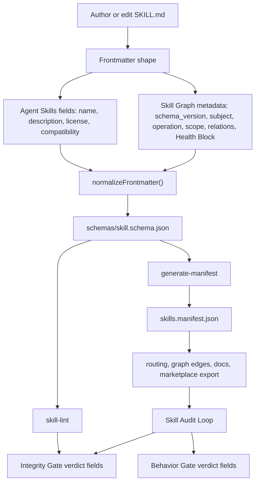
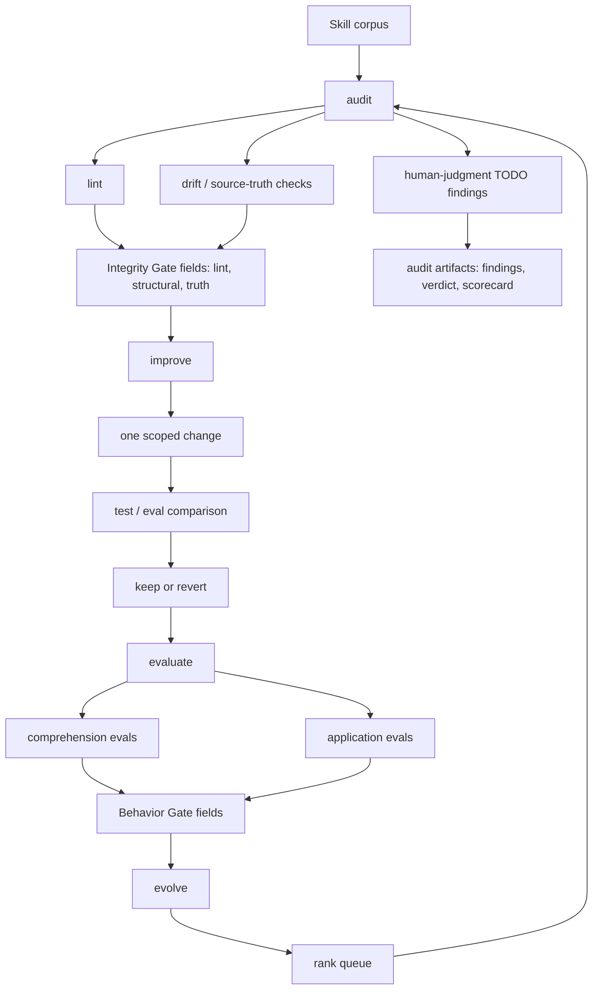

# Skill System Teaching Audit: Protocol, Graph, Audit Loop

Date: 2026-05-26
Auditor: Codex
Repository: `skill-graph` at `de4754cb836130c5796736005361acfca8df8ba3`
Scope: `CLAUDE.md`, `AGENTS.md`, `SKILL_METADATA_PROTOCOL.md`, `SKILL_AUDIT_LOOP.md`, `SKILL_GRAPH.md`, `/Users/jacobbalslev/Development/skills/skills`, schema, audit/eval/evolve tooling, Linear state, and external references.

## Executive Verdict

The Skill System is conceptually strong. The three-layer split is the right model:

1. Skill Metadata Protocol: the per-`SKILL.md` contract.
2. Skill Graph: the corpus-level compiler/router/validator/export system.
3. Skill Audit Loop: the maintenance discipline that re-grounds skills against current behavior.

The teaching problem is not that the ideas are weak. The problem is that new agents meet too many partially overlapping explanations, stale counts, old command names, and migration-era caveats before they see the simple mental model. The docs are sufficient for a persistent maintainer, but not yet sufficient for a cold-start agent that needs to act correctly on the first pass.

Operationally, the Integrity side is partially end-to-end and mostly visible. `doctor` passes, `audit --dry-run` works, normal audit writeback exists, manifest validation works, and application verdict writeback is implemented. But the whole system is not green end-to-end: `npm run verify` currently fails routing eval, the Behavior Gate has no `application.json` artifacts, `evolve --analyze-only` falls back because its analyzer is missing, and one audit smoke test exposed a real false-green path where lint infrastructure failure can still stamp `lint_verdict: PASS`.

## External Research Baseline

The local design is aligned with the broader skill ecosystem:

- Agent Skills defines a skill as a directory with `SKILL.md`, YAML frontmatter, Markdown instructions, optional `scripts/`, `references/`, and `assets/`; it recommends progressive disclosure and keeping the main `SKILL.md` focused. Source: https://agentskills.io/specification
- Claude Code skills use the same basic shape and explicitly describe automatic relevance-based loading, frontmatter-driven discovery, supporting files, and progressive loading. Source: https://code.claude.com/docs/en/skills
- Agent Skills' evaluation guide recommends realistic eval prompts, with/without-skill comparisons, concrete evidence for grading, aggregation, human review, and iterative improvement. Source: https://agentskills.io/skill-creation/evaluating-skills
- SKOS supports the broad relation vocabulary used by the graph model: broader, narrower, and related semantic relations, with `related` explicitly symmetric and non-transitive. Source: https://www.w3.org/TR/skos-reference/
- Google's MLOps maturity framing supports the repo's L0/L1 language: L1 means automated pipeline steps, validation, triggers, and metadata management, not just scripts that can run manually. Source: https://docs.cloud.google.com/architecture/mlops-continuous-delivery-and-automation-pipelines-in-machine-learning
- AGENTS.md is an open convention for giving coding agents predictable repo instructions, effectively "a README for agents." Source: https://github.com/agentsmd/agents.md

## Skills Loaded

I loaded the relevant local skills for this audit:

- `skill-evolution`
- `skill-graph-ontology`
- `skill-graph-semantics`
- `skill-graph-taxonomy`
- `skill-infrastructure`
- `graph-audit`
- `context-graph`
- `skill-scaffold`
- `skill-router`
- `information-architecture`
- `semantics`
- `taxonomy-design`

The three `skill-graph-*` skills are scaffold-level and not canonical evidence. I used them only as routing hints and deferred to the live schema and docs.

## Protocol Diagram

Plain-English version: the Skill Metadata Protocol turns every `SKILL.md` from "a markdown prompt with some metadata" into a typed, routable, auditable unit. The protocol defines how agents should identify the skill, when to load it, where it belongs in the taxonomy, how it relates to other skills, and what evidence exists that it is structurally valid and behaviorally useful.

## How The Skill Metadata Protocol Functions

The protocol functions as a contract across four audiences:

1. Authors use it to write skills consistently.
2. Routers use it to decide when to load a skill.
3. Validators use it to reject malformed or stale metadata.
4. Audit tooling uses it to stamp Health Block verdicts.

The current live contract is migration-era: authors must carry both v7 compatibility fields and v8 axes until the coordinated v7 removal lands. That means new canonical skills in `/Users/jacobbalslev/Development/skills/skills` should keep nested Agent-Skills-compatible metadata and include the v7 fields `type`, `category`, `scope` plus v8 fields such as `subject` and `operation` when `schema_version: 8` is used.

Is it easy to understand and follow? Not yet. A maintainer can reconstruct it, but a cold-start agent sees contradictory signals:

- `SKILL_METADATA_PROTOCOL.md` correctly says near the top that authors must carry both v7 and v8 fields, but later says all 147 skills carry v8 fields and new skills should author v8-only fields.
- `docs/field-decision-guide.md` still teaches only old scope values.
- Several docs repeat live corpus counts that have already changed.
- The "one repo, two hats" reality is critical but spread across files.

The fix is mostly teaching and information architecture: front-load the one-screen mental model, make the migration state a single canonical callout, and make every downstream doc link to that callout instead of restating counts or field-era rules.

## Audit Loop Diagram

Plain-English version: the Skill Audit Loop is meant to keep the library honest. `audit` checks whether a skill is structurally valid and grounded. `improve` makes one controlled change and keeps it only if quality does not regress. `evaluate` checks whether the skill actually changes agent behavior on realistic tasks. `evolve` repeats the loop across the corpus in priority order.

## Step-By-Step Audit Loop Analysis

### 1. `audit`

What works:

- `node bin/skill-graph.js audit skill-router --dry-run` resolves the canonical skill path and runs lint/drift without writing.
- Normal audit writeback exists in `lib/audit/skill-audit.js`; this corrects an older SH-6481 finding that said Integrity writeback was absent.
- Human-judgment TODO findings are explicit, not silent; the generated artifact labels them as TODOs.

What does not work end-to-end:

- A temp-workspace smoke test showed that `skill-lint` can fail because it looks for `schemas/skill.schema.json` under the target workspace, while `audit` still stamps `lint_verdict: PASS` and `structural_verdict: PASS` if the parser sees zero lint diagnostics. That is a real false-green path.
- Audit writeback can add missing Health Block fields at top level on nested-metadata skills, creating mixed top-level/nested metadata.

### 2. `improve`

What works:

- `node bin/skill-graph.js improve --help` is present; the previous report's "missing CLI command" finding is stale.
- The command is wired as part of the current public CLI surface.

Remaining concern:

- The docs still need to make the keep-or-revert contract executable from a cold start. The current explanation is good for maintainers but thin for agents that need exact receipt expectations.

### 3. `evaluate`

What works:

- `node bin/skill-graph.js evaluate --help` is present.
- `lib/audit/evaluate-skill.js` has Health Block writeback for `comprehension_verdict`, `application_verdict`, `eval_last_run`, and failed IDs.
- The tests cover all-errored runs not stamping success.

What does not work end-to-end:

- There are zero `application.json` eval artifacts in the canonical skill library. Therefore the Behavior Gate cannot certify any skill as `APPLICABLE`.
- There are 7 `comprehension.json` artifacts and 17 `evals/evals.json` artifacts in the source library, not the stale "~12/147" or "all 147" framing in docs.

### 4. `evolve`

What works:

- `node bin/skill-graph.js evolve --analyze-only ...` exits cleanly and reports what it is doing.

What does not work end-to-end:

- The analyzer script is missing, so `evolve --analyze-only` falls back to a frontmatter scan.
- The fallback reported queue size 153 and "0 perfect, 153 need work"; that is visible, not silent, but it means the command is not yet the full automated evolution loop described by the doctrine.

## Skill Graph Analysis

The structure is understandable once the reader has the three-layer model. The five-axis v8 classification is also intuitive:

- `subject`: where the skill belongs.
- `operation`: what kind of cognitive work it supports.
- `scope`: where it applies.
- `keywords`: how fuzzy routing finds it.
- `relations`: how it connects to other skills.

The graph's relation vocabulary is directionally good and externally recognizable. `broader`, `narrower`, and `related` map cleanly to SKOS-style knowledge organization. `depends_on` and `replaces` are useful operational edges. `boundary` is useful but poorly named because its mechanic is inverse to how many agents will read it.

What could improve:

- Put the three-layer model at the top of every main entry point: root `AGENTS.md`, `skill-graph/AGENTS.md`, `README.md`, `SKILL_GRAPH.md`, and `SKILL_METADATA_PROTOCOL.md`.
- Make live counts single-source only. Other docs should say "run this command" or link to the generated state, not restate counts.
- Make the v7/v8 migration contract one boxed block, then link to it.
- Add "what to do now" examples for a new skill, an edited skill, and an audit run.
- Show the one-repo/two-hats model visually: canonical source library versus protocol implementation versus marketplace export.
- Rename or heavily alias `relations.boundary` in teaching material as "excludes from co-routing."

## AGENTS.md Sufficiency

`AGENTS.md` is sufficient as a reference document, but insufficient as a cold-start teaching document.

What it does well:

- It names the three layers.
- It warns that non-Claude agents must manually load skills.
- It states the v7/v8 compatibility issue.
- It points to the canonical docs and command surfaces.
- It contains the right doctrine: no fake version bumps, lint as floor, application verdict as the primary quality signal, and boundary's inverse semantics.

Why agents still need repeated explanation:

- The most important mental model is buried after a large global rule stack.
- Some numbers and state claims are stale.
- It mixes "current state", "historical warning", "doctrine", and "command reference" in one long section.
- The root `AGENTS.md` and `skill-graph/AGENTS.md` overlap, so a fresh agent has to reconcile two authority levels.
- It explains the system, but not the exact first 10 minutes of work for a Codex/GPT/Gemini agent.

Recommendation: add a short "Skill System Cold Start" block near the top of root `AGENTS.md` and `skill-graph/AGENTS.md`:

1. What the three layers are.
2. Which file owns which truth.
3. What commands verify current state.
4. What to read before editing.
5. What not to claim unless verified.

## Verification Receipts

| Claim | Receipt |
|---|---|
| Local repo HEAD equals remote `main` | `git -C skill-graph rev-parse HEAD` and `git -C skill-graph ls-remote origin refs/heads/main` both returned `de4754cb836130c5796736005361acfca8df8ba3`. |
| Local package version differs from npm | `npm pkg get version` returned `0.5.10`; `npm view @skill-graph/cli version` returned `0.5.8`. |
| Source skill count | `find /Users/jacobbalslev/Development/skills/skills -name SKILL.md | wc -l` returned `153`. |
| Marketplace skill count | `find /Users/jacobbalslev/Development/skill-graph/marketplace/skills -name SKILL.md | wc -l` returned `147`. |
| Manifest validates | `node scripts/generate-manifest.js --include-template --validate-only` returned `OK manifest valid (154 skill(s))`. |
| Doctor passes | `node bin/skill-graph.js doctor --json` passed 7 checks: links, protocol, doc drift, mirror-freeze, schema, lint, manifest. |
| Tests pass | `npm test` exited 0. |
| Verify fails | `npm run verify` exited non-zero during routing eval. |
| Audit dry-run works | `node bin/skill-graph.js audit skill-router --dry-run` resolved `/Users/jacobbalslev/Development/skills/skills/agent-ops/skill-router/SKILL.md` and ran without writes. |
| Audit false-green path exists | Temp workspace audit printed `lint: FAIL (0 error(s), 0 warning(s))` and then stamped `lint_verdict: PASS` and `structural_verdict: PASS`. Direct lint in the same temp workspace failed on missing `schemas/skill.schema.json`. |
| Behavior artifacts are sparse | `comprehension.json`: 7, `evals/evals.json`: 17, `application.json`: 0 under `/Users/jacobbalslev/Development/skills/skills`. |
| Evolve fallback exists | `evolve --analyze-only` reported "Analyzer script not found; falling back to frontmatter scan." |
| Linear projects checked | Skill Graph project ID `4a1a9dc2-590e-4dbc-b352-9c542e25cb0d`; Skill Audit Loop project ID `3a60852f-597c-4758-a69b-29cde0b59c4a`. |

## Findings

Linear filing status:

- Audit report: SH-6525.
- New child follow-ups filed from this report: F2 -> SH-6526, F4 -> SH-6527, F5 -> SH-6528, F6 -> SH-6529, F7 -> SH-6530, F8 -> SH-6531, F14 -> SH-6532, F17 -> SH-6533, F18 -> SH-6534.
- Existing tasks cover: F1 -> SH-6504, F3 -> SH-6487, F9 -> SH-6508, F10 -> SH-6491, F11 -> SH-6516 through SH-6524, F12 -> SH-6483, F13 -> SH-6488/SH-6492, F15 -> SH-6486/SH-6495. F16 is itself a complete legacy-task scan over existing Linear issues.

### F1. Stale live counts make the docs less trustworthy

Severity: P2
Status: tracked by SH-6504
Evidence: live verification found 153 source skills, 154 manifest entries with template, 147 marketplace skills, 7 comprehension artifacts, and 0 application artifacts. Several docs still mention older 146/147-era counts.
Impact: new agents learn that the docs can be stale before they learn the model.
Action: replace inline counts with commands or generated includes.

### F2. The protocol doc contradicts itself about v8-only authoring

Severity: P1
Status: filed as SH-6526
Evidence: the top of `SKILL_METADATA_PROTOCOL.md` says authors must carry both v7 and v8 fields; a later section says all 147 skills carry v8 classification and new skills should author v8-only fields. Schema lint still requires v7 fields.
Impact: a new author can follow one part of the doc and fail schema lint.
Action: make the migration-state callout the only normative authoring instruction.

### F3. The field decision guide still teaches old scope values

Severity: P2
Status: tracked by SH-6487
Evidence: `docs/field-decision-guide.md` teaches `portable`, `reference`, and `codebase`, while schema accepts `project` and `workspace` aliases.
Impact: authors will continue to create v7-era metadata.
Action: update the guide to v8 terms with v7 aliases explicitly marked as compatibility-only.

### F4. The schema comments claim a `subjects[0] == subject` rule that is not enforced

Severity: P2
Status: filed as SH-6527
Evidence: `schemas/skill.schema.json` has a comment saying `subjects[0]` must equal `subject`, but the JSON Schema only enforces `minItems: 1`.
Impact: docs/schema comments imply an invariant that tooling does not protect.
Action: enforce it in custom lint or remove the claim from the schema comment.

### F5. Drift status vocabulary has an unresolved `CLEAN` versus `OK` mismatch

Severity: P3
Status: filed as SH-6528
Evidence: `scripts/skill-graph-drift.js` emits `CLEAN`; the schema enum uses `OK`; `skill-audit.js` maps both and comments on the mismatch.
Impact: small but persistent cognitive load and normalization risk.
Action: pick one public status and normalize at the source.

### F6. `skill-lint` is not package-root-aware in copied workspaces

Severity: P1
Status: filed as SH-6529
Evidence: direct lint in a temp copied workspace failed with `ENOENT: no such file or directory, open '/private/tmp/.../schemas/skill.schema.json'`.
Impact: standalone or copied-workspace audit runs can fail due to infrastructure layout, not skill quality.
Action: resolve schema from the package root, with workspace override only when explicitly provided.

### F7. `audit` can false-green lint and structural verdicts after infrastructure failure

Severity: P0
Status: filed as SH-6530
Evidence: temp audit printed `lint: FAIL (0 error(s), 0 warning(s))` then stamped `lint_verdict: PASS` and `structural_verdict: PASS`.
Impact: this violates the Health Block contract and can make broken audit infrastructure look like a passing skill.
Action: if lint exits non-zero, stamp failure unless the subprocess failure is classified separately as `ERROR` and blocks writeback.

### F8. Audit TODO findings are explicit, but the generated artifact still reads like a completed audit

Severity: P2
Status: filed as SH-6531
Evidence: default audit seeds five human-judgment TODO findings. They are labeled TODO, but the surrounding artifact still looks like a final findings report.
Impact: agents may file or summarize seeded TODOs as if they were verified defects.
Action: label seed-mode artifacts as "incomplete until human/graded pass" in the top heading and verdict.

### F9. CLI help still references `examples/audits` while the implementation defaults to `audits`

Severity: P3
Status: tracked by SH-6508
Evidence: `bin/skill-graph.js audit --help` and `evolve --help` mention `examples/audits`; current audit implementation defaults to `audits`.
Impact: authors may inspect the wrong output tree.
Action: update help text and docs to the current default.

### F10. `doctor` is documented as equivalent to full verification, but it is narrower

Severity: P1
Status: tracked by SH-6491 or adjacent doctor/verify cleanup
Evidence: `doctor --json` passed, while `npm run verify` failed on routing eval. `doctor` runs links, protocol, doc drift, mirror-freeze, schema, lint, and manifest. It does not run routing-eval, export, overlap, or the full unit suite.
Impact: agents can honestly run `doctor`, see green, and falsely report the system verified.
Action: rename the docs claim to "fast structural doctor" or expand `doctor` to call the full verification suite.

### F11. `npm run verify` currently fails routing eval

Severity: P1
Status: tracked by SH-6516 through SH-6524
Evidence: routing eval failed for 9 skills:

- `a11y`: 3 failures.
- `debugging`: 2 failures.
- `graph-audit`: 4 failures.
- `interaction-patterns`: 1 failure.
- `lint-overlay`: 5 failures.
- `refactor`: 4 failures.
- `skill-router`: 3 failures.
- `task-path-optimization`: 1 failure.
- `testing-strategy`: 3 failures.

Impact: the repository is not fully green end-to-end.
Action: complete the existing routing-eval repair tasks.

### F12. The Behavior Gate is implemented but has no application artifacts

Severity: P1
Status: tracked by SH-6483
Evidence: `find ... -path '*/evals/application.json' | wc -l` returned `0`.
Impact: no skill can honestly be behaviorally certified as `APPLICABLE`.
Action: seed realistic `application.json` evals for a small representative set, then scale.

### F13. `evolve --analyze-only` falls back because its analyzer script is missing

Severity: P2
Status: tracked by SH-6488/SH-6492
Evidence: command output: "Analyzer script not found; falling back to frontmatter scan."
Impact: the command is useful as a preview, but not the full automated evolution loop the docs imply.
Action: bundle the analyzer, update path resolution, or document fallback mode as the current expected state.

### F14. Audit writeback can create mixed top-level and nested Health Block metadata

Severity: P2
Status: filed as SH-6532
Evidence: temp audit on a nested `metadata:` skill added missing `last_audited` and `lint_verdict` at top level while existing `structural_verdict` and `truth_verdict` stayed nested.
Impact: canonical source skills become harder for humans and agents to read.
Action: make writeback preserve the detected encoding and insert missing fields into the same mapping.

### F15. The one-repo/two-hats model is still too easy to miss

Severity: P2
Status: tracked by SH-6486/SH-6495
Evidence: the canonical library at `/Users/jacobbalslev/Development/skills` is also the public Agent-Skills release repo, while `skill-graph` is the protocol/tooling repo and marketplace mirror owner. This is explained, but not visually front-loaded.
Impact: agents confuse where to author skills, where to change tooling, and where export output belongs.
Action: add a diagram and "where to edit" table to the top-level docs.

### F16. Legacy Linear tasks still exist according to the current command-surface plan

Severity: P2
Status: open
Evidence: refined hard-term scan found:

- Skill Graph project: 168 total issues, 11 hard-legacy matches, 4 open hard-legacy matches: SH-6487, SH-6491, SH-6496, SH-6520.
- Skill Audit Loop project: 527 total issues, 476 hard-legacy matches, 120 open hard-legacy matches.
- Open Skill Audit Loop legacy IDs: SH-5119, SH-5121, SH-5134, SH-5135, SH-5136, SH-5137, SH-5138, SH-5139, SH-5150, SH-5168, SH-5185, SH-5195, SH-5201, SH-5226, SH-5227, SH-5229, SH-5230, SH-5231, SH-5232, SH-5233, SH-5234, SH-5235, SH-5236, SH-5237, SH-5238, SH-5239, SH-5240, SH-5241, SH-5242, SH-5243, SH-5244, SH-5245, SH-5246, SH-5247, SH-5248, SH-5249, SH-5250, SH-5251, SH-5252, SH-5253, SH-5254, SH-5255, SH-5257, SH-5585, SH-5617, SH-5618, SH-5619, SH-5620, SH-5622, SH-5623, SH-5624, SH-5625, SH-5626, SH-5627, SH-5628, SH-5660, SH-5661, SH-5662, SH-5663, SH-5664, SH-5665, SH-5666, SH-5667, SH-5668, SH-5669, SH-5670, SH-5671, SH-5672, SH-5673, SH-5674, SH-5675, SH-5676, SH-5677, SH-5678, SH-5679, SH-5680, SH-5681, SH-5682, SH-5683, SH-5684, SH-5685, SH-5686, SH-5687, SH-5688, SH-5689, SH-5690, SH-5691, SH-5692, SH-5693, SH-5694, SH-5695, SH-5696, SH-5697, SH-5698, SH-5699, SH-5700, SH-5701, SH-5702, SH-5703, SH-5704, SH-5705, SH-5706, SH-5707, SH-5708, SH-5709, SH-5710, SH-5711, SH-5712, SH-5713, SH-5714, SH-5715, SH-5716, SH-5717, SH-5718, SH-5719, SH-5720, SH-5721, SH-5722, SH-5723, SH-5724.

Impact: agents may claim old audit-loop tasks whose command names or premises no longer match the current five-operation plan.
Action: bulk relabel or close legacy Skill Audit Loop tasks, preserving any still-useful intent under the new command surface.

### F17. npm release lags the local/remote main package version

Severity: P3
Status: filed as SH-6533
Evidence: local package is `0.5.10`; npm latest is `0.5.8`.
Impact: online install users may not get the currently documented CLI behavior.
Action: either publish `0.5.10` or mark unreleased docs clearly.

### F18. Context7 is mandatory in onboarding but unavailable in this Codex session

Severity: P3
Status: filed as SH-6534
Evidence: `agent-orchestration/ONBOARDING.md` requires Context7 MCP for library docs; no Context7 connector/tool was available in this Codex app context.
Impact: non-Claude agents can be asked to follow an impossible step unless a fallback is specified.
Action: document a fallback path: local repo docs first, official web docs second, and explicitly record "Context7 unavailable" in receipts.

## Routing-Eval Failure Details

These are the exact failing groups from `npm run verify`:

1. `a11y`
   - Positive: "screen reader doesn't announce when the form validation state changes" was expected to route to `a11y` but was boundary-excluded by `form-ux-architecture`.
   - Positive: "add proper labels to these form fields so assistive tech can read them" was expected to route to `a11y` but was boundary-excluded by `form-ux-architecture`.
   - Negative: "rewrite this error message at a 6th-grade reading level" routed to `linguistics`, which was not in `a11y.boundary`.
2. `debugging`
   - Positive: "this function used to work yesterday; what changed?" expected `debugging`, got `server-actions-design`.
   - Negative: "refactor this messy code while the test suite is green" routed to `test-driven-development`, not in `debugging.boundary`.
3. `graph-audit`
   - Positive: "which skills declare a relations target that doesn't exist in the libra..." expected `graph-audit`, got `skill-infrastructure`.
   - Negative: "diagnose why the @/components import cycle broke the build" routed to `client-server-boundary`, not in boundary.
   - Negative: "my agent is stuck in a loop - what's wrong?" routed to `autonomous-loop-patterns`, not in boundary.
   - Negative: "write a reference doc explaining what the lint-checker pipeline does" routed to `replication-patterns`, not in boundary.
4. `interaction-patterns`
   - Negative: "define the user's top task before choosing controls" routed to `spec-driven-development`, not in boundary.
5. `lint-overlay`
   - Positive: "migrate these legacy noImplicitAny violations in phased gates" expected `lint-overlay`, got `spec-driven-development`.
   - Positive: "decide whether this new rule runs pre-commit or in CI only" expected `lint-overlay`, got `context-window`.
   - Negative: "this specific ESLint error is blocking my commit - why?" routed to `error-boundary`, not in boundary.
   - Negative: "decide whether to unit-test or integration-test this handler" routed to `integration-test-design`, not in boundary.
   - Negative: "extract this repeated code pattern into a shared util" routed to `pattern-recognition`, not in boundary.
6. `refactor`
   - Positive: "this 600-line function is hard to reason about - decompose it while kee..." expected `refactor`, got `generative-ui`.
   - Positive: "extract the duplicated validation logic from these three handlers into ..." expected `refactor`, got `conceptual-modeling`.
   - Negative: "the test is failing after my edit - what did I break?" routed to `performance-testing`, not in boundary.
   - Negative: "write an architecture note explaining this pattern for new team members" routed to `semantics`, not in boundary.
7. `skill-router`
   - Positive: "activate the right skill for this agent request: 'my tests are failing ..." expected `skill-router`, got `debugging`.
   - Positive: "build a routing table that covers every agent request type we see" expected `skill-router`, got `agent-eval-design`.
   - Positive: "find the coverage gaps - which agent requests match no skill at all?" expected `skill-router`, got `skill-scaffold`.
8. `task-path-optimization`
   - Negative: "troubleshoot why the deployment keeps timing out" routed to `test-driven-development`, not in boundary.
9. `testing-strategy`
   - Positive: "do I need a unit test for this pure formatter or is integration enough?" was boundary-excluded by `integration-test-design`.
   - Positive: "pin this regression so the same bug can't slip through again" expected `testing-strategy`, got `performance-engineering`.
   - Negative: "write a testing-patterns guide for the contributor docs" routed to `middleware-patterns`, not in boundary.

Existing Linear tasks cover these groups: SH-6516, SH-6517, SH-6518, SH-6519, SH-6520, SH-6521, SH-6522, SH-6523, SH-6524.

## Highest-Value Documentation Fixes

1. Add a one-page "Skill System Cold Start" to root `AGENTS.md` and `skill-graph/AGENTS.md`.
2. Replace all inline corpus counts with a command receipt or generated include.
3. Put the v7/v8 migration contract in one canonical callout and delete or link all duplicates.
4. Add the two diagrams from this report to the canonical docs.
5. Add a "current command surface" table that clearly replaces legacy command names.
6. Add a "what is working now versus not yet end-to-end" table for the Audit Loop.
7. Fix the false-green audit path before trusting Health Block writeback at scale.

## Claim Check

I verified every operational claim in this report with a local command, file read, Linear query, or official external source. I did not verify Context7 because no Context7 tool was available in this Codex session; that limitation is itself recorded as F18.
