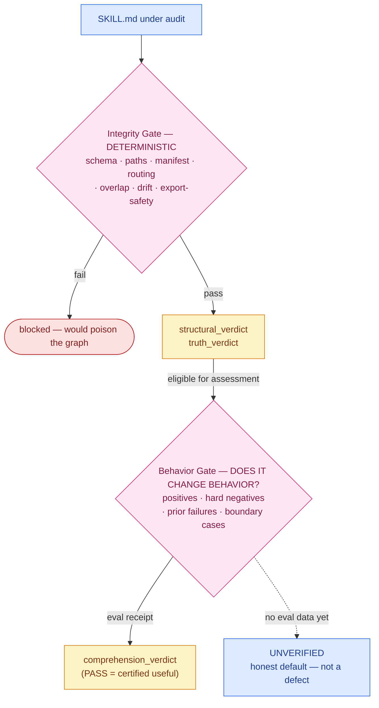

# Skill Audit Loop

> The maintenance discipline that answers one question per skill — *does it still teach an agent to do the thing it claims to teach?* — and records the answer on the skill itself.
>
> **Work mode:** editing this folder (the spec, the runner prompts) or the audit scripts is **SYSTEM** work; running the loop against an individual `SKILL.md` is **CONTENT** work via `/audit:*`. See [`../AGENTS.md` § Work Modes](../AGENTS.md#work-modes--system-vs-content). This README is a front door — the binding contract is [`SKILL_AUDIT_LOOP.md`](SKILL_AUDIT_LOOP.md).

## The Loop

The **Skill Audit Loop** is the umbrella for this lifecycle: **`Read → Verify → Evaluate → Research → Improve → Use → Evaluate → Grade`**. The lowercase `audit` operation is only the report-only Verify command inside that larger loop. Karpathy keep-or-revert applies at the Grade step: a candidate is reverted only on genuine regression, not merely because a narrow eval did not reward it. The full doctrine, the inner pipelines, and the cadence are in [`SKILL_AUDIT_LOOP.md`](SKILL_AUDIT_LOOP.md) (Part 1 doctrine, Part 2 checklist, Part 3 runbook). The mission this serves is canonical in [`../AGENTS.md` § Mission and Vision](../AGENTS.md#mission-and-vision): routing the right skill is the trunk; auditing whether it teaches well is the leaf this structure enables.

## Four Operations

Four operations form the per-skill loop. Two further commands — `discover` (create skills from a keyword matrix) and `merge` (multi-model union-curate) — are utilities, **not** part of the per-skill loop.

| Operation | What it does | Edits the skill body? |
|---|---|---|
| `audit` | Read every field; run deterministic lint/drift plus optional qualitative scorecard; stamp only Integrity-Gate Audit Status fields. | no |
| `improve` | Edit one field or candidate, time-boxed; auto-evaluate; revert only on harmful or measurable regression. | yes |
| `evaluate` | Run the eval suite (LLM grader); write `eval_score`, `eval_failed_ids`, `freshness`, and the behavior verdicts. | no |
| `evolve` | Walk the corpus in priority order through analyze, triage, execute, verify, and checkpoint. | via `improve` |

The grader machinery and inner-loop implementation live in [`../lib/audit/`](../lib/audit/); the runner prompts that drive each mode are in [`../prompts/`](../prompts/).

## Two Gates

The loop reports **two separate gates** and never blends them into one PASS/FAIL. The Integrity Gate proves a skill is safe for the graph; the Behavior Gate proves it is useful to an agent. Eligibility is not certification.

The Integrity Gate's deterministic field mapping is in [`SKILL_AUDIT_LOOP.md`](SKILL_AUDIT_LOOP.md); the per-skill checklist it runs is Part 2.

## Three Verdicts

Each skill carries a three-verdict Audit Status. `structural_verdict` and `truth_verdict` establish **eligibility** for assessment; `comprehension_verdict` records the **assessment** itself. **`comprehension_verdict: PASS` is the verdict that *certifies* a skill is useful** — the others are necessary, not sufficient.

Confidence is ordered, and the value names which evidence backs it: **`PASS`** (from certifying grader evidence) **>** `PROVISIONAL` (a lower-confidence eval receipt) **>** `UNVERIFIED` (no eval receipt for that dimension). The canonical enum definitions, the eligibility-vs-certification distinction, and the disjointness rules are in [`../docs/verdict-semantics.md`](../docs/verdict-semantics.md) — this README never redefines them.

## Doctrine

- **Lint is a floor, never the target.** An empty findings report on a genuinely good skill is a PASS. Do not invent arbitrary internal checks to manufacture findings.
- **`comprehension_verdict` is the primary quality signal.** Structural correctness is table stakes; teaching efficacy is the point.
- **`UNVERIFIED` is the honest default, not a defect.** A skill nobody has graded yet records that truthfully — it does not pretend to a verdict it has not earned.
- **Version labels are earned, not bumped.** Advancing a `schema_version` / `vN` label asserts the content migration happened. See [`../AGENTS.md` § Version Labels Are Earned, Not Bumped](../AGENTS.md#version-labels-are-earned-not-bumped).
- **Never stamp `PASS` without an `eval_last_run` receipt.** A verdict without evidence is a doc lie.
- **Show every finding.** If an audit emits N findings, the report carries N; prioritize separately, never drop.

## Where We Actually Are

The honest self-location, stated without inflated claims: the **Integrity Gate** runner and write-back are complete (≈ MLOps L1). The **Behavior Gate** runners exist, but the eval *data* is sparse — most skills are `UNVERIFIED`, and **that is the expected current state, not a failure**. Certification is gated on real eval artifacts, which are authored skill-by-skill through the loop.

Live maturity and corpus counts are computed, never inlined here — read [`../SKILL_GRAPH.md` § Current State](../SKILL_GRAPH.md#current-state--single-source-of-truth) for the current numbers and [`SKILL_AUDIT_LOOP.md` § Current maturity](SKILL_AUDIT_LOOP.md) for the maturity framing and the command that counts eval coverage from disk.

## Where To Go Next

| You want to… | Read |
|---|---|
| The binding loop contract (doctrine, operations, gates, runbook) | [`SKILL_AUDIT_LOOP.md`](SKILL_AUDIT_LOOP.md) |
| The per-skill audit checklist | [`SKILL_AUDIT_LOOP.md`](SKILL_AUDIT_LOOP.md) § Part 2 |
| The runner prompts (single-model, batch worker, codex-autonomous, minimal-iteration) | [`../prompts/`](../prompts/) |
| Grader prompts + inner-loop implementation | [`../lib/audit/`](../lib/audit/) |
| Verdict enums + confidence ordering | [`../docs/verdict-semantics.md`](../docs/verdict-semantics.md) |
| The quality bar the loop enforces | [`../docs/quality-doctrine.md`](../docs/quality-doctrine.md) |
| The contract the loop audits against | [`../skill-metadata-protocol/`](../skill-metadata-protocol/) |
| Live state (counts, version, maturity) | [`../SKILL_GRAPH.md` § Current State](../SKILL_GRAPH.md#current-state--single-source-of-truth) |

## What This Loop Is Not

- **Not a lint-test factory.** It evaluates intent fidelity and teaching efficacy, not arbitrary structural trivia.
- **Not auto-deletion.** A skill whose capability is now solved natively gets a *recommendation* to deprecate, fold, or reframe — removal needs sign-off, never an unattended delete.
- **Not a guarantee.** The loop *gates* and *records evidence*; it does not promise every skill is correct. A green Integrity Gate plus `UNVERIFIED` behavior is valid-but-unproven, and the status says so.
- **Not "self-improving skills" as a slogan.** It is evidence-constrained re-grounding: keep-or-revert on a measured signal, one field at a time.
