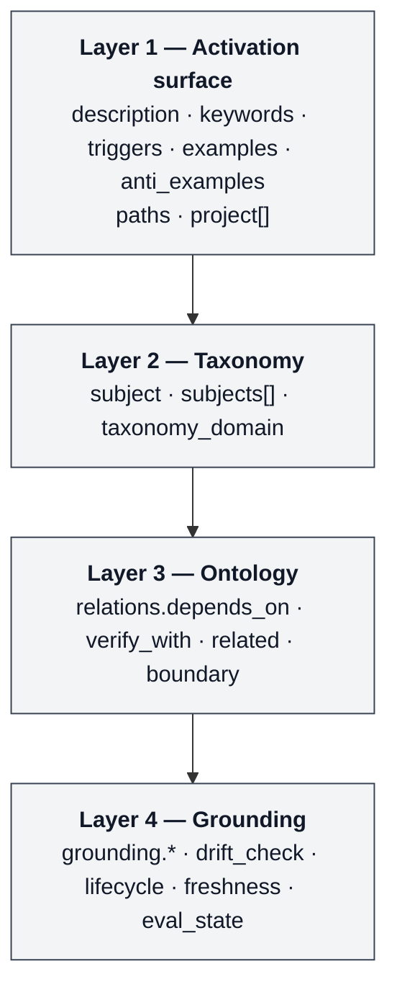

# Skill Graph Primer

> **Read this if:** you author SKILL.md and your library is large enough that skills have started to depend on, verify, or exclude one another. This primer is the conceptual introduction to Skill Metadata Protocol and Skill Graph. It is *explanation* documentation — it answers *what* and *why*. For reference material see `skill-metadata-protocol/field-reference.md`; for procedures see `CONTRIBUTING.md` and `skill-audit-loop/SKILL_AUDIT_LOOP.md`; for decision tables see `skill-metadata-protocol/field-decision-guide.md`.

**Status.** Stable for `schema_version: 8`. The prior contract (v7) lives in git history; retrieve via `git show schema-v7:schemas/SKILL_METADATA_PROTOCOL_schema.json`.
**Audience.** Skill authors who need skills to declare their relevance: which area they cover, which angle they take, which project or stack they fit, which taxonomy / semantic cluster they belong to, and how they should be tested or reverified. Library size is a proxy for this — these questions usually start around 5 skills, sometimes earlier if you have multiple projects, sometimes later for a single small project.
**Prerequisites.** Working familiarity with the [SKILL.md specification](https://agentskills.io/specification), including `SKILL.md` layout and the progressive-disclosure loading model.

## Related documents

| Document | Purpose |
|---|---|
| `skill-metadata-protocol/PRIMER.md` (this file) | Conceptual introduction: what Skill Graph is, when to adopt it, how the metadata composes (Diátaxis: *explanation*) |
| [`docs/QUICKSTART-30MIN.md`](../docs/QUICKSTART-30MIN.md) | Hands-on tutorial: author your first skill in 30 minutes — clone, install, fill in the template, lint, route, record the drift baseline (Diátaxis: *tutorial*). Read this if you'd rather try the tooling first; the PRIMER is the *why* behind the *how* the QUICKSTART teaches. |
| [`README.md`](../README.md) | Project overview, quick start, five-authority-tier tour |
| [`SKILL_GRAPH.md`](../SKILL_GRAPH.md) | Repo organisation: five **authority tiers** (schema / explanation / enforcement / consumer / specimen) and the invariants CI enforces |
| [`skill-metadata-protocol/design-rationale.md`](design-rationale.md) | Archetype section map, requiredness groups, schema strictness rules |
| [`skill-metadata-protocol/field-reference.md`](field-reference.md) | Per-field semantics for all current v8 top-level fields |
| [`skill-metadata-protocol/field-decision-guide.md`](field-decision-guide.md) | Decision tables for `public`, `scope`, `relations.*`, Evaluation Status, `portability`, `project[]` |
| [`docs/manifest-field-mapping.md`](../docs/manifest-field-mapping.md) | The authored → generated bridge: rename map, loss policy, migration notes |
| [SKILL.md specification](https://agentskills.io/specification) | The base standard Skill Metadata Protocol extends |

> **Terminology note.** This primer describes the **four metadata layers** inside a single skill's frontmatter (Activation, Taxonomy, Ontology, Grounding). Do not confuse these with the **five authority tiers** of the repository (schema, explanation, enforcement, consumer, specimen) described in `SKILL_GRAPH.md`. They are different things at different scopes: metadata layers live inside one `SKILL.md`; authority tiers span the whole repo.

## Contents

1. [What is Skill Graph?](#1-what-is-skill-graph)
2. [When to adopt Skill Graph](#2-when-to-adopt-skill-graph)
3. [Skill Metadata Protocol — four layers](#3-skill-metadata-protocol--four-layers)
4. [Structuring and indexing a library — four orthogonal axes](#4-structuring-and-indexing-a-library--four-orthogonal-axes)
5. [Where domain knowledge about tools, frameworks, and templates lives](#5-where-domain-knowledge-about-tools-frameworks-and-templates-lives)
6. [Routing — a worked example](#6-routing--a-worked-example)
7. [Portability back to base SKILL.md](#7-portability-back-to-base-skillmd)
8. [What Skill Graph is not](#8-what-skill-graph-is-not)
9. [See also](#9-see-also)

---

## 1. What is Skill Graph?

**Skill Metadata Protocol is the skill-level contract. Skill Graph is the library-level system that works with it.** Skill Metadata Protocol upgrades a portable `SKILL.md` file with explicit claims about area, angle, taxonomy, semantic relations, methodology, framework, project fit, grounding, and eval state. Skill Graph consumes those claims across a library so a router, indexer, auditor, cluster browser, or eval loop can reason over them. Wrong-skill routing, silent staleness, and project-scope ambiguity are downstream symptoms of the same root problem: the skill has not declared what it is relevant for.

Skill Metadata Protocol is interoperable with [SKILL.md](https://agentskills.io/specification) via `scripts/export-skill.js`. The two are distinct contracts; the export lets a Skill Graph library be consumed by any SKILL.md-compatible runtime.

Skill Graph is a **library system**, not a runtime. This repository ships reference implementations of a linter (`scripts/skill-lint.js`), a manifest generator (`scripts/generate-manifest.js`), a router (`scripts/skill-graph-route.js`), and a drift sentinel (`scripts/skill-graph-drift.js`) so adopters have something to read, fork, or replace. A Skill Graph library can be consumed by any agent runtime that supports the base SKILL.md standard, at whatever level of Skill Graph awareness that runtime chooses to implement.

The shortest mental model: **SKILL.md package reusable procedural knowledge; Skill Metadata Protocol makes each skill's relevance, boundaries, grounding, and trust state explicit; Skill Graph operates over those declarations across a library.**

Skill Metadata Protocol is the canonical contract, not the canonical template. The template is a replaceable authoring aid; the protocol is the schema-backed agreement that tools validate. Adopters can create stricter templates for their own teams without changing the contract.

### At a glance

| | SKILL.md | Skill Metadata Protocol + Skill Graph |
|---|---|---|
| Required top-level fields | 2 (`name`, `description`) | 13 (includes the base `name` + `description`) |
| Optional top-level fields | 3 standard (`license`, `compatibility`, `allowed-tools`) | 20, grouped into 5 metadata layers |
| Validation | Not standardised | Deterministic schema + lint + manifest + drift |
| Relevance model | Lexical (activation surface only) | Compound: activation, taxonomy, semantic relations, grounding, project fit, and eval state |
| Grounding to real artifacts | — | SHA-256 baselines + time-boxed freshness |
| Eval awareness | — | `eval_artifacts`, `eval_state`, `routing_eval` |
| Portability | N/A | One-way export to base SKILL.md via `scripts/export-skill.js` |

### Scope of this primer

The primer transmits the **mental model** needed to read the reference material without getting lost. It does not exhaust the protocol; every field named here has a normative definition in `skill-metadata-protocol/field-reference.md`. Worked authoring procedures live in `CONTRIBUTING.md § Adding or modifying a skill`. Audit procedures live in `skill-audit-loop/SKILL_AUDIT_LOOP.md`.

### How Skill Graph differs from marketplaces and runtimes

Before the four "not"s in section 8, here is what Skill Graph **is**, in relation to its closest neighbors in the 2026 AI-coding-context landscape:

| Neighbor | What it does | How Skill Metadata Protocol / Skill Graph relate |
|---|---|---|
| **[Anthropic SKILL.md](https://www.claude.com/skills)** | A format for skill packaging — *"Build once, use everywhere"*, *"Stack skills for complex work."* | Skill Metadata Protocol adds relevance fields: area, angle, taxonomy, semantic relations, project fit, grounding, and eval state. Skill Graph uses those fields at library level. Export returns to SKILL.md shape via `scripts/export-skill.js`. |
| **[skillsmp.com](https://skillsmp.com)** | Public agent-skill library / marketplace — *"Discover open-source agent skills from GitHub."* The discovery surface for community skills. | Skill Metadata Protocol starts after discovery: annotate what the selected skill is relevant for, how it clusters, and how to test it. **skillsmp answers "what skills exist?"; Skill Metadata Protocol answers "what is this skill relevant for?"; Skill Graph answers "how do we operate on that relevance?"** |
| **[skills.sh](https://skills.sh)** | Public agent-skill library / registry — *"The Open SKILL.md Ecosystem."* | Same distinction as skillsmp: discovery / installation vs. project-relevance metadata plus the Skill Graph system for clustering, routing, testing, and re-verification. |
| **[Cursor rules](https://cursor.com/docs)** (`.cursor/rules/*.mdc`) | Repo-behavior guardrails the IDE applies to every Cursor agent action. | Cursor rules are repo-behavior guardrails; Skill Graph is **skill-library structure** for the moment you have many skills to route, verify, and ground. The two solve different problems and complement each other in the same repo. |
| **CLAUDE.md / AGENTS.md** | Always-on plain-text repo conventions Claude Code or generic agent runtimes read at session start. | CLAUDE.md/AGENTS.md is *always-on* repo context (small, opinionated). Skill Graph is *on-demand* skill packaging (many, structured, routable). |

Agent memory belongs in the same mental map. Memory is local or product-managed recall of stable preferences, workflows, pitfalls, and recent context. Skill Graph is not memory; it gives durable skills memory-like discipline: explicit scope, retrieval signals, truth sources, freshness, and drift checks.

For the standalone reference covering every neighbor with pros/cons per axis, see [`docs/positioning-vs-marketplaces.md`](../docs/positioning-vs-marketplaces.md).

---

## 2. When to adopt Skill Graph

Skill Metadata Protocol is materially more expensive to author and maintain than plain SKILL.md. Structured frontmatter, SHA-256 baselines for grounded skills, cross-skill relation checks, and a time-boxed freshness claim are ongoing authoring work. The payoff is that relevance becomes explicit enough for Skill Graph to index, cluster, route, test, and iterate on. The linter, manifest generator, and drift sentinel absorb the mechanics — they do not absorb the judgment of choosing the right taxonomy, relation predicate, grounding source, or eval boundary.

### Adopt when any of the following describe your library

- **You need to know what a skill is relevant for** beyond its prose description: area, angle, project, stack, taxonomy, methodology, framework, semantic neighbours, and verification surface.
- **You want library structure instead of a flat folder**. `subject`, `taxonomy_domain`, `keywords`, and `relations.*` give you taxonomy, semantic clustering, and retrieval surfaces.
- **You want Karpathy-style eval loops for skills**. `examples`, `anti_examples`, `routing_eval`, `eval_state`, and `drift_check` give you repeatable cases and evidence instead of vibes.
- **Two skills cover overlapping territory** and the agent routes to the wrong one on ambiguous prompts. `boundary` pushes the router off the wrong skill explicitly rather than relying on description re-ranking.
- **One skill is load-bearing for another** and you have silently broken the assumption by editing the parent. `depends_on` surfaces the breakage at lint time instead of at routing time.
- **One or more skills are grounded in specific repo files** and you have noticed the skill get stale the day after the file is rewritten. `drift_check.truth_source_hashes` catches that on the next lint run.
- **You run evals on skills** and want the router to respect quality, not just relevance. `eval_state` + `--min-eval-state passing` turns "we have evals" into "routing honours evals."
- **You are authoring skills for multiple projects** that share some and diverge on others. Use `public: true` for shared skills, and `project[]` belonging references on project-anchored skills to express per-project anchoring — without naming specific codebases in a flat tag.

### Stay on base SKILL.md when

None of the above pressures is pushing on your library yet. The extra fields are overhead without a payoff until the library is large enough to produce the implicit graph in the first place.

---

## 3. Skill Metadata Protocol — four layers

Skill Metadata Protocol organises the frontmatter into **four metadata layers**. Each layer is a group of fields that answers a question the layer above it cannot. A flat keyword retriever sees only Layer 1; a graph-aware Skill Graph router reads all four and makes a compound decision.



**Legend.** Each box is the set of fields that constitute one layer. The arrows do not express runtime data flow; they express expressiveness — each layer reasons over strictly more than the one above it.

### Layer 1. Activation surface

**Purpose.** Free-text signals and overlapping tags — the words, patterns, and logical groupings a skill belongs to.

**Fields.** `description`, `keywords`, `triggers`, `examples`, `anti_examples`, `paths`, `project[]`.

**What it answers.** *Does this skill activate for this query?* This is the **semantic layer** — text for lexical retrieval, exactly what SKILL.md ships with. It is useful for discovery and not sufficient for reasoning.

**What you do with this:** Tune `keywords` until the right skill activates on your test prompts. Adjust `description` when two skills compete for the same prompt. Add `examples` for prompts you've seen in production. Add `anti_examples` after the router has misfired — speculative anti_examples rarely match reality.

### Layer 2. Taxonomy

**Purpose.** Place the skill at exactly one position in a hierarchical tree.

**Fields.** `subject` (the top-level shelf, a required closed 12-enum), `taxonomy_domain` (the slash-delimited nested path, optional).

**What it answers.** *What kind of concern is this?* The tree carries meaning through nesting: `backend-engineering/persistence/connection-pooling` says connection-pooling *is a kind of* persistence *is a kind of* backend-engineering concern. `subject` is always required; add `taxonomy_domain` only when a single `subject` holds enough skills (past ~25) that a sub-path helps navigation. A skill occupies exactly one taxonomic position — this is the difference between taxonomy and the multi-membership tag axes (see section 4).

**What you do with this:** Pick `subject` to file the skill on one of the twelve top-level shelves (`backend-engineering`, `quality-assurance`, `frontend-engineering`, etc.). Add `taxonomy_domain` only when a subject grows large enough that a tree helps readers navigate.

### Layer 3. Ontology

**Purpose.** Typed, machine-checkable relations between skills.

**Fields.** `relations.depends_on` (load-bearing prerequisite), `relations.verify_with` (co-load for confidence), `relations.adjacent` (suggested co-reading, non-load-bearing), `relations.boundary` (anti-ownership — route elsewhere).

**What it answers.** *How does this skill relate to the rest of the library?* The four predicates are not synonyms. `depends_on` closure is transitive; the linter enforces that targets resolve. `verify_with` is additive at selection — the router co-loads the verifier when the primary skill is picked. `boundary` excludes — a prompt covered by a boundary-listed skill is pushed off the current skill and onto the boundary target. `adjacent` is a hint without routing consequences. This is the layer that turns a skill collection into a graph an agent can reason over.

**What you do with this:** Add `boundary` when two skills cover the same prompt and you want the more-specific one to win. Add `verify_with` when one skill's verdict needs another skill's check before being trusted. Add `depends_on` when removing the target would silently break this skill at runtime. Use `adjacent` sparingly — most "often used together" links are better expressed as `verify_with` if the secondary skill should auto-co-load.

### Layer 4. Grounding

**Purpose.** Tie an otherwise abstract skill to specific, hashable artifacts in the codebase, and report when those artifacts have changed.

**Fields.** `grounding.subject_matter`, `grounding.grounding_mode`, `grounding.truth_sources`, `grounding.failure_modes`, `grounding.evidence_priority`, `drift_check.truth_source_hashes`, `lifecycle.stale_after_days`, `freshness`, `eval_state`.

**What it answers.** *Is what this skill claims still true?* Grounding is conditional on a non-empty `project[]` and is enforced by the schema. The drift sentinel (`scripts/skill-graph-drift.js`) SHA-256-hashes every listed `truth_source` and reports one of four states: `CLEAN`, `DRIFT`, `BROKEN` (file moved or deleted), or `NO_BASELINE` (hashes not recorded yet). `lifecycle.stale_after_days` time-boxes the freshness claim independently. This is the layer that turns an abstract ontology into a knowledge graph populated with real entities, and keeps the representation honest as those entities change.

**What you do with this:** Re-baseline `truth_source_hashes` after every deliberate edit to the source file (`node scripts/skill-graph-drift.js --record --apply <skill-dir>`). When the drift sentinel reports DRIFT, re-verify the skill's `## Verification` checklist against the changed truth source *before* re-recording — drift is a prompt to re-read the truth source, not to silently rubber-stamp the new hash.

### How the four layers compose into a routing decision

The reference router (`scripts/skill-graph-route.js`) reads all four layers and produces a single ranked result set. For a query `"accessibility keyboard navigation"` scoped to `--project <your-project>`:

1. **Layer 1** matches against `description`, `keywords`, `triggers`, `paths`. Non-matches are filtered out.
2. **`project[]`** (Layer 1 field) filters further by project belonging when `project[]` is present.
3. **Layer 3** expands the `depends_on` closure — any skill whose dependency is also matched is boosted; co-loads `verify_with` targets of selected skills.
4. **Layer 3** applies `boundary`: if a matched skill's boundary targets another skill that also matched, the boundary-owner absorbs the prompt and the boundary-loser is excluded.
5. **Layer 4** applies the quality gate. The default `--min-eval-state` is `unverified`, which admits everything; passing `--min-eval-state passing` excludes skills below that state. Staleness from `lifecycle.stale_after_days` is annotated on the result line (a `⚠ stale` marker), not used for exclusion.

Section 6 shows this in action with a real query.

---

## 4. Structuring and indexing a library — four orthogonal axes

Beyond the four metadata layers that express *meaning*, a library needs four independent axes for *structure and indexing*. These axes live inside Layers 1 and 2 but are worth calling out explicitly because adopters routinely confuse them. They are **orthogonal**: a single skill picks exactly one value of Scope and Taxonomy, and many values of the two tag axes.

| Axis | Field | Cardinality | Purpose |
|---|---|---|---|
| **Publishability** | `public` | Boolean: `true` (publishable) or `false` (private) | *Is this safe to release publicly?* |
| **Scope** | `scope` | Free-text string | *PRD-style description of the deployment context.* |
| **Taxonomy (hierarchy)** | `subject` + `taxonomy_domain` | Single position in the tree | *What kind of concern is this?* |
| **Project belonging** | `project[]` | Many objects (handle + role) | *Which specific project(s) is this skill anchored to?* |

> The per-skill `routing_bundles` field was **retired** (SKI-286) — see `SKILL_METADATA_PROTOCOL.md § routing_bundles`. Library-level batch-activation grouping is now served by the skill-injector routing config (`bundles` / `bundleTypes`), not per-skill frontmatter.

The axes compose without nesting. A single skill can be `public: true` with `subject: backend-engineering` and `taxonomy_domain: backend-engineering/linting/eslint-rules` — each axis carries a different shape of answer, and the router uses them for different things.

### 4.1 Deployment target — *where does this deploy?*

Two values, chosen at authoring time and enforced by the schema:

- **`portable`** — applies to any project. Most reusable skills (for example the starter `refactor` and `testing-strategy`) use this value.
- **`project`** — anchored to one specific project. Triggers Layer 4 (Grounding): `grounding.subject_matter`, `truth_sources`, and `drift_check.truth_source_hashes` become required, so the skill is pinned to the real artifacts it describes and the drift sentinel can catch silent divergence.

`public` (with `subject`) gives the router broad stratum separation; `project[]` is the axis with body-structure implications (`grounding` is conditional on a non-empty `project[]`) and carries project-fit. The `scope` field is a free-text PRD-style description — it is not an enum. For the full decision tables, see `skill-metadata-protocol/field-decision-guide.md`.

### 4.2 Taxonomy — *what kind of concern is this?*

`subject` is the top-level shelf (closed 12-value enum); `taxonomy_domain` is the optional slash-delimited path beneath. Exactly one position per skill. Segments inherit meaning from the ones above them, so `backend-engineering/linting/eslint-rules` encodes a three-level kind-of hierarchy. This is the closest thing in the contract to a **taxonomical layer** in the classical sense — each skill sits at a unique address in a tree.

Use `taxonomy_domain` only when the library is big enough that a tree helps navigation. Smaller libraries stay flat on `subject` alone.

### 4.3 Projects — *which project is this skill anchored to?*

Skills reusable across projects use `public: true` and need no project belonging reference. Skills anchored to one specific project carry a `project[]` array of belonging references (and are typically `public: false`) (each with a `handle` and `role`). Use `repo[]` when the belonging reference is a specific repository rather than a product project.

`project[]` names the *specific project* a skill is grounded in — **not** a keyword tag for routing. Routing remains driven by `keywords`, `triggers`, and `relations`.

### 4.4 Batch-activation grouping — a library-level concern, not a per-skill field

The per-skill `routing_bundles` field was **retired** (SKI-286): it accumulated zero acting consumer, since the router scores on `keywords` / `triggers` / `relations` and the manifest only copied the field through. Library-level batch-activation ("return the best skill in group X") is now served by the **skill-injector routing config** (`bundles` / `bundleTypes`), defined once per library rather than declared on each skill. Do not author `routing_bundles` on a skill. (Prior contract recoverable from git history; see `SKILL_METADATA_PROTOCOL.md § routing_bundles`.)

### 4.5 When axes collide

If two axes appear to answer the same question for your skill, pick by cardinality:

- **One answer?** Use `public` or Taxonomy.
- **Anchored to a specific project?** Add a `project[]` entry (and set `public: false` if it carries private data).

If an adopter-specific concept doesn't fit any of the axes, the activation surface (`keywords`, `triggers`) is the escape valve.

---

## 5. Where domain knowledge about tools, frameworks, and templates lives

Beyond the four structuring axes, three categories of domain knowledge have dedicated homes in the frontmatter:

**Features and tools** live on the activation surface: `keywords`, `triggers`, `paths`, plus `allowed-tools` (the space-separated tool allowlist SKILL.md inherits from the base standard) for runtime gating. A skill that operates on `.tsx` files declares `paths: ["**/*.tsx"]`; a skill that should only activate when `jest` is in the prompt declares it in `triggers`.

**Frameworks and patterns** live in the relations graph (Layer 3). `depends_on` is the right edge for "you cannot apply this pattern responsibly without that framework in place" — the starter `refactor` skill declares `depends_on: [testing-strategy]` for exactly this reason. `relations.broader` is the right edge for "this is a specialisation of a more general skill." `related` is for "these are worth reading together" without load-bearing dependency.

**Templates** live in the specimen tier of the repo (Tier 5 per `SKILL_GRAPH.md`): `examples/skill-metadata-template.md` is the self-referential authoring template. Adopters fork the template and tighten its frontmatter; the teaching layer (`> **TEMPLATE NOTE:**` blockquotes and `# TEMPLATE NOTE:` YAML comments) is stripped from derived skills before shipping.

---

## 6. Routing — a worked example

The claim that authored edges buy the consumer something needs proof. This section shows it in runnable form.

### 6.1 The smallest conforming Skill Metadata Protocol skill

```yaml
---
schema_version: 8
name: my-skill
description: "Use when <concrete situation>. Covers <A, B, C>. Do NOT use for <D, E>."
---
# my-skill

Body content...
```

This validates. It is also a Skill-Metadata-Protocol-enriched skill in name only — no relations, no grounding, no Evaluation Status — and it routes exactly as a plain SKILL.md skill does. Skill Graph does not penalise you for authoring minimally.

### 6.2 A skill that uses Layers 3 and 5

The `refactor` starter skill reduced to its load-bearing fields:

```yaml
---
schema_version: 8
name: refactor
description: "Reorganizing existing code without changing external behavior."
version: 1.0.0
subject: backend-engineering
public: true
owner: skill-graph-maintainer
freshness: "2026-05-27"
drift_check:
  last_verified: "2026-05-27"
eval_artifacts: present                   # M5 coherence: passing requires present
eval_state: passing
routing_eval: present
relations:
  depends_on: [testing-strategy]          # cannot refactor responsibly without a green suite
  verify_with: [testing-strategy]         # re-run after the refactor to prove behavior preserved
  boundary: [debugging, testing-strategy] # these absorb prompts listed in anti_examples
---
```

### 6.3 Routing trace — prompt lands on `refactor`

```
$ node scripts/skill-graph-route.js "clean up this duplicated logic"
SELECTED  refactor            eval_state=passing    triggers+paths match
VERIFY    testing-strategy    eval_state=passing    verify_with of refactor
```

Three things happened that a description-only retriever could not do:

1. `refactor` was selected on Layer 1 lexical match.
2. `testing-strategy` was co-loaded from Layer 3 because `refactor.relations.verify_with` names it. The agent now has the pre/post guard for behavior preservation in context without the user asking for it.
3. No exclusion fired this run, but the `boundary` edge would have fired on a different prompt — see 6.4.

### 6.4 Routing trace — same library, different prompt, different decision

```
$ node scripts/skill-graph-route.js "the test is failing after my edit"
SELECTED  debugging           eval_state=passing    triggers+paths match
EXCLUDED  refactor            boundary: debugging absorbs this prompt
```

Same library, same manifest, same metadata. Different compound decision. The router explains *why* one skill was chosen and another was not, in a form a human can audit and a CI check can assert on.

### 6.5 Routing trace — boundary edge fires on a webhook prompt

Same pattern, different domain. Imagine an adopter library with `markdown-post-frontmatter-review` (capability, codebase-grounded), `testing-strategy` (capability, listed as `verify_with` of the review skill), and `documentation` (capability, listed in `markdown-post-frontmatter-review.boundary` because docs would otherwise absorb the prompt).

A query about a specific frontmatter-validation failure routes like this:

```
$ node scripts/skill-graph-route.js "review my post's frontmatter — the build is rejecting the date format"
SELECTED  markdown-post-frontmatter-review   eval_state=passing    keyword:frontmatter, keyword:date format
VERIFY    testing-strategy                   eval_state=passing    verify_with of markdown-post-frontmatter-review
EXCLUDED  documentation                      —                     in boundary[] of markdown-post-frontmatter-review: documentation writes prose ABOUT the frontmatter format; markdown-post-frontmatter-review is the validation primitive in code
```

Three layers fired in one query:

1. **Layer 1** lexical match selected `markdown-post-frontmatter-review` on two keyword tokens.
2. **Layer 3 `verify_with`** co-loaded `testing-strategy` because the review skill declares it as a verifier — the agent now has the test-coverage checklist alongside the validation primitive.
3. **Layer 3 `boundary`** excluded `documentation` because the review skill's `boundary` explicitly says "documentation writes prose; this skill is the primitive in code." Without that boundary, `documentation` might have outscored the review skill on a query mentioning "review" — the boundary edge prevents that misroute.

This trace pattern is how the `content-source-router` specimen at [`examples/projects/markdown-static-site/skills/content-source-router/`](../examples/projects/markdown-static-site/skills/content-source-router/SKILL.md) works in concept; install the specimens into your own `skills/` and the same trace runs against them.

---

## 7. Portability back to base SKILL.md

Every valid Skill Metadata Protocol skill can be transformed back to a base SKILL.md file via `scripts/export-skill.js`. This is the compatibility safety valve: adopting the protocol does not trap you in the format.

**The caveat.** Portability is **one-way**. `skill-md` is the only value the protocol currently recognises for `portability.targets`, and its richer structure — typed relations, grounding anchors, drift hashes, overlay inheritance — is flattened or dropped on export. The exported file runs on any runtime that reads base SKILL.md; it cannot be round-tripped back into a protocol-enriched skill without re-authoring the lost fields.

Exporting is appropriate for publishing a skill to a runtime that does not yet read Skill Metadata Protocol fields. It is not appropriate for migrating a library off the protocol once you've committed to it — the information loss is permanent in the exported artifact.

---

## 8. What Skill Graph is not

The positive identity is in [§1 — How Skill Graph differs from marketplaces and runtimes](#how-skill-graph-differs-from-marketplaces-and-runtimes). For completeness, the brief negative summary:

- **Not a prompt library.** Skill Graph does not distribute skills or prompts. It operates on metadata for skills a library already contains.
- **Not a skill marketplace.** There is no registry, no discovery service, no hosted index — see skillsmp.com or skills.sh for that surface.
- **Not an agent runtime.** Skill Graph can feed agent runtimes; it is not one.
- **Not persistent agent memory.** Skill Graph does not remember prior sessions. It structures durable skill knowledge so routers and humans can retrieve and reverify it.
- **Not an always-on project instruction file.** Keep non-negotiable repo rules in AGENTS.md / CLAUDE.md; keep routable procedural knowledge in skills.
- **Not a second skill format competing with SKILL.md.** Skill Metadata Protocol is an enriched contract over SKILL.md and can be exported to base SKILL.md (section 7).
- **Not a tutorial.** For "how do I author my first skill," see [`docs/QUICKSTART-30MIN.md`](../docs/QUICKSTART-30MIN.md) and `CONTRIBUTING.md § Adding or modifying a skill`.
- **Not exhaustive.** This primer transmits the mental model. Normative field semantics live in `skill-metadata-protocol/field-reference.md`; body structure and requiredness groups live in `skill-metadata-protocol/design-rationale.md`; authority-tier invariants live in `SKILL_GRAPH.md`.

---

## 9. See also

**Recommended reading order for a newcomer:**

1. `README.md` — project overview and quick start
2. `skill-metadata-protocol/PRIMER.md` — this file
3. `SKILL_GRAPH.md` — repo organisation and the five authority tiers
4. `skill-metadata-protocol/field-decision-guide.md` — decision tables you will consult while authoring
5. `skill-metadata-protocol/design-rationale.md` — body structure and strictness rules
6. `skill-metadata-protocol/field-reference.md` — per-field reference (bookmark, don't read linearly)

**External specification:** [SKILL.md](https://agentskills.io/specification) — the base standard Skill Metadata Protocol extends.

**Reference implementations** (this repo):
- `scripts/skill-lint.js` — deterministic validator (schema, relations, evals, parity)
- `scripts/generate-manifest.js` — compile library to `skills.manifest.json`
- `scripts/skill-graph-route.js` — reference graph-aware router
- `scripts/skill-graph-drift.js` — reference drift sentinel
- `scripts/skill-audit.js` — stub + graded audit harness
- `scripts/export-skill.js` — one-way export to base SKILL.md
