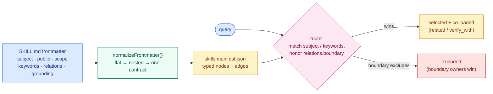

# Skill Metadata Protocol

> The per-`SKILL.md` frontmatter contract: the typed fields that make a skill's relevance, scope, grounding, and relationships **explicit** instead of guessed.
>
> **Work mode:** editing this folder (spec, schema-facing docs, companions) is **SYSTEM** work; conforming an individual `SKILL.md` to the contract is **CONTENT** work that runs only through `/audit:*`. See [`../AGENTS.md` § Work Modes](../AGENTS.md#work-modes--system-vs-content). This README is a front door — the binding spec is [`SKILL_METADATA_PROTOCOL.md`](SKILL_METADATA_PROTOCOL.md).

## Why This Exists

The base `SKILL.md` spec adopted by Claude, Codex, Gemini, Copilot, and Cursor carries two fields: `name` and `description`. Two fields cannot scale a real library — they never say what *area* a skill covers, which *group* it belongs to, which *files* are in scope, or what it is explicitly *not* for. The symptoms are always the same: wrong-skill routing, scope ambiguity, silent overlap, and undetected staleness.

The protocol is the substrate that fixes this. It turns a Markdown instruction file into a machine-readable relevance contract that can be linted, compiled into a manifest, routed against, drift-checked, and audited. The [Skill Graph](../SKILL_GRAPH.md) queries it; the [Skill Audit Loop](../skill-audit-loop/SKILL_AUDIT_LOOP.md) keeps it true. The full mission statement is canonical in [`../AGENTS.md` § Mission and Vision](../AGENTS.md#mission-and-vision).

## What It Adds

Each axis below is *named* here and *specified* in [`field-reference.md`](field-reference.md) — this table is a map, not the contract.

| Axis | Required | What it declares |
|------|----------|------------------|
| `subject` | yes | Primary browse shelf — one of twelve closed values (`backend-engineering`, `frontend-engineering`, `software-architecture`, `data-engineering`, `agent-ops`, `ai-engineering`, `quality-assurance`, `design`, `reasoning-strategy`, `software-engineering-method`, `knowledge-organization`, `product-domain`). |
| `public` | yes | boolean — `true` (publishable/shareable) or `false` (private to one project). Project anchoring is carried by `project[]`. |
| `scope` | yes | Free-text PRD-style statement of what the skill teaches and where it deploys. |
| `subjects[]` | when it applies | Polyhierarchy (max 2, primary first) for a skill that genuinely spans two shelves. |
| `taxonomy_domain` | optional | Slash-delimited sub-path that subdivides an over-subscribed `subject`. |
| `keywords` | recommended | Up to 10 fuzzy activation terms (capped to prevent keyword stuffing). |
| `relations` | when it applies | Typed edges to sibling skills — see [Relations, Briefly](#relations-briefly). |
| `grounding` | when `project[]` is non-empty | `truth_sources`, `grounding_mode`, `failure_modes` — what the skill is checked against. |
| Understanding fields | when `comprehension_state: present` | `mental_model`, `purpose`, `boundary`, `analogy`, `misconception`. |
| Audit Status | written by the loop | `structural_verdict`, `truth_verdict`, `comprehension_verdict`, `application_verdict` — see [`../docs/verdict-semantics.md`](../docs/verdict-semantics.md). |

The binding `required` set and every enum live in [`../schemas/SKILL_METADATA_PROTOCOL_schema.json`](../schemas/SKILL_METADATA_PROTOCOL_schema.json); the live version and corpus counts live in [`../SKILL_GRAPH.md` § Current State](../SKILL_GRAPH.md#current-state--single-source-of-truth) (never restated here, so they cannot go stale).

## The Two Encodings

One logical contract, two physical shapes — both valid, reconciled by the frontmatter normalizer:

- **Protocol-native flat** — every field at the top level of the frontmatter. What the spec illustrates.
- **Agent-Skills nested** — everything under a `metadata:` key, the shape the public Agent-Skills release expects. The canonical library is authored in this shape because the same repo doubles as the public release.

A new skill is authored from [`../examples/skill-metadata-template.md`](../examples/skill-metadata-template.md), never from a hand-typed block. Encoding rules and the migration policy are in [`design-rationale.md`](design-rationale.md).

## How A Record Becomes Routing

The payoff of typing the frontmatter: a query resolves to the right skill, co-loads its allies, and suppresses the skills it owns over.

## Relations, Briefly

`relations` is a typed map with seven edge kinds: `related` (browse/expansion adjacency), `boundary` (exclusion guard), `verify_with` (cross-check), `depends_on` (composition), `broader` / `narrower` (hierarchy), and `disjoint_with` (mutual exclusion). Choosing among them is covered in [`field-decision-guide.md`](field-decision-guide.md).

**`relations.boundary` is named inversely to its mechanic.** `boundary: [skill-B]` does **not** mean "defer to B" — it means "when this skill wins a query, exclude B from co-routing." Write the reason as ownership ("I own this exclusively over B"), never as deference ("use B instead"). This is the single most error-prone field in the protocol; the full warning is in [`SKILL_METADATA_PROTOCOL.md` § Relations](SKILL_METADATA_PROTOCOL.md).

## Where To Go Next

| You want to… | Read |
|---|---|
| The binding contract (required/optional, enums, gates) | [`SKILL_METADATA_PROTOCOL.md`](SKILL_METADATA_PROTOCOL.md) |
| Per-field authoring prose (when to use, value criteria, anti-patterns) | [`field-reference.md`](field-reference.md) |
| Decide between two values (`portable` vs `project`, which relation) | [`field-decision-guide.md`](field-decision-guide.md) |
| Learn the model from scratch | [`PRIMER.md`](PRIMER.md) |
| Why the fields are shaped this way (rationale, migration history) | [`design-rationale.md`](design-rationale.md) |
| The machine contract | [`../schemas/SKILL_METADATA_PROTOCOL_schema.json`](../schemas/SKILL_METADATA_PROTOCOL_schema.json) |
| The generated field index (do not hand-edit) | [`field-reference.generated.md`](field-reference.generated.md) |
| How authored fields project into the manifest | [`../docs/manifest-field-mapping.md`](../docs/manifest-field-mapping.md) |
| The library-level system that queries this contract | [`../SKILL_GRAPH.md`](../SKILL_GRAPH.md) |

## What This Layer Is Not

- **Not the router.** Matching a query to a skill is the [Skill Graph](../SKILL_GRAPH.md)'s job; the protocol only supplies the typed fields it routes on.
- **Not the audit gate.** Whether a skill *teaches well* is certified by the [Skill Audit Loop](../skill-audit-loop/SKILL_AUDIT_LOOP.md), not by frontmatter being well-formed.
- **Not a global ontology.** `subject` and `taxonomy_domain` are browse-and-route handles, not a universal classification of knowledge.
- **Not a runtime.** The contract is authoring-time structure; it is exported back to plain `SKILL.md` to run on any agent.
