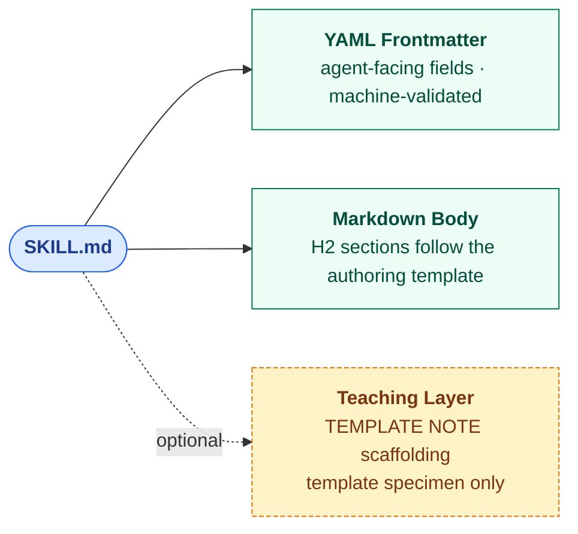

# Skill Metadata Protocol Rationale

This is the rationale and deep explanation for the Skill Metadata Protocol. For normative authoring rules, start with [`SKILL_METADATA_PROTOCOL.md`](SKILL_METADATA_PROTOCOL.md); this document explains why the protocol has this shape and how the pieces fit together.

Skill Metadata Protocol is the **skill-level contract** for AI SKILL.md. It defines the structured relevance metadata a skill should declare: activation signals, taxonomy, project/file scope, sibling-skill relations, grounding, drift checks, eval state, and public export readiness.

Skill Graph is the **library-level system** that works with this protocol. It indexes, routes, clusters, audits, and reverifies libraries of Skill-Metadata-Protocol-enriched skills.

**Current contract: v8.** Every authored skill carries five required frontmatter fields: `name`, `description`, `subject` (12-enum browse shelf — the competency the skill teaches), `public` (boolean publishability/private-data gate), and `scope` (free-text PRD-style statement). Optional classification/routing fields include polyhierarchy (`subjects[]`, max 2), `taxonomy_domain`, capped activation keywords (`keywords`, ≤10), and typed routing edges (`relations`). Project anchoring is carried by non-empty `project[]` plus `grounding`, not by `public`. Audit/eval/provenance state lives in `audit-state.json`. See [`adr/0017-five-axis-classification-model.md`](../docs/adr/0017-five-axis-classification-model.md), [`adr/0019-audit-state-sidecar-separation.md`](../docs/adr/0019-audit-state-sidecar-separation.md), and [`adr/0020-twelve-shelf-competency-reaxis.md`](../docs/adr/0020-twelve-shelf-competency-reaxis.md) for design rationale. Historical migration notes live in ADRs, CHANGELOG, and git history, not in the live authoring path.

## Related Documents

| Document | Purpose |
|---|---|
| [`skill-metadata-protocol/SKILL_METADATA_PROTOCOL.md`](SKILL_METADATA_PROTOCOL.md) | Normative public spec: required fields, semantic rules, authored vs generated fields |
| `skill-metadata-protocol/design-rationale.md` (this file) | Rationale and deep explanation: body structure, requiredness groups, schema strictness rules, design tradeoffs |
| `skill-metadata-protocol/field-reference.md` | One section per authored field — purpose, rules, examples, when to use |
| `skill-metadata-protocol/field-decision-guide.md` | Decision tables for `public`, `scope`, `relations.*`, and the Evaluation Status fields (`eval_artifacts`, `eval_state`, `routing_eval`) / `portability` |
| `docs/concept-map.md` | Teaching map — current frontmatter and sidecar fields grouped by conceptual role |
| `docs/manifest-field-mapping.md` | Authored-to-generated bridge: rename map, loss policy, worked example |
| `docs/adr/` | Architecture decision records — 0001 predicate set, 0002 JSON-LD @context, 0003 OntoClean rigidity tags, 0004 persistent identifiers |
| `schemas/skill.context.jsonld` | JSON-LD @context mapping every authored field to W3C vocabularies (SKOS, Dublin Core, PROV-O) |
| `schemas/vocabulary/` | Controlled vocabularies for `keywords` (canonical + synonyms) and `project` handles — advisory, surfaced as lint warnings |

## Design Principles

This document is the public source of truth for the Skill Metadata Protocol frontmatter format. Every design decision is in service of a benefit a working developer feels:

- **Keeps a flat author-facing frontmatter format** → you can author skills in plain YAML — no nested syntax to remember, no DSL to learn
- **Keeps one agent-facing `SKILL.md` plus one audit sidecar per skill** → authors keep teaching/routing content in `SKILL.md`, while audit/eval/provenance state lives in sibling `audit-state.json` and no longer pollutes the agent-facing contract
- **Keeps one generated manifest downstream** → consumers read a single deterministic artifact; the manifest is content-addressable and CI-verifiable
- **Tightens field semantics** → lint catches you when `relations.depends_on` points at a skill that doesn't exist, instead of silently breaking the router at runtime
- **Adds a small number of high-value fields beyond the SKILL.md base** → typed relations, drift detection, and project scoping become declarative metadata rather than tribal knowledge
- **Stays additive to the SKILL.md standard so every protocol-enriched skill can be transformed back to the base shape** → adopting the protocol does not trap you; the export transform at `scripts/export-skill.js` produces a valid SKILL.md file

### What kind of graph is this?

**In plain English:** Skill Metadata Protocol lets one skill say *"I depend on that one, verify me with this one, and stop co-routing that other one when this one owns the query."* The relation predicates (`depends_on`, `verify_with`, `suppresses`, `related`, `broader`, `narrower`, `disjoint_with`) are the typed edges that Skill Graph can use to turn a skill collection into a graph an agent can reason over.

Skill Graph is a **property graph with a controlled-vocabulary set of typed predicates**, not an RDF knowledge graph. Nodes are skills; edges are keys inside `relations.*`; node attributes are the current frontmatter fields plus joined sidecar state. The JSON-LD `@context` at `schemas/skill.context.jsonld` projects the frontmatter property graph into SKOS / Dublin Core Terms / PROV-O triples for consumers that want RDF semantics, but authoring stays in flat YAML.

Skill Graph does **not** promise:

- Automated inference (no OWL reasoner runs against the graph)
- Open-world consistency checking (the schema closes it via `additionalProperties: false`)
- SPARQL queryability as the primary interface (get that by applying the JSON-LD `@context` first)

What it does promise: deterministic lint, manifest generation, relation-aware routing, drift detection against content-addressable truth sources, and portable export to SKILL.md.

### Drift-check hash semantics

`drift_check.truth_source_hashes` maps each normalized truth-source key to the **SHA-256 hex digest** at the time of last verification. String truth sources hash the whole local file under `path`; object truth sources can narrow the hash to `path#Lstart-Lend` for a line range or `path#anchor` for a Markdown heading slug / literal-text anchor. Local file content is normalized to LF before hashing so CRLF-only edits do not create false drift. The drift sentinel (`scripts/skill-graph-drift.js`) reports `DRIFT` when the live hash differs from the recorded hash, `BROKEN` when a declared local truth source is missing from disk, `STALE` when `today - drift_check.last_verified > lifecycle.stale_after_days`, `NO_BASELINE` when local truth sources are declared but no hashes are recorded, and `EXTERNAL_UNHASHED` when a URL truth source is a valid reference but was not fetched on this run (the default run is network-free; the opt-in `--fetch-external` flag fetches and hashes URL sources via curl). To add a local-file baseline: `node scripts/skill-graph-drift.js --record --apply <skill-path>`; to include URL baselines: `node scripts/skill-graph-drift.js --record --apply --fetch-external <skill-path>`.

## Relationship to the SKILL.md Standard

> **This added structure is the price of making skills verifiable and system-aware once descriptions alone stop being enough.** If your library is small enough that descriptions and keywords are sufficient, stay on plain SKILL.md — Skill Metadata Protocol's additional fields are overhead without payoff until the implicit graph appears.

Skill Metadata Protocol extends the [SKILL.md](https://agentskills.io/specification) open standard with a richer authoring contract. The base standard requires two frontmatter fields (`name` and `description`) and defines four optional fields (`license`, `compatibility`, `metadata`, `allowed-tools`). The protocol keeps the two required base fields and three of the four optional base fields (`license`, `compatibility`, `allowed-tools`) as top-level fields — though `compatibility` is tightened from a free-text string to a structured object, and `name` allows `/` and `:` for namespacing. It does not use the base `metadata` field; protocol extensions are promoted to additional named top-level fields instead.

A Skill-Metadata-Protocol-enriched `SKILL.md` is *not* automatically a valid SKILL.md file: the `compatibility` shape and `name` pattern diverge. The export transform at `scripts/export-skill.js` produces a `SKILL.skill-md.md` that is valid against the base standard — flattening `compatibility` to a string and nesting protocol extension fields under the base `metadata:` key. Round-trip parity is via the export transform, not via direct schema compatibility.

| Field | Source | Skill Metadata Protocol treatment |
|---|---|---|
| `name` | SKILL.md required | Kept as required; the protocol tightens the character pattern |
| `description` | SKILL.md required | Kept as required; short topical summary |
| `license` | SKILL.md optional | Kept top-level; strongly recommended for shared skills |
| `compatibility` | SKILL.md optional | Kept top-level; optional |
| `allowed-tools` | SKILL.md optional | Kept top-level as a space-separated string |
| `metadata` | SKILL.md optional | Used only by the generated Agent-Skills-compatible export shape; not hand-authored in the protocol-native source |
| `subject`, `public`, `scope` | Skill Metadata Protocol frontmatter extension | Required by the protocol; additive to the base |
| `relations`, `grounding`, `triggers`, `keywords`, `examples`, `anti_examples`, `paths`, `project`, `subjects`, `taxonomy_domain`, `stability`, `superseded_by` | Skill Metadata Protocol frontmatter extension | Optional protocol enrichments; additive to the base |
| `schema_version`, `owner`, `freshness`, `drift_check`, `eval_artifacts`, `eval_state`, `routing_eval`, Audit Status fields | Skill Metadata Protocol sidecar extension | Required or loop-owned fields in `audit-state.json`; joined into the manifest but not authored in `SKILL.md` |

A Skill-Metadata-Protocol-enriched `SKILL.md` is **not** a valid SKILL.md file as authored, because the protocol requires fields the base standard does not define. An export transform can produce an SKILL.md-valid file by moving every protocol extension field under the standard `metadata:` key. The transform is implemented as `scripts/export-skill.js`.

## Body Structure

Every skill body follows the section structure demonstrated by [`examples/skill-metadata-template.md`](../examples/skill-metadata-template.md), the canonical authoring specimen. At minimum a skill carries `## Coverage` (the scope map), `## Philosophy of the skill` (the methodological stance), `## Verification` (how to confirm the skill was applied correctly), and `## Do NOT Use When` (the negative boundary). `## Key Files` is recommended for skills that reference concrete repo files — prefer file paths with line ranges (`src/foo.ts:45-120`) over bare paths when the skill depends on a specific function or section. `## References` is recommended for skills that point at external reading.

### Relationship to wider skill-authoring doctrine

This minimum is Skill Metadata Protocol's own. When the protocol is adopted into a monorepo that already has a canonical authoring standard (e.g., a `canonical-standard` or `skill-scaffold` skill), the adopter's standard may impose additional required sections or stricter content rules on top of it. Skill Metadata Protocol does not replace such a standard — it provides the portable subset that every skill must satisfy regardless of which adopter's fuller doctrine also applies. If you are adopting Skill Graph into a repo with a `canonical-standard` skill, reference that skill's section canon instead of republishing a narrower one in your own repo docs.

## Requiredness Groups

These groups are documentation categories only. They do not require nested YAML.

### Required for all skills

`SKILL.md` frontmatter:

```yaml
name
description
subject
public
scope
```

`audit-state.json`:

```yaml
schema_version
owner
freshness
drift_check
eval_artifacts
eval_state
routing_eval
```

### Strongly recommended

Not schema-required, but most useful skills include these:

```yaml
stability
license
relations
keywords
triggers
```

### Required for specific skill classes

| Condition | Required field(s) |
|---|---|
| non-empty `project[]` | `grounding` (schema-enforced) |
| Routable skills (label or language activation) | `keywords`; `triggers` and `paths` when routing explicitly depends on them |

### Optional enrichments

These improve portability, discoverability, and health tracking, but are not required for a valid Skill Metadata Protocol skill.

```yaml
paths
project
taxonomy_domain
subjects
compatibility
allowed-tools
portability
lifecycle
runtime_telemetry
```

## Template and Teaching Layer Discipline

Skill Metadata Protocol is the canonical contract, not the canonical template. The contract is the schema-backed set of fields, requiredness rules, relation semantics, grounding rules, and validation expectations. [`examples/skill-metadata-template.md`](../examples/skill-metadata-template.md) is a teaching artifact that demonstrates the contract for authors. A team can maintain its own stricter template as long as the resulting `SKILL.md` files still validate against the protocol.

### Semantic layer discipline

Two fields look similar but serve opposite layers — sibling levels of progressive disclosure, not duplicates:

| Element | Layer | Purpose | Length |
|---|---|---|---|
| `description:` (frontmatter) | **Subject summary** | Tells the reader and router what the skill is about; activation/exclusion details live in dedicated fields | ≤ 3 sentences |
| `## Coverage` (body section) | **Scope map** | Tells the reader, once the skill is loaded, what topics the skill covers | Bulleted topic list, ≥ 4 items for non-trivial skills |

If `description:` is bloated with scope detail, it will conflict with `## Coverage`. If `## Coverage` restates the description in one line, it has collapsed into the routing layer. Restore each to its proper layer when this happens.

### Teaching layer delivery mechanisms

Meta-commentary aimed at the template reader must never live in an H2 header slot. AI agents adapting a template copy its H2 structure verbatim. That means meta sections like `## How To Read This Template` get cargo-culted into every new skill. The correct delivery mechanisms are:

- **`> **TEMPLATE NOTE:**` blockquotes** for body-level meta guidance (structurally distinct from H2 headers)
- **`# TEMPLATE NOTE:` inline YAML comments** for field-level meta guidance (disappears when an author tightens their frontmatter)
- **Never** put meta-commentary in an H2/H3 section header

### When adapting the example template

1. Restore `description:` to a short topical summary if it has drifted into scope description.
2. Keep the H2 structure demonstrated by the template (see **Body Structure** above).
3. Replace example values only with equally real, context-correct values.
4. Remove sections that are conditionally irrelevant rather than keeping them with fake content.
5. Leave `> **TEMPLATE NOTE:**` blockquotes and `# TEMPLATE NOTE:` YAML comments out of the new skill — they are authoring scaffolding, not skill content.

### Title casing convention

The H1 title at the top of each SKILL.md body is Title Case — every significant word capitalized — and it is the human-readable expansion of `name:`, not a duplicate. Single-word skills (`debugging` → `# Debugging`) capitalize the single word. Abbreviations and identifier-style names expand to their human form (`a11y` → `# Accessibility`, `graph-audit` → `# Graph Audit`). The `name:` field stays lowercase and hyphenated; the H1 is never used as a graph identifier.

### Description convention

Every `description:` field is a short topical summary of what the skill covers. Do not lead with the skill's own name as a noun (`"Debugging skill for …"`); the router already knows the name from the `name:` field. Activation examples, exact triggers, and negative-use cases belong in `examples`, `triggers`, `anti_examples`, and `relations.suppresses`, where the router and marketplace exporter can treat them as typed evidence.

## Anatomy

> **The question this diagram answers:** "What are the parts of a SKILL.md?"

Every Skill Graph SKILL.md is the same shape: a YAML frontmatter, a Markdown body, and — only in the canonical template specimen — a teaching layer that is stripped when the template is adapted. The field-level detail lives in the table below the diagram and in [`skill-metadata-protocol/field-reference.md`](field-reference.md); the body section structure lives in the [Body Structure](#body-structure) section above. This diagram shows only the compositional shape.



<!-- Rendered copy for non-Mermaid viewers. Regenerate via: npx @mermaid-js/mermaid-cli -i <source> -o docs/images/skill-anatomy.png -->


**Legend.** Blue = the file. Green = a required layer. Yellow dashed = an optional / specimen-only layer.

### Current fields, grouped by source file

The current contract is two-file: `SKILL.md` carries agent-facing routing and teaching content; `audit-state.json` carries loop-owned audit/eval/provenance state. The schemas are the authoritative source for types and requiredness (`schemas/SKILL_METADATA_PROTOCOL_schema.json` and `schemas/skill-audit-state.schema.json`); the canonical per-field reference is [`skill-metadata-protocol/field-reference.md`](field-reference.md).

`SKILL.md` frontmatter:

| Group | Fields |
|---|---|
| **Identity** | `name`, `description`, `license`, `compatibility`, `allowed-tools` |
| **Classification** | `subject`, `subjects`, `public`, `scope`, `taxonomy_domain`, `stability`, `superseded_by` |
| **Activation & Routing** | `keywords`, `triggers`, `paths`, `examples`, `anti_examples`, `project`, `relations`, `grounding` |
| **Understanding** | `mental_model`, `purpose`, `concept_boundary`, `analogy`, `misconception` |

`audit-state.json` sidecar:

| Group | Fields |
|---|---|
| **Identity & ownership** | `schema_version`, `version`, `owner`, `urn`, `repo` |
| **Health & drift** | `freshness`, `drift_check`, `lifecycle`, `runtime_telemetry`, `model_run_coverage` |
| **Evaluation Status** | `eval_artifacts`, `eval_state`, `routing_eval`, `eval_last_run`, `eval`, `comprehension_state` |
| **Audit Status** | `last_audited`, `last_changed`, `structural_verdict`, `truth_verdict`, `comprehension_verdict`, `application_verdict`, `eval_score`, `eval_failed_ids`, `lint_verdict`, `drift_status` |
| **Publication support** | `marketplace_tier`, `portability`, `skill_graph_protocol` |

**Conditional requiredness in one line:** `grounding` when `project[]` is non-empty, `superseded_by` when `stability: deprecated`, Understanding fields when `comprehension_state: present`, and `eval_artifacts: present` when `eval_state` is `passing` or `monitored`. The schemas and `skill-lint.js` split those checks by file ownership. `keywords` are recommended for routable skills and reviewed by routing review / routing evals, but they are not a required-field rule. For the decision tables that help you set `public: true` / `public: false` and decide project anchoring, see [`skill-metadata-protocol/field-decision-guide.md`](field-decision-guide.md).

## Why the Evaluation Status is orthogonal (ADR 0001 + ADR 0006)

`eval_artifacts`, `eval_state`, and `routing_eval` are three fields that look like they could be one. They are deliberately separate because they answer three orthogonal questions about a skill's Evaluation Status:

| Question | Field | Values |
|---|---|---|
| Are eval files on disk? | `eval_artifacts` | `none` / `planned` / `present` |
| What does the eval say about content quality? | `eval_state` | `unverified` / `passing` / `monitored` |
| Is routing / trigger coverage explicitly evaluated? | `routing_eval` | `absent` / `present` |

Each axis has consumer-visible meaning. A consumer deciding whether to load a skill into an agent context can read all three and make a graded decision: high-quality content + verified routing > unverified content + verified routing > unverified content + absent routing. Conflating them would force the consumer to guess.

The orthogonality also expresses real states cleanly:

- `eval_artifacts: planned + eval_state: unverified` — the author intends to ship evals but hasn't yet; planned-staleness review should surface when this sits too long.
- `eval_artifacts: present + eval_state: passing + routing_eval: absent` — content quality is verified but the router has never been tested against this skill's `examples[]`. Common during the early life of a skill.
- `eval_artifacts: present + eval_state: monitored + routing_eval: present` — fully verified along all three axes; the harness runs on a cadence and routing coverage is part of the eval set. The aspirational state.

Note the asymmetry: `routing_eval` is binary (`absent` / `present`) because the harness either agrees or it doesn't — there is no "monitored routing eval" because the routing harness provides the concrete pass/fail receipt. `eval_state` is ternary because content evals can run once (`passing`) or repeatedly (`monitored`), and the difference is consumer-visible.

The "honesty over green checkmarks" rule (documented at `skill-metadata-protocol/field-reference.md § routing_eval`) governs the `routing_eval` flip specifically: an author cannot claim `routing_eval: present` until `node scripts/skill-graph-routing-eval.js --skill <name>` returns verdict PASS. The OSS starter library currently sits at all-8-`present` (verified by `node scripts/skill-graph-routing-eval.js --only-asserted`).

For the field-by-field rationale and worked-example confusion-cases, see [`docs/field-rationale.md`](../docs/field-rationale.md).

## How JSON-LD context maps fields to W3C terms (ADR 0002)

Skill Metadata Protocol ships an optional JSON-LD `@context` at `schemas/skill.context.jsonld` that projects every authored field onto a W3C standard vocabulary term. This is the FAIR Interoperability layer (Wilkinson et al. 2016, DOI:10.1038/sdata.2016.18): a protocol-enriched skill loaded into a knowledge-graph consumer that already understands SKOS, PROV-O, OWL, or Dublin Core gets RDF-projectable semantics with no Skill-Metadata-Protocol-specific code.

The context is the source of truth for cross-vocabulary mapping. The most consequential mappings:

| Authored field | W3C term | Vocabulary | Why this term |
|---|---|---|---|
| `name` | `dcterms:identifier` | Dublin Core | Stable display-layer skill identity |
| `description` | `dcterms:description` | Dublin Core | Free-text subject summary |
| `version` | `dcterms:hasVersion` | Dublin Core | Skill content version (semver) |
| `freshness` | `dcterms:modified` | Dublin Core (xsd:date) | Author's claim of last-meaningful-review date |
| `taxonomy_domain` | `skos:broader` | SKOS | Hierarchical sub-path within a subject projects to a skos:broader chain |
| `relations.related` | `skos:related` | SKOS | Symmetric associative relation between concepts |
| `relations.broader` | `skos:broader` | SKOS | Cross-skill generalisation (target is more general) |
| `relations.narrower` | `skos:narrower` | SKOS | Cross-skill specialisation (target is more specific) |
| `relations.suppresses` | `sg:disjointOwnership` | Skill-Graph custom | Routing-layer asymmetric exclusion — intentionally weaker than OWL class-disjointness (per ADR 0006 / ADR 0018) |
| `relations.disjoint_with` | `owl:disjointWith` | OWL | Formal class-theoretic disjointness — distinct from `suppresses` (per ADR 0006 / ADR 0018) |
| `relations.verify_with` | `prov:wasInformedBy` | PROV-O | Verifier skill informs this skill's claims |
| `relations.depends_on` | `dcterms:requires` | Dublin Core | Operational prerequisite |
| `grounding.truth_sources` | `dcterms:source` | Dublin Core | Source resources from which claims are derived |
| `urn` | `@id` | RFC 8141 + JSON-LD | Globally-unique persistent identifier |

The `suppresses` vs `disjoint_with` split is the most semantically subtle entry. Per ADR 0006 and ADR 0018, `suppresses` operates at the **routing layer** (the router uses it as a score-aware exclusion guard when the declaring skill wins or ties — asymmetric, directional) while `disjoint_with` operates at the **ontology layer** (formal class-disjointness — symmetric, reflexive). They are NOT aliases. Treating them as aliases would force consumers to reason about routing claims as if they were ontological claims, which is unsound.

The `@context` also declares the `owl` namespace (since the v1.1.0 update) so the `disjoint_with` mapping resolves cleanly. The `_adr_anchors` block in the context file explicitly cross-references ADRs 0001, 0002, and 0006 so future maintainers see the reasoning for the split mapping in-tree, not only in commit history.

**Coverage policy:** ADR 0002 requires that every top-level authored field appears in `schemas/skill.context.jsonld`. Protocol consistency check C8 enforces this automatically, including declared JSON-LD namespace prefixes. When adding a top-level schema field, update the context mapping in the same change.

**Read this when:** adding a new top-level field, adding a new `relations.*` predicate, or considering whether to map an existing field to a different W3C term.

## Schema Strictness

The Skill Metadata Protocol schemas are intentionally strict.

- Unknown top-level fields fail validation rather than being silently accepted.
- Field names must not rely on undocumented aliases.
- New public fields must be added by updating both the docs and the schemas.
- If you touched `skill-metadata-protocol/design-rationale.md` or `schemas/SKILL_METADATA_PROTOCOL_schema.json`, also update the other side so they remain in lockstep. Skill Metadata Protocol is the source of truth for semantics; the schema is the source of truth for machine enforcement. Drift between them is a bug.

## Relationship to Audit Tooling

Skill Metadata Protocol is designed to work with:

1. `skill-audit-loop/SKILL_AUDIT_LOOP.md` § Part 2
2. `skill-audit-loop/SKILL_AUDIT_LOOP.md`

The metadata must support three things cleanly:

- activation
- relation-aware retrieval
- deterministic auditing

## Non-Goals

This contract does not introduce:
- open-core vs closed-core runtime layers
- nested metadata requirements for authoring
- enterprise-only fields
- a second skill format
- a marketplace-specific packaging system

It also does not require a full private control plane. The OSS contract keeps only the metadata needed for a portable, graph-aware, lintable system.

## Authored vs Generated Fields

### Authored in `SKILL.md`

The agent-facing authored fields are listed in `schemas/SKILL_METADATA_PROTOCOL_schema.json`.

For the purpose, rules, and examples for each field, see `skill-metadata-protocol/field-reference.md`.

### Authored or stamped in `audit-state.json`

The audit/eval/provenance fields are listed in `schemas/skill-audit-state.schema.json`. Human authors provide ownership and freshness state; audit-loop tooling stamps verdicts, eval receipts, drift status, and runtime telemetry.

### Generated in `skills.manifest.json`

- normalized category rollups
- health flags
- eval counts
- missing coverage flags
- mirror status
- compiled activation tables
- generated docs ownership

See `docs/manifest-field-mapping.md` for the full rename map, loss policy, migration policy, and a worked example showing the authored-to-generated projection field by field.

## Schema Versioning Policy

Skill Graph uses a single integer `schema_version` to signal authored skill contract evolution. Current authored skill version: **8**. The policy points below define when `schema_version` bumps, what consumers should expect, and where migration evidence lives:

1. **Breaking changes bump `schema_version`.** Renamed fields, removed fields, retyped fields, removed enum values, or tightened required-ness constraints bump the integer. Consumers must migrate or pin.
2. **Additive changes do not bump.** New optional fields, new enum values that extend (not replace) an enum, and new warning-only companion checks do not bump the version. Consumers on the prior minor release continue to pass.
3. **Validate against the canonical schema.** Per [ADR-0014](../docs/adr/0014-canonical-only-schema-files.md), `schemas/SKILL_METADATA_PROTOCOL_schema.json`, `schemas/skill-audit-state.schema.json`, and `schemas/manifest.schema.json` are the schema files on disk. They track the current contract.
4. **Manifest schema-file version and manifest root `schema_version` are separate surfaces.** The current manifest schema tracks v8 skill entries, but generated manifests still emit root field value `4` because earlier manifest changes did not require a root-version bump for consumers. `schemas/manifest.schema.json` validates that root value explicitly.
5. **Major versions are clean cuts.** Per `AGENTS.md § Major Version Is a Clean Cut`, live schema and live docs describe the current version. Historical contracts live in ADRs, CHANGELOG, and git history.
6. **Migration tooling runs once per bump, then retires.** Per ADR-0014, codemods walk the corpus once, then are deleted. The migration narrative for any historical bump lives in git log + the corresponding ADR; the codemod itself is not retained on disk.

For field-level current decision tables, see `skill-metadata-protocol/field-decision-guide.md`.

## Stability Promotion Criteria (SH-6109)

`stability: stable` signals that a skill's content is settled and suitable for production dependence. The promotion criteria below are checked at **WARN level** (never ERROR) by `scripts/lint/check-stability-promotion.js`, exposed as `npm run stability:check` and wired into `npm run verify`. Run history: added as a `skill-lint.js` check in `7e0306d`, removed from `skill-lint.js` in `2bd8e64` (2026-05-19) when the lint surface narrowed to canonical-source mandates, library kept in place by `92978fb` (2026-05-20), CLI entrypoint + verify wiring added 2026-05-24. The script is intentionally separate from `skill-lint.js` because `stability` is a Skill Graph quality posture, not a schema or external-format requirement. Final promotion remains author judgment, audited by the Audit Status fields and the application-eval pipeline (gate 9); the gate just surfaces a warning when a skill claims `stability: stable` without meeting the five criteria.

A skill qualifies for `stability: stable` when it meets all five of the following:

| # | Criterion | Field(s) | Pass condition |
|---|---|---|---|
| 1 | Eval has been run | `eval_state` | Value is `passing` or `monitored` (not `unverified` or absent) |
| 2 | Eval score meets quality bar | `eval_score` | ≥ 4.0 on the 0.0–5.0 audit scale (≡ 80%) |
| 3 | Routing coverage evaluated | `routing_eval` | Value is `present` with a passing `skill-graph-routing-eval.js` receipt |
| 4 | Drift verified recently | `drift_check.last_verified` | ISO 8601 date within the last 90 days |
| 5 | Truth sources declared | `grounding.truth_sources` | Non-empty array; exempt when the skill is not project-anchored (empty `project[]`) |

**Severity:** All findings from this check are warnings, not errors. This prevents 141 currently-experimental skills from breaking the lint run if any author prematurely sets `stability: stable`.

**When criterion 5 is exempt:** Skills that are not project-anchored (empty `project[]`) have no codebase tie-in by definition. They are exempt from criterion 5 because `grounding.truth_sources` is not meaningful for repo-agnostic skills.

**To promote a skill:** Satisfy each criterion, then change `stability: experimental` to `stability: stable`. The lint run will emit no stability-promotion warnings once all five criteria are met.

**Implementation:** `scripts/lint/check-stability-promotion.js` (library + CLI), wired as `npm run stability:check` inside `npm run verify`. Tests: `scripts/__tests__/test-stability-promotion.js` (8 cases). Final promotion is author judgment, audited by reading the Audit Status fields directly; the gate surfaces premature-stable claims rather than blocking them.
